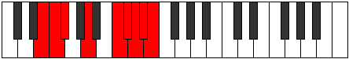

# Mode Pathyllic

## Links

- [Documentation](index.md)
- [Scales Index](Scales.md)
- [Modes Index](Modes.md)
- [Chords Index](Chords.md)

## Parent Scale

[Zaryllic](ScaleZaryllic.md)

## Number

[3879](https://ianring.com/musictheory/scales/3879)

## Perfection

- 4 Perfect notes
- 4 Perfect notes

## Perfection Profile

[false true true true false false true false]

## Permutations

| Tonic | Notes | Signature | Illustration | Audio |
|-------|-------|-----------|--------------|-------|
| [C](ModeCNaturalPathyllic.md) | **C**, C#, D, F, **G#**, **A**, A#, **B**, **C** | C |  | [midi](ModeCNaturalPathyllic.mid) [ogg](ModeCNaturalPathyllic.ogg) |
| [C#](ModeCSharpPathyllic.md) | **C#**, D, D#, F#, **A**, **A#**, B, **C**, **C#** | C |  | [midi](ModeCSharpPathyllic.mid) [ogg](ModeCSharpPathyllic.ogg) |
| [Db](ModeDFlatPathyllic.md) | **Db**, D, Eb, Gb, **A**, **Bb**, B, **C**, **Db** | C |  | [midi](ModeDFlatPathyllic.mid) [ogg](ModeDFlatPathyllic.ogg) |
| [D](ModeDNaturalPathyllic.md) | **D**, D#, E, G, **A#**, **B**, C, **C#**, **D** | C |  | [midi](ModeDNaturalPathyllic.mid) [ogg](ModeDNaturalPathyllic.ogg) |
| [D#](ModeDSharpPathyllic.md) | **D#**, E, F, G#, **B**, **C**, C#, **D**, **D#** | C |  | [midi](ModeDSharpPathyllic.mid) [ogg](ModeDSharpPathyllic.ogg) |
| [Eb](ModeEFlatPathyllic.md) | **Eb**, E, F, Ab, **B**, **C**, Db, **D**, **Eb** | C |  | [midi](ModeEFlatPathyllic.mid) [ogg](ModeEFlatPathyllic.ogg) |
| [E](ModeENaturalPathyllic.md) | **E**, F, F#, A, **C**, **C#**, D, **D#**, **E** | C |  | [midi](ModeENaturalPathyllic.mid) [ogg](ModeENaturalPathyllic.ogg) |
| [F](ModeFNaturalPathyllic.md) | **F**, F#, G, A#, **C#**, **D**, D#, **E**, **F** | C |  | [midi](ModeFNaturalPathyllic.mid) [ogg](ModeFNaturalPathyllic.ogg) |
| [F#](ModeFSharpPathyllic.md) | **F#**, G, G#, B, **D**, **D#**, E, **F**, **F#** | C |  | [midi](ModeFSharpPathyllic.mid) [ogg](ModeFSharpPathyllic.ogg) |
| [Gb](ModeGFlatPathyllic.md) | **Gb**, G, Ab, B, **D**, **Eb**, E, **F**, **Gb** | C |  | [midi](ModeGFlatPathyllic.mid) [ogg](ModeGFlatPathyllic.ogg) |
| [G](ModeGNaturalPathyllic.md) | **G**, G#, A, C, **D#**, **E**, F, **F#**, **G** | C |  | [midi](ModeGNaturalPathyllic.mid) [ogg](ModeGNaturalPathyllic.ogg) |
| [G#](ModeGSharpPathyllic.md) | **G#**, A, A#, C#, **E**, **F**, F#, **G**, **G#** | C |  | [midi](ModeGSharpPathyllic.mid) [ogg](ModeGSharpPathyllic.ogg) |
| [Ab](ModeAFlatPathyllic.md) | **Ab**, A, Bb, Db, **E**, **F**, Gb, **G**, **Ab** | C |  | [midi](ModeAFlatPathyllic.mid) [ogg](ModeAFlatPathyllic.ogg) |
| [A](ModeANaturalPathyllic.md) | **A**, A#, B, D, **F**, **F#**, G, **G#**, **A** | C |  | [midi](ModeANaturalPathyllic.mid) [ogg](ModeANaturalPathyllic.ogg) |
| [A#](ModeASharpPathyllic.md) | **A#**, B, C, D#, **F#**, **G**, G#, **A**, **A#** | C |  | [midi](ModeASharpPathyllic.mid) [ogg](ModeASharpPathyllic.ogg) |
| [Bb](ModeBFlatPathyllic.md) | **Bb**, B, C, Eb, **Gb**, **G**, Ab, **A**, **Bb** | C |  | [midi](ModeBFlatPathyllic.mid) [ogg](ModeBFlatPathyllic.ogg) |
| [B](ModeBNaturalPathyllic.md) | **B**, C, C#, E, **G**, **G#**, A, **A#**, **B** | C |  | [midi](ModeBNaturalPathyllic.mid) [ogg](ModeBNaturalPathyllic.ogg) |
