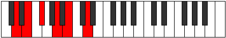
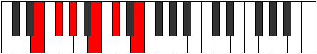
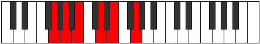
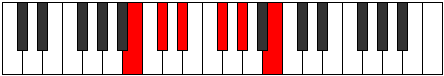

# Mode Pentatonic

## Links

- [Documentation](index.md)
- [Scales Index](Scales.md)
- [Modes Index](Modes.md)
- [Chords Index](Chords.md)

## Parent Scale

[Epathitonic](ScaleEpathitonic.md)

## Number

[661](https://ianring.com/musictheory/scales/661)

## Perfection

- 4 Perfect notes
- 1 Perfect notes

## Perfection Profile

[true true false true true]

## Permutations

| Tonic | Notes | Signature | Illustration | Audio |
|-------|-------|-----------|--------------|-------|
| [C](ModeCNaturalPentatonic.md) | C, D, **E**, G, A, C | C |  | [midi](https://github.com/edipermadi/music/blob/main/docs/ModeCNaturalPentatonic.mid?raw=true) |
| [C#](ModeCSharpPentatonic.md) | C#, D#, **F**, G#, A#, C# | C |  | [midi](https://github.com/edipermadi/music/blob/main/docs/ModeCSharpPentatonic.mid?raw=true) |
| [Db](ModeDFlatPentatonic.md) | Db, Eb, **F**, Ab, Bb, Db | C |  | [midi](https://github.com/edipermadi/music/blob/main/docs/ModeDFlatPentatonic.mid?raw=true) |
| [D](ModeDNaturalPentatonic.md) | D, E, **F#**, A, B, D | C |  | [midi](https://github.com/edipermadi/music/blob/main/docs/ModeDNaturalPentatonic.mid?raw=true) |
| [D#](ModeDSharpPentatonic.md) | D#, F, **G**, A#, C, D# | C |  | [midi](https://github.com/edipermadi/music/blob/main/docs/ModeDSharpPentatonic.mid?raw=true) |
| [Eb](ModeEFlatPentatonic.md) | Eb, F, **G**, Bb, C, Eb | C |  | [midi](https://github.com/edipermadi/music/blob/main/docs/ModeEFlatPentatonic.mid?raw=true) |
| [E](ModeENaturalPentatonic.md) | E, F#, **G#**, B, C#, E | C |  | [midi](https://github.com/edipermadi/music/blob/main/docs/ModeENaturalPentatonic.mid?raw=true) |
| [F](ModeFNaturalPentatonic.md) | F, G, **A**, C, D, F | C |  | [midi](https://github.com/edipermadi/music/blob/main/docs/ModeFNaturalPentatonic.mid?raw=true) |
| [F#](ModeFSharpPentatonic.md) | F#, G#, **A#**, C#, D#, F# | C |  | [midi](https://github.com/edipermadi/music/blob/main/docs/ModeFSharpPentatonic.mid?raw=true) |
| [Gb](ModeGFlatPentatonic.md) | Gb, Ab, **Bb**, Db, Eb, Gb | C |  | [midi](https://github.com/edipermadi/music/blob/main/docs/ModeGFlatPentatonic.mid?raw=true) |
| [G](ModeGNaturalPentatonic.md) | G, A, **B**, D, E, G | C |  | [midi](https://github.com/edipermadi/music/blob/main/docs/ModeGNaturalPentatonic.mid?raw=true) |
| [G#](ModeGSharpPentatonic.md) | G#, A#, **C**, D#, F, G# | C |  | [midi](https://github.com/edipermadi/music/blob/main/docs/ModeGSharpPentatonic.mid?raw=true) |
| [Ab](ModeAFlatPentatonic.md) | Ab, Bb, **C**, Eb, F, Ab | C |  | [midi](https://github.com/edipermadi/music/blob/main/docs/ModeAFlatPentatonic.mid?raw=true) |
| [A](ModeANaturalPentatonic.md) | A, B, **C#**, E, F#, A | C |  | [midi](https://github.com/edipermadi/music/blob/main/docs/ModeANaturalPentatonic.mid?raw=true) |
| [A#](ModeASharpPentatonic.md) | A#, C, **D**, F, G, A# | C |  | [midi](https://github.com/edipermadi/music/blob/main/docs/ModeASharpPentatonic.mid?raw=true) |
| [Bb](ModeBFlatPentatonic.md) | Bb, C, **D**, F, G, Bb | C |  | [midi](https://github.com/edipermadi/music/blob/main/docs/ModeBFlatPentatonic.mid?raw=true) |
| [B](ModeBNaturalPentatonic.md) | B, C#, **D#**, F#, G#, B | C |  | [midi](https://github.com/edipermadi/music/blob/main/docs/ModeBNaturalPentatonic.mid?raw=true) |
