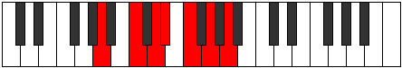

# Mode Phracrimic

## Links

- [Documentation](index.md)
- [Scales Index](Scales.md)
- [Modes Index](Modes.md)
- [Chords Index](Chords.md)

## Parent Scale

[Phracrimic](ScalePhracrimic.md)

## Number

[1385](https://ianring.com/musictheory/scales/1385)

## Interval Pattern

3, 2, 1, 2, 2, 2

## Chord Pattern

ii, iii

## Perfection

- 4 Perfect notes
- 2 Perfect notes

## Perfection Profile

[false true true false true true]

## Permutations

| Tonic | Notes | Signature | Illustration | Audio |
|-------|-------|-----------|--------------|-------|
| [C](ModeCNaturalPhracrimic.md) | **C**, D#, E#, **F#**, G#, A#, **C** | C |  | [midi](https://github.com/edipermadi/music/blob/main/docs/ModeCNaturalPhracrimic.mid?raw=true) |
| [C#](ModeCSharpPhracrimic.md) | **C#**, D##, E##, **F##**, G##, A##, **C#** | C |  | [midi](https://github.com/edipermadi/music/blob/main/docs/ModeCSharpPhracrimic.mid?raw=true) |
| [Db](ModeDFlatPhracrimic.md) | **Db**, E, F#, **G**, A, B, **Db** | C |  | [midi](https://github.com/edipermadi/music/blob/main/docs/ModeDFlatPhracrimic.mid?raw=true) |
| [D](ModeDNaturalPhracrimic.md) | **D**, E#, F##, **G#**, A#, B#, **D** | C |  | [midi](https://github.com/edipermadi/music/blob/main/docs/ModeDNaturalPhracrimic.mid?raw=true) |
| [D#](ModeDSharpPhracrimic.md) | **D#**, E##, F###, **G##**, A##, B##, **D#** | C |  | [midi](https://github.com/edipermadi/music/blob/main/docs/ModeDSharpPhracrimic.mid?raw=true) |
| [Eb](ModeEFlatPhracrimic.md) | **Eb**, F#, G#, **A**, B, C#, **Eb** | C |  | [midi](https://github.com/edipermadi/music/blob/main/docs/ModeEFlatPhracrimic.mid?raw=true) |
| [E](ModeENaturalPhracrimic.md) | **E**, F##, G##, **A#**, B#, C##, **E** | C |  | [midi](https://github.com/edipermadi/music/blob/main/docs/ModeENaturalPhracrimic.mid?raw=true) |
| [F](ModeFNaturalPhracrimic.md) | **F**, G#, A#, **B**, C#, D#, **F** | C |  | [midi](https://github.com/edipermadi/music/blob/main/docs/ModeFNaturalPhracrimic.mid?raw=true) |
| [F#](ModeFSharpPhracrimic.md) | **F#**, G##, A##, **B#**, C##, D##, **F#** | C |  | [midi](https://github.com/edipermadi/music/blob/main/docs/ModeFSharpPhracrimic.mid?raw=true) |
| [Gb](ModeGFlatPhracrimic.md) | **Gb**, A, B, **C**, D, E, **Gb** | C |  | [midi](https://github.com/edipermadi/music/blob/main/docs/ModeGFlatPhracrimic.mid?raw=true) |
| [G](ModeGNaturalPhracrimic.md) | **G**, A#, B#, **C#**, D#, E#, **G** | C |  | [midi](https://github.com/edipermadi/music/blob/main/docs/ModeGNaturalPhracrimic.mid?raw=true) |
| [G#](ModeGSharpPhracrimic.md) | **G#**, A##, B##, **C##**, D##, E##, **G#** | C |  | [midi](https://github.com/edipermadi/music/blob/main/docs/ModeGSharpPhracrimic.mid?raw=true) |
| [Ab](ModeAFlatPhracrimic.md) | **Ab**, B, C#, **D**, E, F#, **Ab** | C |  | [midi](https://github.com/edipermadi/music/blob/main/docs/ModeAFlatPhracrimic.mid?raw=true) |
| [A](ModeANaturalPhracrimic.md) | **A**, B#, C##, **D#**, E#, F##, **A** | C |  | [midi](https://github.com/edipermadi/music/blob/main/docs/ModeANaturalPhracrimic.mid?raw=true) |
| [A#](ModeASharpPhracrimic.md) | **A#**, B##, C###, **D##**, E##, F###, **A#** | C |  | [midi](https://github.com/edipermadi/music/blob/main/docs/ModeASharpPhracrimic.mid?raw=true) |
| [Bb](ModeBFlatPhracrimic.md) | **Bb**, C#, D#, **E**, F#, G#, **Bb** | C |  | [midi](https://github.com/edipermadi/music/blob/main/docs/ModeBFlatPhracrimic.mid?raw=true) |
| [B](ModeBNaturalPhracrimic.md) | **B**, C##, D##, **E#**, F##, G##, **B** | C |  | [midi](https://github.com/edipermadi/music/blob/main/docs/ModeBNaturalPhracrimic.mid?raw=true) |
