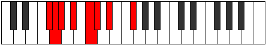

# Mode Phradian

## Links

- [Documentation](index.md)
- [Scales Index](Scales.md)
- [Modes Index](Modes.md)
- [Chords Index](Chords.md)

## Parent Scale

[Ionycrian](ScaleIonycrian.md)

## Number

[727](https://ianring.com/musictheory/scales/727)

## Perfection

- 5 Perfect notes
- 2 Perfect notes

## Perfection Profile

[true false true false true true true]

## Permutations

| Tonic | Notes | Signature | Illustration | Audio |
|-------|-------|-----------|--------------|-------|
| [C](ModeCNaturalPhradian.md) | C, **Db**, Ebb, **Fb**, Gb, Abb, Bbb, C | C |  | [midi](https://github.com/edipermadi/music/blob/main/docs/ModeCNaturalPhradian.mid?raw=true) |
| [C#](ModeCSharpPhradian.md) | C#, **D**, Eb, **F**, G, Ab, Bb, C# | C |  | [midi](https://github.com/edipermadi/music/blob/main/docs/ModeCSharpPhradian.mid?raw=true) |
| [Db](ModeDFlatPhradian.md) | Db, **Ebb**, Fbb, **Gbb**, Abb, Bbbb, Cbb, Db | C |  | [midi](https://github.com/edipermadi/music/blob/main/docs/ModeDFlatPhradian.mid?raw=true) |
| [D](ModeDNaturalPhradian.md) | D, **Eb**, Fb, **Gb**, Ab, Bbb, Cb, D | C |  | [midi](https://github.com/edipermadi/music/blob/main/docs/ModeDNaturalPhradian.mid?raw=true) |
| [D#](ModeDSharpPhradian.md) | D#, **E**, F, **G**, A, Bb, C, D# | C |  | [midi](https://github.com/edipermadi/music/blob/main/docs/ModeDSharpPhradian.mid?raw=true) |
| [Eb](ModeEFlatPhradian.md) | Eb, **Fb**, Gbb, **Abb**, Bbb, Cbb, Dbb, Eb | C |  | [midi](https://github.com/edipermadi/music/blob/main/docs/ModeEFlatPhradian.mid?raw=true) |
| [E](ModeENaturalPhradian.md) | E, **F**, Gb, **Ab**, Bb, Cb, Db, E | C |  | [midi](https://github.com/edipermadi/music/blob/main/docs/ModeENaturalPhradian.mid?raw=true) |
| [F](ModeFNaturalPhradian.md) | F, **Gb**, Abb, **Bbb**, Cb, Dbb, Ebb, F | C |  | [midi](https://github.com/edipermadi/music/blob/main/docs/ModeFNaturalPhradian.mid?raw=true) |
| [F#](ModeFSharpPhradian.md) | F#, **G**, Ab, **Bb**, C, Db, Eb, F# | C |  | [midi](https://github.com/edipermadi/music/blob/main/docs/ModeFSharpPhradian.mid?raw=true) |
| [Gb](ModeGFlatPhradian.md) | Gb, **Abb**, Bbbb, **Cbb**, Dbb, Ebbb, Fbb, Gb | C |  | [midi](https://github.com/edipermadi/music/blob/main/docs/ModeGFlatPhradian.mid?raw=true) |
| [G](ModeGNaturalPhradian.md) | G, **Ab**, Bbb, **Cb**, Db, Ebb, Fb, G | C |  | [midi](https://github.com/edipermadi/music/blob/main/docs/ModeGNaturalPhradian.mid?raw=true) |
| [G#](ModeGSharpPhradian.md) | G#, **A**, Bb, **C**, D, Eb, F, G# | C |  | [midi](https://github.com/edipermadi/music/blob/main/docs/ModeGSharpPhradian.mid?raw=true) |
| [Ab](ModeAFlatPhradian.md) | Ab, **Bbb**, Cbb, **Dbb**, Ebb, Fbb, Gbb, Ab | C |  | [midi](https://github.com/edipermadi/music/blob/main/docs/ModeAFlatPhradian.mid?raw=true) |
| [A](ModeANaturalPhradian.md) | A, **Bb**, Cb, **Db**, Eb, Fb, Gb, A | C |  | [midi](https://github.com/edipermadi/music/blob/main/docs/ModeANaturalPhradian.mid?raw=true) |
| [A#](ModeASharpPhradian.md) | A#, **B**, C, **D**, E, F, G, A# | C |  | [midi](https://github.com/edipermadi/music/blob/main/docs/ModeASharpPhradian.mid?raw=true) |
| [Bb](ModeBFlatPhradian.md) | Bb, **Cb**, Dbb, **Ebb**, Fb, Gbb, Abb, Bb | C |  | [midi](https://github.com/edipermadi/music/blob/main/docs/ModeBFlatPhradian.mid?raw=true) |
| [B](ModeBNaturalPhradian.md) | B, **C**, Db, **Eb**, F, Gb, Ab, B | C |  | [midi](https://github.com/edipermadi/music/blob/main/docs/ModeBNaturalPhradian.mid?raw=true) |
