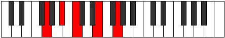
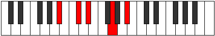

# Mode Phradic

## Links

- [Documentation](index.md)
- [Scales Index](Scales.md)
- [Modes Index](Modes.md)
- [Chords Index](Chords.md)

## Parent Scale

[Daric](ScaleDaric.md)

## Number

[553](https://ianring.com/musictheory/scales/553)

## Perfection

- 1 Perfect notes
- 3 Perfect notes

## Interval Pattern

3, 2, 4, 3

## Perfection Profile

[false false true false]

## Permutations

| Tonic | Notes | Signature | Illustration | Audio |
|-------|-------|-----------|--------------|-------|
| [C](ModeCNaturalPhradic.md) | **C**, **D#**, F, **A**, **C** | C |  | [midi](https://github.com/edipermadi/music/blob/main/docs/ModeCNaturalPhradic.mid?raw=true) |
| [C#](ModeCSharpPhradic.md) | **C#**, **E**, F#, **A#**, **C#** | C |  | [midi](https://github.com/edipermadi/music/blob/main/docs/ModeCSharpPhradic.mid?raw=true) |
| [Db](ModeDFlatPhradic.md) | **Db**, **E**, Gb, **Bb**, **Db** | C |  | [midi](https://github.com/edipermadi/music/blob/main/docs/ModeDFlatPhradic.mid?raw=true) |
| [D](ModeDNaturalPhradic.md) | **D**, **F**, G, **B**, **D** | C |  | [midi](https://github.com/edipermadi/music/blob/main/docs/ModeDNaturalPhradic.mid?raw=true) |
| [D#](ModeDSharpPhradic.md) | **D#**, **F#**, G#, **C**, **D#** | C |  | [midi](https://github.com/edipermadi/music/blob/main/docs/ModeDSharpPhradic.mid?raw=true) |
| [Eb](ModeEFlatPhradic.md) | **Eb**, **Gb**, Ab, **C**, **Eb** | C |  | [midi](https://github.com/edipermadi/music/blob/main/docs/ModeEFlatPhradic.mid?raw=true) |
| [E](ModeENaturalPhradic.md) | **E**, **G**, A, **C#**, **E** | C |  | [midi](https://github.com/edipermadi/music/blob/main/docs/ModeENaturalPhradic.mid?raw=true) |
| [F](ModeFNaturalPhradic.md) | **F**, **G#**, A#, **D**, **F** | C |  | [midi](https://github.com/edipermadi/music/blob/main/docs/ModeFNaturalPhradic.mid?raw=true) |
| [F#](ModeFSharpPhradic.md) | **F#**, **A**, B, **D#**, **F#** | C |  | [midi](https://github.com/edipermadi/music/blob/main/docs/ModeFSharpPhradic.mid?raw=true) |
| [Gb](ModeGFlatPhradic.md) | **Gb**, **A**, B, **Eb**, **Gb** | C |  | [midi](https://github.com/edipermadi/music/blob/main/docs/ModeGFlatPhradic.mid?raw=true) |
| [G](ModeGNaturalPhradic.md) | **G**, **A#**, C, **E**, **G** | C |  | [midi](https://github.com/edipermadi/music/blob/main/docs/ModeGNaturalPhradic.mid?raw=true) |
| [G#](ModeGSharpPhradic.md) | **G#**, **B**, C#, **F**, **G#** | C |  | [midi](https://github.com/edipermadi/music/blob/main/docs/ModeGSharpPhradic.mid?raw=true) |
| [Ab](ModeAFlatPhradic.md) | **Ab**, **B**, Db, **F**, **Ab** | C |  | [midi](https://github.com/edipermadi/music/blob/main/docs/ModeAFlatPhradic.mid?raw=true) |
| [A](ModeANaturalPhradic.md) | **A**, **C**, D, **F#**, **A** | C |  | [midi](https://github.com/edipermadi/music/blob/main/docs/ModeANaturalPhradic.mid?raw=true) |
| [A#](ModeASharpPhradic.md) | **A#**, **C#**, D#, **G**, **A#** | C |  | [midi](https://github.com/edipermadi/music/blob/main/docs/ModeASharpPhradic.mid?raw=true) |
| [Bb](ModeBFlatPhradic.md) | **Bb**, **Db**, Eb, **G**, **Bb** | C |  | [midi](https://github.com/edipermadi/music/blob/main/docs/ModeBFlatPhradic.mid?raw=true) |
| [B](ModeBNaturalPhradic.md) | **B**, **D**, E, **G#**, **B** | C |  | [midi](https://github.com/edipermadi/music/blob/main/docs/ModeBNaturalPhradic.mid?raw=true) |
