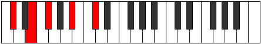

# Mode Phradic

## Links

- [Documentation](index.md)
- [Scales Index](Scales.md)
- [Modes Index](Modes.md)
- [Chords Index](Chords.md)

## Parent Scale

[Daric](ScaleDaric.md)

## Number

[553](https://ianring.com/musictheory/scales/553)

## Perfection

- 1 Perfect notes
- 3 Perfect notes

## Perfection Profile

[false false true false]

## Permutations

| Tonic | Notes | Signature | Illustration | Audio |
|-------|-------|-----------|--------------|-------|
| [C](ModeCNaturalPhradic.md) | **C**, **D#**, F, **A**, **C** | C |  | [midi](ModeCNaturalPhradic.mid) [ogg](ModeCNaturalPhradic.ogg) |
| [C#](ModeCSharpPhradic.md) | **C#**, **E**, F#, **A#**, **C#** | C |  | [midi](ModeCSharpPhradic.mid) [ogg](ModeCSharpPhradic.ogg) |
| [Db](ModeDFlatPhradic.md) | **Db**, **E**, Gb, **Bb**, **Db** | C |  | [midi](ModeDFlatPhradic.mid) [ogg](ModeDFlatPhradic.ogg) |
| [D](ModeDNaturalPhradic.md) | **D**, **F**, G, **B**, **D** | C |  | [midi](ModeDNaturalPhradic.mid) [ogg](ModeDNaturalPhradic.ogg) |
| [D#](ModeDSharpPhradic.md) | **D#**, **F#**, G#, **C**, **D#** | C |  | [midi](ModeDSharpPhradic.mid) [ogg](ModeDSharpPhradic.ogg) |
| [Eb](ModeEFlatPhradic.md) | **Eb**, **Gb**, Ab, **C**, **Eb** | C |  | [midi](ModeEFlatPhradic.mid) [ogg](ModeEFlatPhradic.ogg) |
| [E](ModeENaturalPhradic.md) | **E**, **G**, A, **C#**, **E** | C |  | [midi](ModeENaturalPhradic.mid) [ogg](ModeENaturalPhradic.ogg) |
| [F](ModeFNaturalPhradic.md) | **F**, **G#**, A#, **D**, **F** | C |  | [midi](ModeFNaturalPhradic.mid) [ogg](ModeFNaturalPhradic.ogg) |
| [F#](ModeFSharpPhradic.md) | **F#**, **A**, B, **D#**, **F#** | C |  | [midi](ModeFSharpPhradic.mid) [ogg](ModeFSharpPhradic.ogg) |
| [Gb](ModeGFlatPhradic.md) | **Gb**, **A**, B, **Eb**, **Gb** | C |  | [midi](ModeGFlatPhradic.mid) [ogg](ModeGFlatPhradic.ogg) |
| [G](ModeGNaturalPhradic.md) | **G**, **A#**, C, **E**, **G** | C |  | [midi](ModeGNaturalPhradic.mid) [ogg](ModeGNaturalPhradic.ogg) |
| [G#](ModeGSharpPhradic.md) | **G#**, **B**, C#, **F**, **G#** | C |  | [midi](ModeGSharpPhradic.mid) [ogg](ModeGSharpPhradic.ogg) |
| [Ab](ModeAFlatPhradic.md) | **Ab**, **B**, Db, **F**, **Ab** | C |  | [midi](ModeAFlatPhradic.mid) [ogg](ModeAFlatPhradic.ogg) |
| [A](ModeANaturalPhradic.md) | **A**, **C**, D, **F#**, **A** | C |  | [midi](ModeANaturalPhradic.mid) [ogg](ModeANaturalPhradic.ogg) |
| [A#](ModeASharpPhradic.md) | **A#**, **C#**, D#, **G**, **A#** | C |  | [midi](ModeASharpPhradic.mid) [ogg](ModeASharpPhradic.ogg) |
| [Bb](ModeBFlatPhradic.md) | **Bb**, **Db**, Eb, **G**, **Bb** | C |  | [midi](ModeBFlatPhradic.mid) [ogg](ModeBFlatPhradic.ogg) |
| [B](ModeBNaturalPhradic.md) | **B**, **D**, E, **G#**, **B** | C |  | [midi](ModeBNaturalPhradic.mid) [ogg](ModeBNaturalPhradic.ogg) |
