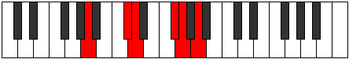

# Mode Phraditonic

## Links

- [Documentation](index.md)
- [Scales Index](Scales.md)
- [Modes Index](Modes.md)
- [Chords Index](Chords.md)

## Parent Scale

[Phraditonic](ScalePhraditonic.md)

## Number

[1585](https://ianring.com/musictheory/scales/1585)

## Perfection

- 3 Perfect notes
- 2 Perfect notes

## Perfection Profile

[false false true true true]

## Permutations

| Tonic | Notes | Signature | Illustration | Audio |
|-------|-------|-----------|--------------|-------|
| [C](ModeCNaturalPhraditonic.md) | **C**, **E**, F, A, A#, **C** | C |  | [midi](ModeCNaturalPhraditonic.mid) [ogg](ModeCNaturalPhraditonic.ogg) |
| [C#](ModeCSharpPhraditonic.md) | **C#**, **F**, F#, A#, B, **C#** | C |  | [midi](ModeCSharpPhraditonic.mid) [ogg](ModeCSharpPhraditonic.ogg) |
| [Db](ModeDFlatPhraditonic.md) | **Db**, **F**, Gb, Bb, B, **Db** | C |  | [midi](ModeDFlatPhraditonic.mid) [ogg](ModeDFlatPhraditonic.ogg) |
| [D](ModeDNaturalPhraditonic.md) | **D**, **F#**, G, B, C, **D** | C |  | [midi](ModeDNaturalPhraditonic.mid) [ogg](ModeDNaturalPhraditonic.ogg) |
| [D#](ModeDSharpPhraditonic.md) | **D#**, **G**, G#, C, C#, **D#** | C |  | [midi](ModeDSharpPhraditonic.mid) [ogg](ModeDSharpPhraditonic.ogg) |
| [Eb](ModeEFlatPhraditonic.md) | **Eb**, **G**, Ab, C, Db, **Eb** | C |  | [midi](ModeEFlatPhraditonic.mid) [ogg](ModeEFlatPhraditonic.ogg) |
| [E](ModeENaturalPhraditonic.md) | **E**, **G#**, A, C#, D, **E** | C |  | [midi](ModeENaturalPhraditonic.mid) [ogg](ModeENaturalPhraditonic.ogg) |
| [F](ModeFNaturalPhraditonic.md) | **F**, **A**, A#, D, D#, **F** | C |  | [midi](ModeFNaturalPhraditonic.mid) [ogg](ModeFNaturalPhraditonic.ogg) |
| [F#](ModeFSharpPhraditonic.md) | **F#**, **A#**, B, D#, E, **F#** | C |  | [midi](ModeFSharpPhraditonic.mid) [ogg](ModeFSharpPhraditonic.ogg) |
| [Gb](ModeGFlatPhraditonic.md) | **Gb**, **Bb**, B, Eb, E, **Gb** | C |  | [midi](ModeGFlatPhraditonic.mid) [ogg](ModeGFlatPhraditonic.ogg) |
| [G](ModeGNaturalPhraditonic.md) | **G**, **B**, C, E, F, **G** | C |  | [midi](ModeGNaturalPhraditonic.mid) [ogg](ModeGNaturalPhraditonic.ogg) |
| [G#](ModeGSharpPhraditonic.md) | **G#**, **C**, C#, F, F#, **G#** | C |  | [midi](ModeGSharpPhraditonic.mid) [ogg](ModeGSharpPhraditonic.ogg) |
| [Ab](ModeAFlatPhraditonic.md) | **Ab**, **C**, Db, F, Gb, **Ab** | C |  | [midi](ModeAFlatPhraditonic.mid) [ogg](ModeAFlatPhraditonic.ogg) |
| [A](ModeANaturalPhraditonic.md) | **A**, **C#**, D, F#, G, **A** | C |  | [midi](ModeANaturalPhraditonic.mid) [ogg](ModeANaturalPhraditonic.ogg) |
| [A#](ModeASharpPhraditonic.md) | **A#**, **D**, D#, G, G#, **A#** | C |  | [midi](ModeASharpPhraditonic.mid) [ogg](ModeASharpPhraditonic.ogg) |
| [Bb](ModeBFlatPhraditonic.md) | **Bb**, **D**, Eb, G, Ab, **Bb** | C |  | [midi](ModeBFlatPhraditonic.mid) [ogg](ModeBFlatPhraditonic.ogg) |
| [B](ModeBNaturalPhraditonic.md) | **B**, **D#**, E, G#, A, **B** | C |  | [midi](ModeBNaturalPhraditonic.mid) [ogg](ModeBNaturalPhraditonic.ogg) |
