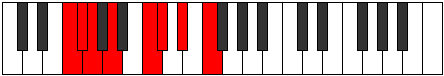

# Mode Phragian

## Links

- [Documentation](README.md)
- [Scales Index](Scales.md)
- [Modes Index](Modes.md)
- [Chords Index](Chords.md)

## Parent Scale

[Korian](ScaleKorian.md)

## Number

[1431](https://ianring.com/musictheory/scales/1431)

## Transposition

1, 1, 2, 3, 1, 2, 2

## Chord Pattern

ii, ii, IV⁺, v⁰, VIb5, VIb5, vii⁰, vii⁰

## Perfection

- 3 Perfect notes
- 4 Perfect notes

## Perfection Profile

[true true false false true false false]

## Permutations

| Tonic | Notes | Signature | Illustration | Audio |
|-------|-------|-----------|--------------|-------|
| [C](ModeCNaturalPhragian.md) | C, Db, **Ebb**, **Fb**, G, **Ab**, **Bb**, C | C |  | [midi](https://github.com/edipermadi/music/blob/main/docs/ModeCNaturalPhragian.mid?raw=true) |
| [C#](ModeCSharpPhragian.md) | C#, D, **Eb**, **F**, G#, **A**, **B**, C# | C |  | [midi](https://github.com/edipermadi/music/blob/main/docs/ModeCSharpPhragian.mid?raw=true) |
| [Db](ModeDFlatPhragian.md) | Db, Ebb, **Fbb**, **Gbb**, Ab, **Bbb**, **Cb**, Db | C |  | [midi](https://github.com/edipermadi/music/blob/main/docs/ModeDFlatPhragian.mid?raw=true) |
| [D](ModeDNaturalPhragian.md) | D, Eb, **Fb**, **Gb**, A, **Bb**, **C**, D | C |  | [midi](https://github.com/edipermadi/music/blob/main/docs/ModeDNaturalPhragian.mid?raw=true) |
| [D#](ModeDSharpPhragian.md) | D#, E, **F**, **G**, A#, **B**, **C#**, D# | C |  | [midi](https://github.com/edipermadi/music/blob/main/docs/ModeDSharpPhragian.mid?raw=true) |
| [Eb](ModeEFlatPhragian.md) | Eb, Fb, **Gbb**, **Abb**, Bb, **Cb**, **Db**, Eb | C |  | [midi](https://github.com/edipermadi/music/blob/main/docs/ModeEFlatPhragian.mid?raw=true) |
| [E](ModeENaturalPhragian.md) | E, F, **Gb**, **Ab**, B, **C**, **D**, E | C |  | [midi](https://github.com/edipermadi/music/blob/main/docs/ModeENaturalPhragian.mid?raw=true) |
| [F](ModeFNaturalPhragian.md) | F, Gb, **Abb**, **Bbb**, C, **Db**, **Eb**, F | C |  | [midi](https://github.com/edipermadi/music/blob/main/docs/ModeFNaturalPhragian.mid?raw=true) |
| [F#](ModeFSharpPhragian.md) | F#, G, **Ab**, **Bb**, C#, **D**, **E**, F# | C |  | [midi](https://github.com/edipermadi/music/blob/main/docs/ModeFSharpPhragian.mid?raw=true) |
| [Gb](ModeGFlatPhragian.md) | Gb, Abb, **Bbbb**, **Cbb**, Db, **Ebb**, **Fb**, Gb | C |  | [midi](https://github.com/edipermadi/music/blob/main/docs/ModeGFlatPhragian.mid?raw=true) |
| [G](ModeGNaturalPhragian.md) | G, Ab, **Bbb**, **Cb**, D, **Eb**, **F**, G | C |  | [midi](https://github.com/edipermadi/music/blob/main/docs/ModeGNaturalPhragian.mid?raw=true) |
| [G#](ModeGSharpPhragian.md) | G#, A, **Bb**, **C**, D#, **E**, **F#**, G# | C |  | [midi](https://github.com/edipermadi/music/blob/main/docs/ModeGSharpPhragian.mid?raw=true) |
| [Ab](ModeAFlatPhragian.md) | Ab, Bbb, **Cbb**, **Dbb**, Eb, **Fb**, **Gb**, Ab | C |  | [midi](https://github.com/edipermadi/music/blob/main/docs/ModeAFlatPhragian.mid?raw=true) |
| [A](ModeANaturalPhragian.md) | A, Bb, **Cb**, **Db**, E, **F**, **G**, A | C |  | [midi](https://github.com/edipermadi/music/blob/main/docs/ModeANaturalPhragian.mid?raw=true) |
| [A#](ModeASharpPhragian.md) | A#, B, **C**, **D**, E#, **F#**, **G#**, A# | C |  | [midi](https://github.com/edipermadi/music/blob/main/docs/ModeASharpPhragian.mid?raw=true) |
| [Bb](ModeBFlatPhragian.md) | Bb, Cb, **Dbb**, **Ebb**, F, **Gb**, **Ab**, Bb | C |  | [midi](https://github.com/edipermadi/music/blob/main/docs/ModeBFlatPhragian.mid?raw=true) |
| [B](ModeBNaturalPhragian.md) | B, C, **Db**, **Eb**, F#, **G**, **A**, B | C |  | [midi](https://github.com/edipermadi/music/blob/main/docs/ModeBNaturalPhragian.mid?raw=true) |
