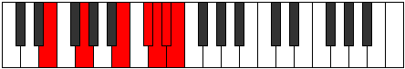

# Mode Phragimic

## Links

- [Documentation](index.md)
- [Scales Index](Scales.md)
- [Modes Index](Modes.md)
- [Chords Index](Chords.md)

## Parent Scale

[Kocrimic](ScaleKocrimic.md)

## Number

[3721](https://ianring.com/musictheory/scales/3721)

## Perfection

- 2 Perfect notes
- 4 Perfect notes

## Perfection Profile

[true true false false false false]

## Permutations

| Tonic | Notes | Signature | Illustration | Audio |
|-------|-------|-----------|--------------|-------|
| [C](ModeCNaturalPhragimic.md) | C, D#, **E###**, **Cbbb**, **Cbb**, **Dbbb**, C | C |  | [midi](ModeCNaturalPhragimic.mid) [ogg](ModeCNaturalPhragimic.ogg) |
| [C#](ModeCSharpPhragimic.md) | C#, D##, **F###**, **G###**, **A##**, **B#**, C# | C |  | [midi](ModeCSharpPhragimic.mid) [ogg](ModeCSharpPhragimic.ogg) |
| [Db](ModeDFlatPhragimic.md) | Db, E, **F###**, **G###**, **A##**, **B#**, Db | C |  | [midi](ModeDFlatPhragimic.mid) [ogg](ModeDFlatPhragimic.ogg) |
| [D](ModeDNaturalPhragimic.md) | D, E#, **Cbbb**, **Dbbb**, **Dbb**, **Ebbb**, D | C |  | [midi](ModeDNaturalPhragimic.mid) [ogg](ModeDNaturalPhragimic.ogg) |
| [D#](ModeDSharpPhragimic.md) | D#, E##, **Cbb**, **Dbb**, **Ebbb**, **Fbbb**, D# | C |  | [midi](ModeDSharpPhragimic.mid) [ogg](ModeDSharpPhragimic.ogg) |
| [Eb](ModeEFlatPhragimic.md) | Eb, F#, **G###**, **A###**, **B##**, **C##**, Eb | C |  | [midi](ModeEFlatPhragimic.mid) [ogg](ModeEFlatPhragimic.ogg) |
| [E](ModeENaturalPhragimic.md) | E, F##, **Cb**, **Db**, **Ebb**, **Fbb**, E | C |  | [midi](ModeENaturalPhragimic.mid) [ogg](ModeENaturalPhragimic.ogg) |
| [F](ModeFNaturalPhragimic.md) | F, G#, **A###**, **B###**, **C###**, **D##**, F | C |  | [midi](ModeFNaturalPhragimic.mid) [ogg](ModeFNaturalPhragimic.ogg) |
| [F#](ModeFSharpPhragimic.md) | F#, G##, **Db**, **Eb**, **Fb**, **Gbb**, F# | C |  | [midi](ModeFSharpPhragimic.mid) [ogg](ModeFSharpPhragimic.ogg) |
| [Gb](ModeGFlatPhragimic.md) | Gb, A, **B##**, **C###**, **D##**, **E#**, Gb | C |  | [midi](ModeGFlatPhragimic.mid) [ogg](ModeGFlatPhragimic.ogg) |
| [G](ModeGNaturalPhragimic.md) | G, A#, **B###**, **D##**, **E#**, **F#**, G | C |  | [midi](ModeGNaturalPhragimic.mid) [ogg](ModeGNaturalPhragimic.ogg) |
| [G#](ModeGSharpPhragimic.md) | G#, A##, **C###**, **D###**, **E##**, **F##**, G# | C |  | [midi](ModeGSharpPhragimic.mid) [ogg](ModeGSharpPhragimic.ogg) |
| [Ab](ModeAFlatPhragimic.md) | Ab, B, **C###**, **D###**, **E##**, **F##**, Ab | C |  | [midi](ModeAFlatPhragimic.mid) [ogg](ModeAFlatPhragimic.ogg) |
| [A](ModeANaturalPhragimic.md) | A, B#, **D##**, **E##**, **F##**, **G#**, A | C |  | [midi](ModeANaturalPhragimic.mid) [ogg](ModeANaturalPhragimic.ogg) |
| [A#](ModeASharpPhragimic.md) | A#, B##, **D###**, **E###**, **F###**, **G##**, A# | C |  | [midi](ModeASharpPhragimic.mid) [ogg](ModeASharpPhragimic.ogg) |
| [Bb](ModeBFlatPhragimic.md) | Bb, C#, **D###**, **E###**, **F###**, **G##**, Bb | C |  | [midi](ModeBFlatPhragimic.mid) [ogg](ModeBFlatPhragimic.ogg) |
| [B](ModeBNaturalPhragimic.md) | B, C##, **E##**, **F###**, **G##**, **A#**, B | C |  | [midi](ModeBNaturalPhragimic.mid) [ogg](ModeBNaturalPhragimic.ogg) |
