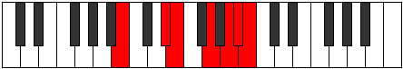

# Mode Phralimic

## Links

- [Documentation](index.md)
- [Scales Index](Scales.md)
- [Modes Index](Modes.md)
- [Chords Index](Chords.md)

## Parent Scale

[Phralimic](ScalePhralimic.md)

## Number

[3377](https://ianring.com/musictheory/scales/3377)

## Perfection

- 3 Perfect notes
- 3 Perfect notes

## Perfection Profile

[false true true false true false]

## Permutations

| Tonic | Notes | Signature | Illustration | Audio |
|-------|-------|-----------|--------------|-------|
| [C](ModeCNaturalPhralimic.md) | **C**, D##, E#, **F###**, G###, **A##**, **C** | C |  | [midi](ModeCNaturalPhralimic.mid) [ogg](ModeCNaturalPhralimic.ogg) |
| [C#](ModeCSharpPhralimic.md) | **C#**, D###, E##, **Cbbb**, Dbbb, **Dbb**, **C#** | C |  | [midi](ModeCSharpPhralimic.mid) [ogg](ModeCSharpPhralimic.ogg) |
| [Db](ModeDFlatPhralimic.md) | **Db**, E#, F#, **G##**, A##, **B#**, **Db** | C |  | [midi](ModeDFlatPhralimic.mid) [ogg](ModeDFlatPhralimic.ogg) |
| [D](ModeDNaturalPhralimic.md) | **D**, E##, F##, **G###**, A###, **B##**, **D** | C |  | [midi](ModeDNaturalPhralimic.mid) [ogg](ModeDNaturalPhralimic.ogg) |
| [D#](ModeDSharpPhralimic.md) | **D#**, E###, F###, **Cb**, Db, **Ebb**, **D#** | C |  | [midi](ModeDSharpPhralimic.mid) [ogg](ModeDSharpPhralimic.ogg) |
| [Eb](ModeEFlatPhralimic.md) | **Eb**, F##, G#, **A##**, B##, **C##**, **Eb** | C |  | [midi](ModeEFlatPhralimic.mid) [ogg](ModeEFlatPhralimic.ogg) |
| [E](ModeENaturalPhralimic.md) | **E**, F###, G##, **A###**, B###, **C###**, **E** | C |  | [midi](ModeENaturalPhralimic.mid) [ogg](ModeENaturalPhralimic.ogg) |
| [F](ModeFNaturalPhralimic.md) | **F**, G##, A#, **B##**, C###, **D##**, **F** | C |  | [midi](ModeFNaturalPhralimic.mid) [ogg](ModeFNaturalPhralimic.ogg) |
| [F#](ModeFSharpPhralimic.md) | **F#**, G###, A##, **B###**, D##, **E#**, **F#** | C |  | [midi](ModeFSharpPhralimic.mid) [ogg](ModeFSharpPhralimic.ogg) |
| [Gb](ModeGFlatPhralimic.md) | **Gb**, A#, B, **C##**, D##, **E#**, **Gb** | C |  | [midi](ModeGFlatPhralimic.mid) [ogg](ModeGFlatPhralimic.ogg) |
| [G](ModeGNaturalPhralimic.md) | **G**, A##, B#, **C###**, D###, **E##**, **G** | C |  | [midi](ModeGNaturalPhralimic.mid) [ogg](ModeGNaturalPhralimic.ogg) |
| [G#](ModeGSharpPhralimic.md) | **G#**, A###, B##, **D##**, E##, **F##**, **G#** | C |  | [midi](ModeGSharpPhralimic.mid) [ogg](ModeGSharpPhralimic.ogg) |
| [Ab](ModeAFlatPhralimic.md) | **Ab**, B#, C#, **D##**, E##, **F##**, **Ab** | C |  | [midi](ModeAFlatPhralimic.mid) [ogg](ModeAFlatPhralimic.ogg) |
| [A](ModeANaturalPhralimic.md) | **A**, B##, C##, **D###**, E###, **F###**, **A** | C |  | [midi](ModeANaturalPhralimic.mid) [ogg](ModeANaturalPhralimic.ogg) |
| [A#](ModeASharpPhralimic.md) | **A#**, B###, C###, **E##**, F###, **G##**, **A#** | C |  | [midi](ModeASharpPhralimic.mid) [ogg](ModeASharpPhralimic.ogg) |
| [Bb](ModeBFlatPhralimic.md) | **Bb**, C##, D#, **E##**, F###, **G##**, **Bb** | C |  | [midi](ModeBFlatPhralimic.mid) [ogg](ModeBFlatPhralimic.ogg) |
| [B](ModeBNaturalPhralimic.md) | **B**, C###, D##, **E###**, Cbbb, **Cbb**, **B** | C |  | [midi](ModeBNaturalPhralimic.mid) [ogg](ModeBNaturalPhralimic.ogg) |
