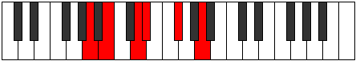

# Mode Phralitonic

## Links

- [Documentation](index.md)
- [Scales Index](Scales.md)
- [Modes Index](Modes.md)
- [Chords Index](Chords.md)

## Parent Scale

[Thoditonic](ScaleThoditonic.md)

## Number

[613](https://ianring.com/musictheory/scales/613)

## Interval Pattern

2, 3, 1, 3, 3

## Chord Pattern

ii, II, III, iv⁰

## Perfection

- 2 Perfect notes
- 3 Perfect notes

## Perfection Profile

[false true true false false]

## Permutations

| Tonic | Notes | Signature | Illustration | Audio |
|-------|-------|-----------|--------------|-------|
| [C](ModeCNaturalPhralitonic.md) | **C**, D, F, **F#**, **A**, **C** | C |  | [midi](https://github.com/edipermadi/music/blob/main/docs/ModeCNaturalPhralitonic.mid?raw=true) |
| [C#](ModeCSharpPhralitonic.md) | **C#**, D#, F#, **G**, **A#**, **C#** | C |  | [midi](https://github.com/edipermadi/music/blob/main/docs/ModeCSharpPhralitonic.mid?raw=true) |
| [Db](ModeDFlatPhralitonic.md) | **Db**, Eb, Gb, **G**, **Bb**, **Db** | C |  | [midi](https://github.com/edipermadi/music/blob/main/docs/ModeDFlatPhralitonic.mid?raw=true) |
| [D](ModeDNaturalPhralitonic.md) | **D**, E, G, **G#**, **B**, **D** | C |  | [midi](https://github.com/edipermadi/music/blob/main/docs/ModeDNaturalPhralitonic.mid?raw=true) |
| [D#](ModeDSharpPhralitonic.md) | **D#**, F, G#, **A**, **C**, **D#** | C |  | [midi](https://github.com/edipermadi/music/blob/main/docs/ModeDSharpPhralitonic.mid?raw=true) |
| [Eb](ModeEFlatPhralitonic.md) | **Eb**, F, Ab, **A**, **C**, **Eb** | C |  | [midi](https://github.com/edipermadi/music/blob/main/docs/ModeEFlatPhralitonic.mid?raw=true) |
| [E](ModeENaturalPhralitonic.md) | **E**, F#, A, **A#**, **C#**, **E** | C |  | [midi](https://github.com/edipermadi/music/blob/main/docs/ModeENaturalPhralitonic.mid?raw=true) |
| [F](ModeFNaturalPhralitonic.md) | **F**, G, A#, **B**, **D**, **F** | C |  | [midi](https://github.com/edipermadi/music/blob/main/docs/ModeFNaturalPhralitonic.mid?raw=true) |
| [F#](ModeFSharpPhralitonic.md) | **F#**, G#, B, **C**, **D#**, **F#** | C |  | [midi](https://github.com/edipermadi/music/blob/main/docs/ModeFSharpPhralitonic.mid?raw=true) |
| [Gb](ModeGFlatPhralitonic.md) | **Gb**, Ab, B, **C**, **Eb**, **Gb** | C |  | [midi](https://github.com/edipermadi/music/blob/main/docs/ModeGFlatPhralitonic.mid?raw=true) |
| [G](ModeGNaturalPhralitonic.md) | **G**, A, C, **C#**, **E**, **G** | C |  | [midi](https://github.com/edipermadi/music/blob/main/docs/ModeGNaturalPhralitonic.mid?raw=true) |
| [G#](ModeGSharpPhralitonic.md) | **G#**, A#, C#, **D**, **F**, **G#** | C |  | [midi](https://github.com/edipermadi/music/blob/main/docs/ModeGSharpPhralitonic.mid?raw=true) |
| [Ab](ModeAFlatPhralitonic.md) | **Ab**, Bb, Db, **D**, **F**, **Ab** | C |  | [midi](https://github.com/edipermadi/music/blob/main/docs/ModeAFlatPhralitonic.mid?raw=true) |
| [A](ModeANaturalPhralitonic.md) | **A**, B, D, **D#**, **F#**, **A** | C |  | [midi](https://github.com/edipermadi/music/blob/main/docs/ModeANaturalPhralitonic.mid?raw=true) |
| [A#](ModeASharpPhralitonic.md) | **A#**, C, D#, **E**, **G**, **A#** | C |  | [midi](https://github.com/edipermadi/music/blob/main/docs/ModeASharpPhralitonic.mid?raw=true) |
| [Bb](ModeBFlatPhralitonic.md) | **Bb**, C, Eb, **E**, **G**, **Bb** | C |  | [midi](https://github.com/edipermadi/music/blob/main/docs/ModeBFlatPhralitonic.mid?raw=true) |
| [B](ModeBNaturalPhralitonic.md) | **B**, C#, E, **F**, **G#**, **B** | C |  | [midi](https://github.com/edipermadi/music/blob/main/docs/ModeBNaturalPhralitonic.mid?raw=true) |
