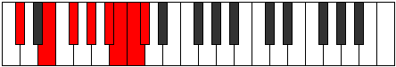
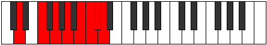

# Mode Phraptian

## Links

- [Documentation](index.md)
- [Scales Index](Scales.md)
- [Modes Index](Modes.md)
- [Chords Index](Chords.md)

## Parent Scale

[Phraptian](ScalePhraptian.md)

## Number

[3753](https://ianring.com/musictheory/scales/3753)

## Perfection

- 4 Perfect notes
- 3 Perfect notes

## Perfection Profile

[true true true false false true false]

## Permutations

| Tonic | Notes | Signature | Illustration | Audio |
|-------|-------|-----------|--------------|-------|
| [C](ModeCNaturalPhraptian.md) | C, D#, E#, **F##**, **G##**, A#, **B**, C | C |  | [midi](ModeCNaturalPhraptian.mid) [ogg](ModeCNaturalPhraptian.ogg) |
| [C#](ModeCSharpPhraptian.md) | C#, D##, E##, **F###**, **G###**, A##, **B#**, C# | C |  | [midi](ModeCSharpPhraptian.mid) [ogg](ModeCSharpPhraptian.ogg) |
| [Db](ModeDFlatPhraptian.md) | Db, E, F#, **G#**, **A#**, B, **C**, Db | C |  | [midi](ModeDFlatPhraptian.mid) [ogg](ModeDFlatPhraptian.ogg) |
| [D](ModeDNaturalPhraptian.md) | D, E#, F##, **G##**, **A##**, B#, **C#**, D | C |  | [midi](ModeDNaturalPhraptian.mid) [ogg](ModeDNaturalPhraptian.ogg) |
| [D#](ModeDSharpPhraptian.md) | D#, E##, F###, **G###**, **A###**, B##, **C##**, D# | C |  | [midi](ModeDSharpPhraptian.mid) [ogg](ModeDSharpPhraptian.ogg) |
| [Eb](ModeEFlatPhraptian.md) | Eb, F#, G#, **A#**, **B#**, C#, **D**, Eb | C |  | [midi](ModeEFlatPhraptian.mid) [ogg](ModeEFlatPhraptian.ogg) |
| [E](ModeENaturalPhraptian.md) | E, F##, G##, **A##**, **B##**, C##, **D#**, E | C |  | [midi](ModeENaturalPhraptian.mid) [ogg](ModeENaturalPhraptian.ogg) |
| [F](ModeFNaturalPhraptian.md) | F, G#, A#, **B#**, **C##**, D#, **E**, F | C |  | [midi](ModeFNaturalPhraptian.mid) [ogg](ModeFNaturalPhraptian.ogg) |
| [F#](ModeFSharpPhraptian.md) | F#, G##, A##, **B##**, **C###**, D##, **E#**, F# | C |  | [midi](ModeFSharpPhraptian.mid) [ogg](ModeFSharpPhraptian.ogg) |
| [Gb](ModeGFlatPhraptian.md) | Gb, A, B, **C#**, **D#**, E, **F**, Gb | C |  | [midi](ModeGFlatPhraptian.mid) [ogg](ModeGFlatPhraptian.ogg) |
| [G](ModeGNaturalPhraptian.md) | G, A#, B#, **C##**, **D##**, E#, **F#**, G | C |  | [midi](ModeGNaturalPhraptian.mid) [ogg](ModeGNaturalPhraptian.ogg) |
| [G#](ModeGSharpPhraptian.md) | G#, A##, B##, **C###**, **D###**, E##, **F##**, G# | C |  | [midi](ModeGSharpPhraptian.mid) [ogg](ModeGSharpPhraptian.ogg) |
| [Ab](ModeAFlatPhraptian.md) | Ab, B, C#, **D#**, **E#**, F#, **G**, Ab | C |  | [midi](ModeAFlatPhraptian.mid) [ogg](ModeAFlatPhraptian.ogg) |
| [A](ModeANaturalPhraptian.md) | A, B#, C##, **D##**, **E##**, F##, **G#**, A | C |  | [midi](ModeANaturalPhraptian.mid) [ogg](ModeANaturalPhraptian.ogg) |
| [A#](ModeASharpPhraptian.md) | A#, B##, C###, **D###**, **E###**, F###, **G##**, A# | C |  | [midi](ModeASharpPhraptian.mid) [ogg](ModeASharpPhraptian.ogg) |
| [Bb](ModeBFlatPhraptian.md) | Bb, C#, D#, **E#**, **F##**, G#, **A**, Bb | C |  | [midi](ModeBFlatPhraptian.mid) [ogg](ModeBFlatPhraptian.ogg) |
| [B](ModeBNaturalPhraptian.md) | B, C##, D##, **E##**, **F###**, G##, **A#**, B | C |  | [midi](ModeBNaturalPhraptian.mid) [ogg](ModeBNaturalPhraptian.ogg) |
