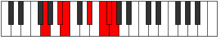

# Mode Phraptimic

## Links

- [Documentation](index.md)
- [Scales Index](Scales.md)
- [Modes Index](Modes.md)
- [Chords Index](Chords.md)

## Parent Scale

[Aerycrimic](ScaleAerycrimic.md)

## Number

[3353](https://ianring.com/musictheory/scales/3353)

## Interval Pattern

3, 1, 4, 2, 1, 1

## Chord Pattern

iv

## Perfection

- 3 Perfect notes
- 3 Perfect notes

## Perfection Profile

[false true true true false false]

## Permutations

| Tonic | Notes | Signature | Illustration | Audio |
|-------|-------|-----------|--------------|-------|
| [C](ModeCNaturalPhraptimic.md) | **C**, D#, E, F###, **G###**, **A##**, **C** | C |  | [midi](https://github.com/edipermadi/music/blob/main/docs/ModeCNaturalPhraptimic.mid?raw=true) |
| [C#](ModeCSharpPhraptimic.md) | **C#**, D##, E#, Cbbb, **Dbbb**, **Dbb**, **C#** | C |  | [midi](https://github.com/edipermadi/music/blob/main/docs/ModeCSharpPhraptimic.mid?raw=true) |
| [Db](ModeDFlatPhraptimic.md) | **Db**, E, F, G##, **A##**, **B#**, **Db** | C |  | [midi](https://github.com/edipermadi/music/blob/main/docs/ModeDFlatPhraptimic.mid?raw=true) |
| [D](ModeDNaturalPhraptimic.md) | **D**, E#, F#, G###, **A###**, **B##**, **D** | C |  | [midi](https://github.com/edipermadi/music/blob/main/docs/ModeDNaturalPhraptimic.mid?raw=true) |
| [D#](ModeDSharpPhraptimic.md) | **D#**, E##, F##, Cb, **Db**, **Ebb**, **D#** | C |  | [midi](https://github.com/edipermadi/music/blob/main/docs/ModeDSharpPhraptimic.mid?raw=true) |
| [Eb](ModeEFlatPhraptimic.md) | **Eb**, F#, G, A##, **B##**, **C##**, **Eb** | C |  | [midi](https://github.com/edipermadi/music/blob/main/docs/ModeEFlatPhraptimic.mid?raw=true) |
| [E](ModeENaturalPhraptimic.md) | **E**, F##, G#, A###, **B###**, **C###**, **E** | C |  | [midi](https://github.com/edipermadi/music/blob/main/docs/ModeENaturalPhraptimic.mid?raw=true) |
| [F](ModeFNaturalPhraptimic.md) | **F**, G#, A, B##, **C###**, **D##**, **F** | C |  | [midi](https://github.com/edipermadi/music/blob/main/docs/ModeFNaturalPhraptimic.mid?raw=true) |
| [F#](ModeFSharpPhraptimic.md) | **F#**, G##, A#, B###, **D##**, **E#**, **F#** | C |  | [midi](https://github.com/edipermadi/music/blob/main/docs/ModeFSharpPhraptimic.mid?raw=true) |
| [Gb](ModeGFlatPhraptimic.md) | **Gb**, A, Bb, C##, **D##**, **E#**, **Gb** | C |  | [midi](https://github.com/edipermadi/music/blob/main/docs/ModeGFlatPhraptimic.mid?raw=true) |
| [G](ModeGNaturalPhraptimic.md) | **G**, A#, B, C###, **D###**, **E##**, **G** | C |  | [midi](https://github.com/edipermadi/music/blob/main/docs/ModeGNaturalPhraptimic.mid?raw=true) |
| [G#](ModeGSharpPhraptimic.md) | **G#**, A##, B#, D##, **E##**, **F##**, **G#** | C |  | [midi](https://github.com/edipermadi/music/blob/main/docs/ModeGSharpPhraptimic.mid?raw=true) |
| [Ab](ModeAFlatPhraptimic.md) | **Ab**, B, C, D##, **E##**, **F##**, **Ab** | C |  | [midi](https://github.com/edipermadi/music/blob/main/docs/ModeAFlatPhraptimic.mid?raw=true) |
| [A](ModeANaturalPhraptimic.md) | **A**, B#, C#, D###, **E###**, **F###**, **A** | C |  | [midi](https://github.com/edipermadi/music/blob/main/docs/ModeANaturalPhraptimic.mid?raw=true) |
| [A#](ModeASharpPhraptimic.md) | **A#**, B##, C##, E##, **F###**, **G##**, **A#** | C |  | [midi](https://github.com/edipermadi/music/blob/main/docs/ModeASharpPhraptimic.mid?raw=true) |
| [Bb](ModeBFlatPhraptimic.md) | **Bb**, C#, D, E##, **F###**, **G##**, **Bb** | C |  | [midi](https://github.com/edipermadi/music/blob/main/docs/ModeBFlatPhraptimic.mid?raw=true) |
| [B](ModeBNaturalPhraptimic.md) | **B**, C##, D#, E###, **Cbbb**, **Cbb**, **B** | C |  | [midi](https://github.com/edipermadi/music/blob/main/docs/ModeBNaturalPhraptimic.mid?raw=true) |
