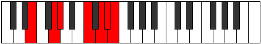
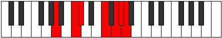

# Mode Phraptimic

## Links

- [Documentation](index.md)
- [Scales Index](Scales.md)
- [Modes Index](Modes.md)
- [Chords Index](Chords.md)

## Parent Scale

[Aerycrimic](ScaleAerycrimic.md)

## Number

[3353](https://ianring.com/musictheory/scales/3353)

## Perfection

- 3 Perfect notes
- 3 Perfect notes

## Perfection Profile

[false true true true false false]

## Permutations

| Tonic | Notes | Signature | Illustration | Audio |
|-------|-------|-----------|--------------|-------|
| [C](ModeCNaturalPhraptimic.md) | **C**, D#, E, F###, **G###**, **A##**, **C** | C |  | [midi](ModeCNaturalPhraptimic.mid) [ogg](ModeCNaturalPhraptimic.ogg) |
| [C#](ModeCSharpPhraptimic.md) | **C#**, D##, E#, Cbbb, **Dbbb**, **Dbb**, **C#** | C |  | [midi](ModeCSharpPhraptimic.mid) [ogg](ModeCSharpPhraptimic.ogg) |
| [Db](ModeDFlatPhraptimic.md) | **Db**, E, F, G##, **A##**, **B#**, **Db** | C |  | [midi](ModeDFlatPhraptimic.mid) [ogg](ModeDFlatPhraptimic.ogg) |
| [D](ModeDNaturalPhraptimic.md) | **D**, E#, F#, G###, **A###**, **B##**, **D** | C |  | [midi](ModeDNaturalPhraptimic.mid) [ogg](ModeDNaturalPhraptimic.ogg) |
| [D#](ModeDSharpPhraptimic.md) | **D#**, E##, F##, Cb, **Db**, **Ebb**, **D#** | C |  | [midi](ModeDSharpPhraptimic.mid) [ogg](ModeDSharpPhraptimic.ogg) |
| [Eb](ModeEFlatPhraptimic.md) | **Eb**, F#, G, A##, **B##**, **C##**, **Eb** | C |  | [midi](ModeEFlatPhraptimic.mid) [ogg](ModeEFlatPhraptimic.ogg) |
| [E](ModeENaturalPhraptimic.md) | **E**, F##, G#, A###, **B###**, **C###**, **E** | C |  | [midi](ModeENaturalPhraptimic.mid) [ogg](ModeENaturalPhraptimic.ogg) |
| [F](ModeFNaturalPhraptimic.md) | **F**, G#, A, B##, **C###**, **D##**, **F** | C |  | [midi](ModeFNaturalPhraptimic.mid) [ogg](ModeFNaturalPhraptimic.ogg) |
| [F#](ModeFSharpPhraptimic.md) | **F#**, G##, A#, B###, **D##**, **E#**, **F#** | C |  | [midi](ModeFSharpPhraptimic.mid) [ogg](ModeFSharpPhraptimic.ogg) |
| [Gb](ModeGFlatPhraptimic.md) | **Gb**, A, Bb, C##, **D##**, **E#**, **Gb** | C |  | [midi](ModeGFlatPhraptimic.mid) [ogg](ModeGFlatPhraptimic.ogg) |
| [G](ModeGNaturalPhraptimic.md) | **G**, A#, B, C###, **D###**, **E##**, **G** | C |  | [midi](ModeGNaturalPhraptimic.mid) [ogg](ModeGNaturalPhraptimic.ogg) |
| [G#](ModeGSharpPhraptimic.md) | **G#**, A##, B#, D##, **E##**, **F##**, **G#** | C |  | [midi](ModeGSharpPhraptimic.mid) [ogg](ModeGSharpPhraptimic.ogg) |
| [Ab](ModeAFlatPhraptimic.md) | **Ab**, B, C, D##, **E##**, **F##**, **Ab** | C |  | [midi](ModeAFlatPhraptimic.mid) [ogg](ModeAFlatPhraptimic.ogg) |
| [A](ModeANaturalPhraptimic.md) | **A**, B#, C#, D###, **E###**, **F###**, **A** | C |  | [midi](ModeANaturalPhraptimic.mid) [ogg](ModeANaturalPhraptimic.ogg) |
| [A#](ModeASharpPhraptimic.md) | **A#**, B##, C##, E##, **F###**, **G##**, **A#** | C |  | [midi](ModeASharpPhraptimic.mid) [ogg](ModeASharpPhraptimic.ogg) |
| [Bb](ModeBFlatPhraptimic.md) | **Bb**, C#, D, E##, **F###**, **G##**, **Bb** | C |  | [midi](ModeBFlatPhraptimic.mid) [ogg](ModeBFlatPhraptimic.ogg) |
| [B](ModeBNaturalPhraptimic.md) | **B**, C##, D#, E###, **Cbbb**, **Cbb**, **B** | C |  | [midi](ModeBNaturalPhraptimic.mid) [ogg](ModeBNaturalPhraptimic.ogg) |
