# Mode Phraptyllic

## Links

- [Documentation](index.md)
- [Scales Index](Scales.md)
- [Modes Index](Modes.md)
- [Chords Index](Chords.md)

## Parent Scale

[Thagyllic](ScaleThagyllic.md)

## Number

[2299](https://ianring.com/musictheory/scales/2299)

## Perfection

- 5 Perfect notes
- 3 Perfect notes

## Interval Pattern

1, 2, 1, 1, 1, 1, 4, 1

## Perfection Profile

[true false false true true true false true]

## Permutations

| Tonic | Notes | Signature | Illustration | Audio |
|-------|-------|-----------|--------------|-------|
| [C](ModeCNaturalPhraptyllic.md) | C, **C#**, **D#**, E, F, F#, **G**, B, C | C | 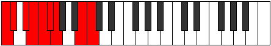 | [midi](https://github.com/edipermadi/music/blob/main/docs/ModeCNaturalPhraptyllic.mid?raw=true) |
| [C#](ModeCSharpPhraptyllic.md) | C#, **D**, **E**, F, F#, G, **G#**, C, C# | C | 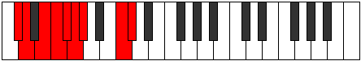 | [midi](https://github.com/edipermadi/music/blob/main/docs/ModeCSharpPhraptyllic.mid?raw=true) |
| [Db](ModeDFlatPhraptyllic.md) | Db, **D**, **E**, F, Gb, G, **Ab**, C, Db | C |  | [midi](https://github.com/edipermadi/music/blob/main/docs/ModeDFlatPhraptyllic.mid?raw=true) |
| [D](ModeDNaturalPhraptyllic.md) | D, **D#**, **F**, F#, G, G#, **A**, C#, D | C | 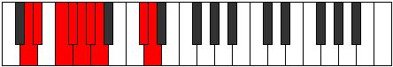 | [midi](https://github.com/edipermadi/music/blob/main/docs/ModeDNaturalPhraptyllic.mid?raw=true) |
| [D#](ModeDSharpPhraptyllic.md) | D#, **E**, **F#**, G, G#, A, **A#**, D, D# | C | 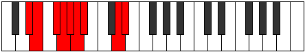 | [midi](https://github.com/edipermadi/music/blob/main/docs/ModeDSharpPhraptyllic.mid?raw=true) |
| [Eb](ModeEFlatPhraptyllic.md) | Eb, **E**, **Gb**, G, Ab, A, **Bb**, D, Eb | C |  | [midi](https://github.com/edipermadi/music/blob/main/docs/ModeEFlatPhraptyllic.mid?raw=true) |
| [E](ModeENaturalPhraptyllic.md) | E, **F**, **G**, G#, A, A#, **B**, D#, E | C | 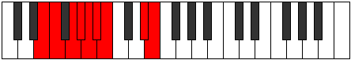 | [midi](https://github.com/edipermadi/music/blob/main/docs/ModeENaturalPhraptyllic.mid?raw=true) |
| [F](ModeFNaturalPhraptyllic.md) | F, **F#**, **G#**, A, A#, B, **C**, E, F | C |  | [midi](https://github.com/edipermadi/music/blob/main/docs/ModeFNaturalPhraptyllic.mid?raw=true) |
| [F#](ModeFSharpPhraptyllic.md) | F#, **G**, **A**, A#, B, C, **C#**, F, F# | C | 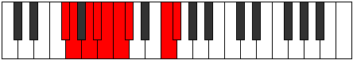 | [midi](https://github.com/edipermadi/music/blob/main/docs/ModeFSharpPhraptyllic.mid?raw=true) |
| [Gb](ModeGFlatPhraptyllic.md) | Gb, **G**, **A**, Bb, B, C, **Db**, F, Gb | C |  | [midi](https://github.com/edipermadi/music/blob/main/docs/ModeGFlatPhraptyllic.mid?raw=true) |
| [G](ModeGNaturalPhraptyllic.md) | G, **G#**, **A#**, B, C, C#, **D**, F#, G | C | 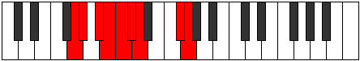 | [midi](https://github.com/edipermadi/music/blob/main/docs/ModeGNaturalPhraptyllic.mid?raw=true) |
| [G#](ModeGSharpPhraptyllic.md) | G#, **A**, **B**, C, C#, D, **D#**, G, G# | C | 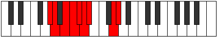 | [midi](https://github.com/edipermadi/music/blob/main/docs/ModeGSharpPhraptyllic.mid?raw=true) |
| [Ab](ModeAFlatPhraptyllic.md) | Ab, **A**, **B**, C, Db, D, **Eb**, G, Ab | C |  | [midi](https://github.com/edipermadi/music/blob/main/docs/ModeAFlatPhraptyllic.mid?raw=true) |
| [A](ModeANaturalPhraptyllic.md) | A, **A#**, **C**, C#, D, D#, **E**, G#, A | C | 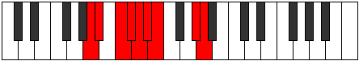 | [midi](https://github.com/edipermadi/music/blob/main/docs/ModeANaturalPhraptyllic.mid?raw=true) |
| [A#](ModeASharpPhraptyllic.md) | A#, **B**, **C#**, D, D#, E, **F**, A, A# | C | 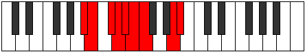 | [midi](https://github.com/edipermadi/music/blob/main/docs/ModeASharpPhraptyllic.mid?raw=true) |
| [Bb](ModeBFlatPhraptyllic.md) | Bb, **B**, **Db**, D, Eb, E, **F**, A, Bb | C |  | [midi](https://github.com/edipermadi/music/blob/main/docs/ModeBFlatPhraptyllic.mid?raw=true) |
| [B](ModeBNaturalPhraptyllic.md) | B, **C**, **D**, D#, E, F, **F#**, A#, B | C | 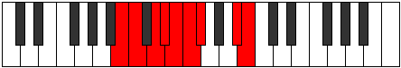 | [midi](https://github.com/edipermadi/music/blob/main/docs/ModeBNaturalPhraptyllic.mid?raw=true) |
