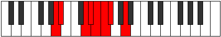

# Mode Phrathian

## Links

- [Documentation](index.md)
- [Scales Index](Scales.md)
- [Modes Index](Modes.md)
- [Chords Index](Chords.md)

## Parent Scale

[Thycrian](ScaleThycrian.md)

## Number

[995](https://ianring.com/musictheory/scales/995)

## Perfection

- 4 Perfect notes
- 3 Perfect notes

## Perfection Profile

[true true true true false false false]

## Permutations

| Tonic | Notes | Signature | Illustration | Audio |
|-------|-------|-----------|--------------|-------|
| [C](ModeCNaturalPhrathian.md) | C, Db, E#, F#, **G**, **Ab**, **Bbb**, C | C |  | [midi](ModeCNaturalPhrathian.mid) [ogg](ModeCNaturalPhrathian.ogg) |
| [C#](ModeCSharpPhrathian.md) | C#, D, E##, F##, **G#**, **A**, **Bb**, C# | C |  | [midi](ModeCSharpPhrathian.mid) [ogg](ModeCSharpPhrathian.ogg) |
| [Db](ModeDFlatPhrathian.md) | Db, Ebb, F#, G, **Ab**, **Bbb**, **Cbb**, Db | C |  | [midi](ModeDFlatPhrathian.mid) [ogg](ModeDFlatPhrathian.ogg) |
| [D](ModeDNaturalPhrathian.md) | D, Eb, F##, G#, **A**, **Bb**, **Cb**, D | C |  | [midi](ModeDNaturalPhrathian.mid) [ogg](ModeDNaturalPhrathian.ogg) |
| [D#](ModeDSharpPhrathian.md) | D#, E, F###, G##, **A#**, **B**, **C**, D# | C |  | [midi](ModeDSharpPhrathian.mid) [ogg](ModeDSharpPhrathian.ogg) |
| [Eb](ModeEFlatPhrathian.md) | Eb, Fb, G#, A, **Bb**, **Cb**, **Dbb**, Eb | C |  | [midi](ModeEFlatPhrathian.mid) [ogg](ModeEFlatPhrathian.ogg) |
| [E](ModeENaturalPhrathian.md) | E, F, G##, A#, **B**, **C**, **Db**, E | C |  | [midi](ModeENaturalPhrathian.mid) [ogg](ModeENaturalPhrathian.ogg) |
| [F](ModeFNaturalPhrathian.md) | F, Gb, A#, B, **C**, **Db**, **Ebb**, F | C |  | [midi](ModeFNaturalPhrathian.mid) [ogg](ModeFNaturalPhrathian.ogg) |
| [F#](ModeFSharpPhrathian.md) | F#, G, A##, B#, **C#**, **D**, **Eb**, F# | C |  | [midi](ModeFSharpPhrathian.mid) [ogg](ModeFSharpPhrathian.ogg) |
| [Gb](ModeGFlatPhrathian.md) | Gb, Abb, B, C, **Db**, **Ebb**, **Fbb**, Gb | C |  | [midi](ModeGFlatPhrathian.mid) [ogg](ModeGFlatPhrathian.ogg) |
| [G](ModeGNaturalPhrathian.md) | G, Ab, B#, C#, **D**, **Eb**, **Fb**, G | C |  | [midi](ModeGNaturalPhrathian.mid) [ogg](ModeGNaturalPhrathian.ogg) |
| [G#](ModeGSharpPhrathian.md) | G#, A, B##, C##, **D#**, **E**, **F**, G# | C |  | [midi](ModeGSharpPhrathian.mid) [ogg](ModeGSharpPhrathian.ogg) |
| [Ab](ModeAFlatPhrathian.md) | Ab, Bbb, C#, D, **Eb**, **Fb**, **Gbb**, Ab | C |  | [midi](ModeAFlatPhrathian.mid) [ogg](ModeAFlatPhrathian.ogg) |
| [A](ModeANaturalPhrathian.md) | A, Bb, C##, D#, **E**, **F**, **Gb**, A | C |  | [midi](ModeANaturalPhrathian.mid) [ogg](ModeANaturalPhrathian.ogg) |
| [A#](ModeASharpPhrathian.md) | A#, B, C###, D##, **E#**, **F#**, **G**, A# | C |  | [midi](ModeASharpPhrathian.mid) [ogg](ModeASharpPhrathian.ogg) |
| [Bb](ModeBFlatPhrathian.md) | Bb, Cb, D#, E, **F**, **Gb**, **Abb**, Bb | C |  | [midi](ModeBFlatPhrathian.mid) [ogg](ModeBFlatPhrathian.ogg) |
| [B](ModeBNaturalPhrathian.md) | B, C, D##, E#, **F#**, **G**, **Ab**, B | C |  | [midi](ModeBNaturalPhrathian.mid) [ogg](ModeBNaturalPhrathian.ogg) |
