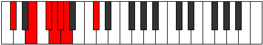
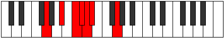

# Mode Phrathimic

## Links

- [Documentation](index.md)
- [Scales Index](Scales.md)
- [Modes Index](Modes.md)
- [Chords Index](Chords.md)

## Parent Scale

[Starimic](ScaleStarimic.md)

## Number

[489](https://ianring.com/musictheory/scales/489)

## Perfection

- 3 Perfect notes
- 3 Perfect notes

## Perfection Profile

[true false true false false true]

## Permutations

| Tonic | Notes | Signature | Illustration | Audio |
|-------|-------|-----------|--------------|-------|
| [C](ModeCNaturalPhrathimic.md) | C, **D#**, E#, **F#**, **G**, Ab, C | C |  | [midi](ModeCNaturalPhrathimic.mid) [ogg](ModeCNaturalPhrathimic.ogg) |
| [C#](ModeCSharpPhrathimic.md) | C#, **D##**, E##, **F##**, **G#**, A, C# | C |  | [midi](ModeCSharpPhrathimic.mid) [ogg](ModeCSharpPhrathimic.ogg) |
| [Db](ModeDFlatPhrathimic.md) | Db, **E**, F#, **G**, **Ab**, Bbb, Db | C |  | [midi](ModeDFlatPhrathimic.mid) [ogg](ModeDFlatPhrathimic.ogg) |
| [D](ModeDNaturalPhrathimic.md) | D, **E#**, F##, **G#**, **A**, Bb, D | C |  | [midi](ModeDNaturalPhrathimic.mid) [ogg](ModeDNaturalPhrathimic.ogg) |
| [D#](ModeDSharpPhrathimic.md) | D#, **E##**, F###, **G##**, **A#**, B, D# | C |  | [midi](ModeDSharpPhrathimic.mid) [ogg](ModeDSharpPhrathimic.ogg) |
| [Eb](ModeEFlatPhrathimic.md) | Eb, **F#**, G#, **A**, **Bb**, Cb, Eb | C |  | [midi](ModeEFlatPhrathimic.mid) [ogg](ModeEFlatPhrathimic.ogg) |
| [E](ModeENaturalPhrathimic.md) | E, **F##**, G##, **A#**, **B**, C, E | C |  | [midi](ModeENaturalPhrathimic.mid) [ogg](ModeENaturalPhrathimic.ogg) |
| [F](ModeFNaturalPhrathimic.md) | F, **G#**, A#, **B**, **C**, Db, F | C |  | [midi](ModeFNaturalPhrathimic.mid) [ogg](ModeFNaturalPhrathimic.ogg) |
| [F#](ModeFSharpPhrathimic.md) | F#, **G##**, A##, **B#**, **C#**, D, F# | C |  | [midi](ModeFSharpPhrathimic.mid) [ogg](ModeFSharpPhrathimic.ogg) |
| [Gb](ModeGFlatPhrathimic.md) | Gb, **A**, B, **C**, **Db**, Ebb, Gb | C |  | [midi](ModeGFlatPhrathimic.mid) [ogg](ModeGFlatPhrathimic.ogg) |
| [G](ModeGNaturalPhrathimic.md) | G, **A#**, B#, **C#**, **D**, Eb, G | C |  | [midi](ModeGNaturalPhrathimic.mid) [ogg](ModeGNaturalPhrathimic.ogg) |
| [G#](ModeGSharpPhrathimic.md) | G#, **A##**, B##, **C##**, **D#**, E, G# | C |  | [midi](ModeGSharpPhrathimic.mid) [ogg](ModeGSharpPhrathimic.ogg) |
| [Ab](ModeAFlatPhrathimic.md) | Ab, **B**, C#, **D**, **Eb**, Fb, Ab | C |  | [midi](ModeAFlatPhrathimic.mid) [ogg](ModeAFlatPhrathimic.ogg) |
| [A](ModeANaturalPhrathimic.md) | A, **B#**, C##, **D#**, **E**, F, A | C |  | [midi](ModeANaturalPhrathimic.mid) [ogg](ModeANaturalPhrathimic.ogg) |
| [A#](ModeASharpPhrathimic.md) | A#, **B##**, C###, **D##**, **E#**, F#, A# | C |  | [midi](ModeASharpPhrathimic.mid) [ogg](ModeASharpPhrathimic.ogg) |
| [Bb](ModeBFlatPhrathimic.md) | Bb, **C#**, D#, **E**, **F**, Gb, Bb | C |  | [midi](ModeBFlatPhrathimic.mid) [ogg](ModeBFlatPhrathimic.ogg) |
| [B](ModeBNaturalPhrathimic.md) | B, **C##**, D##, **E#**, **F#**, G, B | C |  | [midi](ModeBNaturalPhrathimic.mid) [ogg](ModeBNaturalPhrathimic.ogg) |
