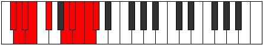
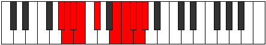

# Mode Phrathygic

## Links

- [Documentation](index.md)
- [Scales Index](Scales.md)
- [Modes Index](Modes.md)
- [Chords Index](Chords.md)

## Parent Scale

[Aeolacrygic](ScaleAeolacrygic.md)

## Number

[3887](https://ianring.com/musictheory/scales/3887)

## Perfection

- 6 Perfect notes
- 3 Perfect notes

## Interval Pattern

1, 1, 1, 2, 3, 1, 1, 1, 1

## Perfection Profile

[false true true true true true false true false]

## Permutations

| Tonic | Notes | Signature | Illustration | Audio |
|-------|-------|-----------|--------------|-------|
| [C](ModeCNaturalPhrathygic.md) | **C**, C#, D, D#, F, G#, **A**, A#, **B**, **C** | C |  | [midi](https://github.com/edipermadi/music/blob/main/docs/ModeCNaturalPhrathygic.mid?raw=true) |
| [C#](ModeCSharpPhrathygic.md) | **C#**, D, D#, E, F#, A, **A#**, B, **C**, **C#** | C |  | [midi](https://github.com/edipermadi/music/blob/main/docs/ModeCSharpPhrathygic.mid?raw=true) |
| [Db](ModeDFlatPhrathygic.md) | **Db**, D, Eb, E, Gb, A, **Bb**, B, **C**, **Db** | C |  | [midi](https://github.com/edipermadi/music/blob/main/docs/ModeDFlatPhrathygic.mid?raw=true) |
| [D](ModeDNaturalPhrathygic.md) | **D**, D#, E, F, G, A#, **B**, C, **C#**, **D** | C |  | [midi](https://github.com/edipermadi/music/blob/main/docs/ModeDNaturalPhrathygic.mid?raw=true) |
| [D#](ModeDSharpPhrathygic.md) | **D#**, E, F, F#, G#, B, **C**, C#, **D**, **D#** | C |  | [midi](https://github.com/edipermadi/music/blob/main/docs/ModeDSharpPhrathygic.mid?raw=true) |
| [Eb](ModeEFlatPhrathygic.md) | **Eb**, E, F, Gb, Ab, B, **C**, Db, **D**, **Eb** | C |  | [midi](https://github.com/edipermadi/music/blob/main/docs/ModeEFlatPhrathygic.mid?raw=true) |
| [E](ModeENaturalPhrathygic.md) | **E**, F, F#, G, A, C, **C#**, D, **D#**, **E** | C |  | [midi](https://github.com/edipermadi/music/blob/main/docs/ModeENaturalPhrathygic.mid?raw=true) |
| [F](ModeFNaturalPhrathygic.md) | **F**, F#, G, G#, A#, C#, **D**, D#, **E**, **F** | C |  | [midi](https://github.com/edipermadi/music/blob/main/docs/ModeFNaturalPhrathygic.mid?raw=true) |
| [F#](ModeFSharpPhrathygic.md) | **F#**, G, G#, A, B, D, **D#**, E, **F**, **F#** | C |  | [midi](https://github.com/edipermadi/music/blob/main/docs/ModeFSharpPhrathygic.mid?raw=true) |
| [Gb](ModeGFlatPhrathygic.md) | **Gb**, G, Ab, A, B, D, **Eb**, E, **F**, **Gb** | C |  | [midi](https://github.com/edipermadi/music/blob/main/docs/ModeGFlatPhrathygic.mid?raw=true) |
| [G](ModeGNaturalPhrathygic.md) | **G**, G#, A, A#, C, D#, **E**, F, **F#**, **G** | C |  | [midi](https://github.com/edipermadi/music/blob/main/docs/ModeGNaturalPhrathygic.mid?raw=true) |
| [G#](ModeGSharpPhrathygic.md) | **G#**, A, A#, B, C#, E, **F**, F#, **G**, **G#** | C |  | [midi](https://github.com/edipermadi/music/blob/main/docs/ModeGSharpPhrathygic.mid?raw=true) |
| [Ab](ModeAFlatPhrathygic.md) | **Ab**, A, Bb, B, Db, E, **F**, Gb, **G**, **Ab** | C |  | [midi](https://github.com/edipermadi/music/blob/main/docs/ModeAFlatPhrathygic.mid?raw=true) |
| [A](ModeANaturalPhrathygic.md) | **A**, A#, B, C, D, F, **F#**, G, **G#**, **A** | C |  | [midi](https://github.com/edipermadi/music/blob/main/docs/ModeANaturalPhrathygic.mid?raw=true) |
| [A#](ModeASharpPhrathygic.md) | **A#**, B, C, C#, D#, F#, **G**, G#, **A**, **A#** | C |  | [midi](https://github.com/edipermadi/music/blob/main/docs/ModeASharpPhrathygic.mid?raw=true) |
| [Bb](ModeBFlatPhrathygic.md) | **Bb**, B, C, Db, Eb, Gb, **G**, Ab, **A**, **Bb** | C |  | [midi](https://github.com/edipermadi/music/blob/main/docs/ModeBFlatPhrathygic.mid?raw=true) |
| [B](ModeBNaturalPhrathygic.md) | **B**, C, C#, D, E, G, **G#**, A, **A#**, **B** | C |  | [midi](https://github.com/edipermadi/music/blob/main/docs/ModeBNaturalPhrathygic.mid?raw=true) |
