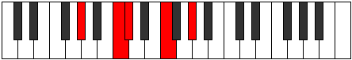

# Mode Phratic

## Links

- [Documentation](index.md)
- [Scales Index](Scales.md)
- [Modes Index](Modes.md)
- [Chords Index](Chords.md)

## Parent Scale

[Thaptic](ScaleThaptic.md)

## Number

[561](https://ianring.com/musictheory/scales/561)

## Perfection

- 2 Perfect notes
- 2 Perfect notes

## Perfection Profile

[false false true true]

## Permutations

| Tonic | Notes | Signature | Illustration | Audio |
|-------|-------|-----------|--------------|-------|
| [C](ModeCNaturalPhratic.md) | **C**, **E**, F, A, **C** | C |  | [midi](ModeCNaturalPhratic.mid) [ogg](ModeCNaturalPhratic.ogg) |
| [C#](ModeCSharpPhratic.md) | **C#**, **F**, F#, A#, **C#** | C |  | [midi](ModeCSharpPhratic.mid) [ogg](ModeCSharpPhratic.ogg) |
| [Db](ModeDFlatPhratic.md) | **Db**, **F**, Gb, Bb, **Db** | C |  | [midi](ModeDFlatPhratic.mid) [ogg](ModeDFlatPhratic.ogg) |
| [D](ModeDNaturalPhratic.md) | **D**, **F#**, G, B, **D** | C |  | [midi](ModeDNaturalPhratic.mid) [ogg](ModeDNaturalPhratic.ogg) |
| [D#](ModeDSharpPhratic.md) | **D#**, **G**, G#, C, **D#** | C |  | [midi](ModeDSharpPhratic.mid) [ogg](ModeDSharpPhratic.ogg) |
| [Eb](ModeEFlatPhratic.md) | **Eb**, **G**, Ab, C, **Eb** | C |  | [midi](ModeEFlatPhratic.mid) [ogg](ModeEFlatPhratic.ogg) |
| [E](ModeENaturalPhratic.md) | **E**, **G#**, A, C#, **E** | C |  | [midi](ModeENaturalPhratic.mid) [ogg](ModeENaturalPhratic.ogg) |
| [F](ModeFNaturalPhratic.md) | **F**, **A**, A#, D, **F** | C |  | [midi](ModeFNaturalPhratic.mid) [ogg](ModeFNaturalPhratic.ogg) |
| [F#](ModeFSharpPhratic.md) | **F#**, **A#**, B, D#, **F#** | C |  | [midi](ModeFSharpPhratic.mid) [ogg](ModeFSharpPhratic.ogg) |
| [Gb](ModeGFlatPhratic.md) | **Gb**, **Bb**, B, Eb, **Gb** | C |  | [midi](ModeGFlatPhratic.mid) [ogg](ModeGFlatPhratic.ogg) |
| [G](ModeGNaturalPhratic.md) | **G**, **B**, C, E, **G** | C |  | [midi](ModeGNaturalPhratic.mid) [ogg](ModeGNaturalPhratic.ogg) |
| [G#](ModeGSharpPhratic.md) | **G#**, **C**, C#, F, **G#** | C |  | [midi](ModeGSharpPhratic.mid) [ogg](ModeGSharpPhratic.ogg) |
| [Ab](ModeAFlatPhratic.md) | **Ab**, **C**, Db, F, **Ab** | C |  | [midi](ModeAFlatPhratic.mid) [ogg](ModeAFlatPhratic.ogg) |
| [A](ModeANaturalPhratic.md) | **A**, **C#**, D, F#, **A** | C |  | [midi](ModeANaturalPhratic.mid) [ogg](ModeANaturalPhratic.ogg) |
| [A#](ModeASharpPhratic.md) | **A#**, **D**, D#, G, **A#** | C |  | [midi](ModeASharpPhratic.mid) [ogg](ModeASharpPhratic.ogg) |
| [Bb](ModeBFlatPhratic.md) | **Bb**, **D**, Eb, G, **Bb** | C |  | [midi](ModeBFlatPhratic.mid) [ogg](ModeBFlatPhratic.ogg) |
| [B](ModeBNaturalPhratic.md) | **B**, **D#**, E, G#, **B** | C |  | [midi](ModeBNaturalPhratic.mid) [ogg](ModeBNaturalPhratic.ogg) |
