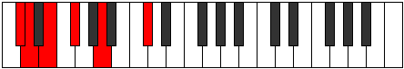
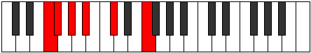

# Mode Phratonic

## Links

- [Documentation](index.md)
- [Scales Index](Scales.md)
- [Modes Index](Modes.md)
- [Chords Index](Chords.md)

## Parent Scale

[Lothitonic](ScaleLothitonic.md)

## Number

[299](https://ianring.com/musictheory/scales/299)

## Perfection

- 3 Perfect notes
- 2 Perfect notes

## Perfection Profile

[false true false true true]

## Permutations

| Tonic | Notes | Signature | Illustration | Audio |
|-------|-------|-----------|--------------|-------|
| [C](ModeCNaturalPhratonic.md) | **C**, C#, **D#**, F, G#, **C** | C |  | [midi](ModeCNaturalPhratonic.mid) [ogg](ModeCNaturalPhratonic.ogg) |
| [C#](ModeCSharpPhratonic.md) | **C#**, D, **E**, F#, A, **C#** | C |  | [midi](ModeCSharpPhratonic.mid) [ogg](ModeCSharpPhratonic.ogg) |
| [Db](ModeDFlatPhratonic.md) | **Db**, D, **E**, Gb, A, **Db** | C |  | [midi](ModeDFlatPhratonic.mid) [ogg](ModeDFlatPhratonic.ogg) |
| [D](ModeDNaturalPhratonic.md) | **D**, D#, **F**, G, A#, **D** | C |  | [midi](ModeDNaturalPhratonic.mid) [ogg](ModeDNaturalPhratonic.ogg) |
| [D#](ModeDSharpPhratonic.md) | **D#**, E, **F#**, G#, B, **D#** | C |  | [midi](ModeDSharpPhratonic.mid) [ogg](ModeDSharpPhratonic.ogg) |
| [Eb](ModeEFlatPhratonic.md) | **Eb**, E, **Gb**, Ab, B, **Eb** | C |  | [midi](ModeEFlatPhratonic.mid) [ogg](ModeEFlatPhratonic.ogg) |
| [E](ModeENaturalPhratonic.md) | **E**, F, **G**, A, C, **E** | C |  | [midi](ModeENaturalPhratonic.mid) [ogg](ModeENaturalPhratonic.ogg) |
| [F](ModeFNaturalPhratonic.md) | **F**, F#, **G#**, A#, C#, **F** | C |  | [midi](ModeFNaturalPhratonic.mid) [ogg](ModeFNaturalPhratonic.ogg) |
| [F#](ModeFSharpPhratonic.md) | **F#**, G, **A**, B, D, **F#** | C |  | [midi](ModeFSharpPhratonic.mid) [ogg](ModeFSharpPhratonic.ogg) |
| [Gb](ModeGFlatPhratonic.md) | **Gb**, G, **A**, B, D, **Gb** | C |  | [midi](ModeGFlatPhratonic.mid) [ogg](ModeGFlatPhratonic.ogg) |
| [G](ModeGNaturalPhratonic.md) | **G**, G#, **A#**, C, D#, **G** | C |  | [midi](ModeGNaturalPhratonic.mid) [ogg](ModeGNaturalPhratonic.ogg) |
| [G#](ModeGSharpPhratonic.md) | **G#**, A, **B**, C#, E, **G#** | C |  | [midi](ModeGSharpPhratonic.mid) [ogg](ModeGSharpPhratonic.ogg) |
| [Ab](ModeAFlatPhratonic.md) | **Ab**, A, **B**, Db, E, **Ab** | C |  | [midi](ModeAFlatPhratonic.mid) [ogg](ModeAFlatPhratonic.ogg) |
| [A](ModeANaturalPhratonic.md) | **A**, A#, **C**, D, F, **A** | C |  | [midi](ModeANaturalPhratonic.mid) [ogg](ModeANaturalPhratonic.ogg) |
| [A#](ModeASharpPhratonic.md) | **A#**, B, **C#**, D#, F#, **A#** | C |  | [midi](ModeASharpPhratonic.mid) [ogg](ModeASharpPhratonic.ogg) |
| [Bb](ModeBFlatPhratonic.md) | **Bb**, B, **Db**, Eb, Gb, **Bb** | C |  | [midi](ModeBFlatPhratonic.mid) [ogg](ModeBFlatPhratonic.ogg) |
| [B](ModeBNaturalPhratonic.md) | **B**, C, **D**, E, G, **B** | C |  | [midi](ModeBNaturalPhratonic.mid) [ogg](ModeBNaturalPhratonic.ogg) |
