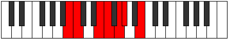

# Mode Phrocrimic

## Links

- [Documentation](README.md)
- [Scales Index](Scales.md)
- [Modes Index](Modes.md)
- [Chords Index](Chords.md)

## Parent Scale

[Laptimic](ScaleLaptimic.md)

## Number

[867](https://ianring.com/musictheory/scales/867)

## Transposition

1, 4, 1, 2, 1, 3

## Chord Pattern

iii, iv, iv

## Perfection

- 3 Perfect notes
- 3 Perfect notes

## Perfection Profile

[false true true true false false]

## Permutations

| Tonic | Notes | Signature | Illustration | Audio |
|-------|-------|-----------|--------------|-------|
| [C](ModeCNaturalPhrocrimic.md) | **C**, Db, E#, F#, **G#**, **A**, **C** | C |  | [midi](https://github.com/edipermadi/music/blob/main/docs/ModeCNaturalPhrocrimic.mid?raw=true) |
| [C#](ModeCSharpPhrocrimic.md) | **C#**, D, E##, F##, **G##**, **A#**, **C#** | C |  | [midi](https://github.com/edipermadi/music/blob/main/docs/ModeCSharpPhrocrimic.mid?raw=true) |
| [Db](ModeDFlatPhrocrimic.md) | **Db**, Ebb, F#, G, **A**, **Bb**, **Db** | C |  | [midi](https://github.com/edipermadi/music/blob/main/docs/ModeDFlatPhrocrimic.mid?raw=true) |
| [D](ModeDNaturalPhrocrimic.md) | **D**, Eb, F##, G#, **A#**, **B**, **D** | C |  | [midi](https://github.com/edipermadi/music/blob/main/docs/ModeDNaturalPhrocrimic.mid?raw=true) |
| [D#](ModeDSharpPhrocrimic.md) | **D#**, E, F###, G##, **A##**, **B#**, **D#** | C |  | [midi](https://github.com/edipermadi/music/blob/main/docs/ModeDSharpPhrocrimic.mid?raw=true) |
| [Eb](ModeEFlatPhrocrimic.md) | **Eb**, Fb, G#, A, **B**, **C**, **Eb** | C |  | [midi](https://github.com/edipermadi/music/blob/main/docs/ModeEFlatPhrocrimic.mid?raw=true) |
| [E](ModeENaturalPhrocrimic.md) | **E**, F, G##, A#, **B#**, **C#**, **E** | C |  | [midi](https://github.com/edipermadi/music/blob/main/docs/ModeENaturalPhrocrimic.mid?raw=true) |
| [F](ModeFNaturalPhrocrimic.md) | **F**, Gb, A#, B, **C#**, **D**, **F** | C |  | [midi](https://github.com/edipermadi/music/blob/main/docs/ModeFNaturalPhrocrimic.mid?raw=true) |
| [F#](ModeFSharpPhrocrimic.md) | **F#**, G, A##, B#, **C##**, **D#**, **F#** | C |  | [midi](https://github.com/edipermadi/music/blob/main/docs/ModeFSharpPhrocrimic.mid?raw=true) |
| [Gb](ModeGFlatPhrocrimic.md) | **Gb**, Abb, B, C, **D**, **Eb**, **Gb** | C |  | [midi](https://github.com/edipermadi/music/blob/main/docs/ModeGFlatPhrocrimic.mid?raw=true) |
| [G](ModeGNaturalPhrocrimic.md) | **G**, Ab, B#, C#, **D#**, **E**, **G** | C |  | [midi](https://github.com/edipermadi/music/blob/main/docs/ModeGNaturalPhrocrimic.mid?raw=true) |
| [G#](ModeGSharpPhrocrimic.md) | **G#**, A, B##, C##, **D##**, **E#**, **G#** | C |  | [midi](https://github.com/edipermadi/music/blob/main/docs/ModeGSharpPhrocrimic.mid?raw=true) |
| [Ab](ModeAFlatPhrocrimic.md) | **Ab**, Bbb, C#, D, **E**, **F**, **Ab** | C |  | [midi](https://github.com/edipermadi/music/blob/main/docs/ModeAFlatPhrocrimic.mid?raw=true) |
| [A](ModeANaturalPhrocrimic.md) | **A**, Bb, C##, D#, **E#**, **F#**, **A** | C |  | [midi](https://github.com/edipermadi/music/blob/main/docs/ModeANaturalPhrocrimic.mid?raw=true) |
| [A#](ModeASharpPhrocrimic.md) | **A#**, B, C###, D##, **E##**, **F##**, **A#** | C |  | [midi](https://github.com/edipermadi/music/blob/main/docs/ModeASharpPhrocrimic.mid?raw=true) |
| [Bb](ModeBFlatPhrocrimic.md) | **Bb**, Cb, D#, E, **F#**, **G**, **Bb** | C |  | [midi](https://github.com/edipermadi/music/blob/main/docs/ModeBFlatPhrocrimic.mid?raw=true) |
| [B](ModeBNaturalPhrocrimic.md) | **B**, C, D##, E#, **F##**, **G#**, **B** | C |  | [midi](https://github.com/edipermadi/music/blob/main/docs/ModeBNaturalPhrocrimic.mid?raw=true) |
