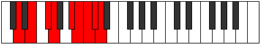

# Mode Phrocryllic

## Links

- [Documentation](index.md)
- [Scales Index](Scales.md)
- [Modes Index](Modes.md)
- [Chords Index](Chords.md)

## Parent Scale

[Gythyllic](ScaleGythyllic.md)

## Number

[3893](https://ianring.com/musictheory/scales/3893)

## Interval Pattern

2, 2, 1, 3, 1, 1, 1, 1

## Chord Pattern

I⁺, ii⁰, ii, III⁺, III, iv, IV, iv⁰, V⁺, v⁰, vi, VII, viii⁰

## Perfection

- 5 Perfect notes
- 3 Perfect notes

## Perfection Profile

[false true true true false true true false]

## Permutations

| Tonic | Notes | Signature | Illustration | Audio |
|-------|-------|-----------|--------------|-------|
| [C](ModeCNaturalPhrocryllic.md) | **C**, D, E, F, **G#**, A, A#, **B**, **C** | C |  | [midi](https://github.com/edipermadi/music/blob/main/docs/ModeCNaturalPhrocryllic.mid?raw=true) |
| [C#](ModeCSharpPhrocryllic.md) | **C#**, D#, F, F#, **A**, A#, B, **C**, **C#** | C |  | [midi](https://github.com/edipermadi/music/blob/main/docs/ModeCSharpPhrocryllic.mid?raw=true) |
| [Db](ModeDFlatPhrocryllic.md) | **Db**, Eb, F, Gb, **A**, Bb, B, **C**, **Db** | C |  | [midi](https://github.com/edipermadi/music/blob/main/docs/ModeDFlatPhrocryllic.mid?raw=true) |
| [D](ModeDNaturalPhrocryllic.md) | **D**, E, F#, G, **A#**, B, C, **C#**, **D** | C |  | [midi](https://github.com/edipermadi/music/blob/main/docs/ModeDNaturalPhrocryllic.mid?raw=true) |
| [D#](ModeDSharpPhrocryllic.md) | **D#**, F, G, G#, **B**, C, C#, **D**, **D#** | C |  | [midi](https://github.com/edipermadi/music/blob/main/docs/ModeDSharpPhrocryllic.mid?raw=true) |
| [Eb](ModeEFlatPhrocryllic.md) | **Eb**, F, G, Ab, **B**, C, Db, **D**, **Eb** | C |  | [midi](https://github.com/edipermadi/music/blob/main/docs/ModeEFlatPhrocryllic.mid?raw=true) |
| [E](ModeENaturalPhrocryllic.md) | **E**, F#, G#, A, **C**, C#, D, **D#**, **E** | C |  | [midi](https://github.com/edipermadi/music/blob/main/docs/ModeENaturalPhrocryllic.mid?raw=true) |
| [F](ModeFNaturalPhrocryllic.md) | **F**, G, A, A#, **C#**, D, D#, **E**, **F** | C |  | [midi](https://github.com/edipermadi/music/blob/main/docs/ModeFNaturalPhrocryllic.mid?raw=true) |
| [F#](ModeFSharpPhrocryllic.md) | **F#**, G#, A#, B, **D**, D#, E, **F**, **F#** | C |  | [midi](https://github.com/edipermadi/music/blob/main/docs/ModeFSharpPhrocryllic.mid?raw=true) |
| [Gb](ModeGFlatPhrocryllic.md) | **Gb**, Ab, Bb, B, **D**, Eb, E, **F**, **Gb** | C |  | [midi](https://github.com/edipermadi/music/blob/main/docs/ModeGFlatPhrocryllic.mid?raw=true) |
| [G](ModeGNaturalPhrocryllic.md) | **G**, A, B, C, **D#**, E, F, **F#**, **G** | C |  | [midi](https://github.com/edipermadi/music/blob/main/docs/ModeGNaturalPhrocryllic.mid?raw=true) |
| [G#](ModeGSharpPhrocryllic.md) | **G#**, A#, C, C#, **E**, F, F#, **G**, **G#** | C |  | [midi](https://github.com/edipermadi/music/blob/main/docs/ModeGSharpPhrocryllic.mid?raw=true) |
| [Ab](ModeAFlatPhrocryllic.md) | **Ab**, Bb, C, Db, **E**, F, Gb, **G**, **Ab** | C |  | [midi](https://github.com/edipermadi/music/blob/main/docs/ModeAFlatPhrocryllic.mid?raw=true) |
| [A](ModeANaturalPhrocryllic.md) | **A**, B, C#, D, **F**, F#, G, **G#**, **A** | C |  | [midi](https://github.com/edipermadi/music/blob/main/docs/ModeANaturalPhrocryllic.mid?raw=true) |
| [A#](ModeASharpPhrocryllic.md) | **A#**, C, D, D#, **F#**, G, G#, **A**, **A#** | C |  | [midi](https://github.com/edipermadi/music/blob/main/docs/ModeASharpPhrocryllic.mid?raw=true) |
| [Bb](ModeBFlatPhrocryllic.md) | **Bb**, C, D, Eb, **Gb**, G, Ab, **A**, **Bb** | C |  | [midi](https://github.com/edipermadi/music/blob/main/docs/ModeBFlatPhrocryllic.mid?raw=true) |
| [B](ModeBNaturalPhrocryllic.md) | **B**, C#, D#, E, **G**, G#, A, **A#**, **B** | C |  | [midi](https://github.com/edipermadi/music/blob/main/docs/ModeBNaturalPhrocryllic.mid?raw=true) |
