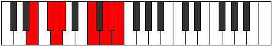
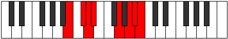

# Mode Phrodian

## Links

- [Documentation](index.md)
- [Scales Index](Scales.md)
- [Modes Index](Modes.md)
- [Chords Index](Chords.md)

## Parent Scale

[Katogian](ScaleKatogian.md)

## Number

[3357](https://ianring.com/musictheory/scales/3357)

## Interval Pattern

2, 1, 1, 4, 2, 1, 1

## Chord Pattern

I⁺, IV⁺, IV, V, V⁺, v⁰, v

## Perfection

- 3 Perfect notes
- 4 Perfect notes

## Perfection Profile

[false false true true true false false]

## Permutations

| Tonic | Notes | Signature | Illustration | Audio |
|-------|-------|-----------|--------------|-------|
| [C](ModeCNaturalPhrodian.md) | **C**, **D**, Eb, Fb, G#, **A#**, **B**, **C** | C |  | [midi](https://github.com/edipermadi/music/blob/main/docs/ModeCNaturalPhrodian.mid?raw=true) |
| [C#](ModeCSharpPhrodian.md) | **C#**, **D#**, E, F, G##, **A##**, **B#**, **C#** | C |  | [midi](https://github.com/edipermadi/music/blob/main/docs/ModeCSharpPhrodian.mid?raw=true) |
| [Db](ModeDFlatPhrodian.md) | **Db**, **Eb**, Fb, Gbb, A, **B**, **C**, **Db** | C |  | [midi](https://github.com/edipermadi/music/blob/main/docs/ModeDFlatPhrodian.mid?raw=true) |
| [D](ModeDNaturalPhrodian.md) | **D**, **E**, F, Gb, A#, **B#**, **C#**, **D** | C |  | [midi](https://github.com/edipermadi/music/blob/main/docs/ModeDNaturalPhrodian.mid?raw=true) |
| [D#](ModeDSharpPhrodian.md) | **D#**, **E#**, F#, G, A##, **B##**, **C##**, **D#** | C |  | [midi](https://github.com/edipermadi/music/blob/main/docs/ModeDSharpPhrodian.mid?raw=true) |
| [Eb](ModeEFlatPhrodian.md) | **Eb**, **F**, Gb, Abb, B, **C#**, **D**, **Eb** | C |  | [midi](https://github.com/edipermadi/music/blob/main/docs/ModeEFlatPhrodian.mid?raw=true) |
| [E](ModeENaturalPhrodian.md) | **E**, **F#**, G, Ab, B#, **C##**, **D#**, **E** | C |  | [midi](https://github.com/edipermadi/music/blob/main/docs/ModeENaturalPhrodian.mid?raw=true) |
| [F](ModeFNaturalPhrodian.md) | **F**, **G**, Ab, Bbb, C#, **D#**, **E**, **F** | C |  | [midi](https://github.com/edipermadi/music/blob/main/docs/ModeFNaturalPhrodian.mid?raw=true) |
| [F#](ModeFSharpPhrodian.md) | **F#**, **G#**, A, Bb, C##, **D##**, **E#**, **F#** | C |  | [midi](https://github.com/edipermadi/music/blob/main/docs/ModeFSharpPhrodian.mid?raw=true) |
| [Gb](ModeGFlatPhrodian.md) | **Gb**, **Ab**, Bbb, Cbb, D, **E**, **F**, **Gb** | C |  | [midi](https://github.com/edipermadi/music/blob/main/docs/ModeGFlatPhrodian.mid?raw=true) |
| [G](ModeGNaturalPhrodian.md) | **G**, **A**, Bb, Cb, D#, **E#**, **F#**, **G** | C |  | [midi](https://github.com/edipermadi/music/blob/main/docs/ModeGNaturalPhrodian.mid?raw=true) |
| [G#](ModeGSharpPhrodian.md) | **G#**, **A#**, B, C, D##, **E##**, **F##**, **G#** | C |  | [midi](https://github.com/edipermadi/music/blob/main/docs/ModeGSharpPhrodian.mid?raw=true) |
| [Ab](ModeAFlatPhrodian.md) | **Ab**, **Bb**, Cb, Dbb, E, **F#**, **G**, **Ab** | C |  | [midi](https://github.com/edipermadi/music/blob/main/docs/ModeAFlatPhrodian.mid?raw=true) |
| [A](ModeANaturalPhrodian.md) | **A**, **B**, C, Db, E#, **F##**, **G#**, **A** | C |  | [midi](https://github.com/edipermadi/music/blob/main/docs/ModeANaturalPhrodian.mid?raw=true) |
| [A#](ModeASharpPhrodian.md) | **A#**, **B#**, C#, D, E##, **F###**, **G##**, **A#** | C |  | [midi](https://github.com/edipermadi/music/blob/main/docs/ModeASharpPhrodian.mid?raw=true) |
| [Bb](ModeBFlatPhrodian.md) | **Bb**, **C**, Db, Ebb, F#, **G#**, **A**, **Bb** | C |  | [midi](https://github.com/edipermadi/music/blob/main/docs/ModeBFlatPhrodian.mid?raw=true) |
| [B](ModeBNaturalPhrodian.md) | **B**, **C#**, D, Eb, F##, **G##**, **A#**, **B** | C |  | [midi](https://github.com/edipermadi/music/blob/main/docs/ModeBNaturalPhrodian.mid?raw=true) |
