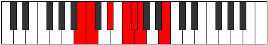

# Mode Phrogimic

## Links

- [Documentation](index.md)
- [Scales Index](Scales.md)
- [Modes Index](Modes.md)
- [Chords Index](Chords.md)

## Parent Scale

[Phralimic](ScalePhralimic.md)

## Number

[467](https://ianring.com/musictheory/scales/467)

## Perfection

- 3 Perfect notes
- 3 Perfect notes

## Perfection Profile

[true true false true false false]

## Permutations

| Tonic | Notes | Signature | Illustration | Audio |
|-------|-------|-----------|--------------|-------|
| [C](ModeCNaturalPhrogimic.md) | C, Db, **E**, F#, **G**, **Ab**, C | C |  | [midi](ModeCNaturalPhrogimic.mid) [ogg](ModeCNaturalPhrogimic.ogg) |
| [C#](ModeCSharpPhrogimic.md) | C#, D, **E#**, F##, **G#**, **A**, C# | C |  | [midi](ModeCSharpPhrogimic.mid) [ogg](ModeCSharpPhrogimic.ogg) |
| [Db](ModeDFlatPhrogimic.md) | Db, Ebb, **F**, G, **Ab**, **Bbb**, Db | C |  | [midi](ModeDFlatPhrogimic.mid) [ogg](ModeDFlatPhrogimic.ogg) |
| [D](ModeDNaturalPhrogimic.md) | D, Eb, **F#**, G#, **A**, **Bb**, D | C |  | [midi](ModeDNaturalPhrogimic.mid) [ogg](ModeDNaturalPhrogimic.ogg) |
| [D#](ModeDSharpPhrogimic.md) | D#, E, **F##**, G##, **A#**, **B**, D# | C |  | [midi](ModeDSharpPhrogimic.mid) [ogg](ModeDSharpPhrogimic.ogg) |
| [Eb](ModeEFlatPhrogimic.md) | Eb, Fb, **G**, A, **Bb**, **Cb**, Eb | C |  | [midi](ModeEFlatPhrogimic.mid) [ogg](ModeEFlatPhrogimic.ogg) |
| [E](ModeENaturalPhrogimic.md) | E, F, **G#**, A#, **B**, **C**, E | C |  | [midi](ModeENaturalPhrogimic.mid) [ogg](ModeENaturalPhrogimic.ogg) |
| [F](ModeFNaturalPhrogimic.md) | F, Gb, **A**, B, **C**, **Db**, F | C |  | [midi](ModeFNaturalPhrogimic.mid) [ogg](ModeFNaturalPhrogimic.ogg) |
| [F#](ModeFSharpPhrogimic.md) | F#, G, **A#**, B#, **C#**, **D**, F# | C |  | [midi](ModeFSharpPhrogimic.mid) [ogg](ModeFSharpPhrogimic.ogg) |
| [Gb](ModeGFlatPhrogimic.md) | Gb, Abb, **Bb**, C, **Db**, **Ebb**, Gb | C |  | [midi](ModeGFlatPhrogimic.mid) [ogg](ModeGFlatPhrogimic.ogg) |
| [G](ModeGNaturalPhrogimic.md) | G, Ab, **B**, C#, **D**, **Eb**, G | C |  | [midi](ModeGNaturalPhrogimic.mid) [ogg](ModeGNaturalPhrogimic.ogg) |
| [G#](ModeGSharpPhrogimic.md) | G#, A, **B#**, C##, **D#**, **E**, G# | C |  | [midi](ModeGSharpPhrogimic.mid) [ogg](ModeGSharpPhrogimic.ogg) |
| [Ab](ModeAFlatPhrogimic.md) | Ab, Bbb, **C**, D, **Eb**, **Fb**, Ab | C |  | [midi](ModeAFlatPhrogimic.mid) [ogg](ModeAFlatPhrogimic.ogg) |
| [A](ModeANaturalPhrogimic.md) | A, Bb, **C#**, D#, **E**, **F**, A | C |  | [midi](ModeANaturalPhrogimic.mid) [ogg](ModeANaturalPhrogimic.ogg) |
| [A#](ModeASharpPhrogimic.md) | A#, B, **C##**, D##, **E#**, **F#**, A# | C |  | [midi](ModeASharpPhrogimic.mid) [ogg](ModeASharpPhrogimic.ogg) |
| [Bb](ModeBFlatPhrogimic.md) | Bb, Cb, **D**, E, **F**, **Gb**, Bb | C |  | [midi](ModeBFlatPhrogimic.mid) [ogg](ModeBFlatPhrogimic.ogg) |
| [B](ModeBNaturalPhrogimic.md) | B, C, **D#**, E#, **F#**, **G**, B | C |  | [midi](ModeBNaturalPhrogimic.mid) [ogg](ModeBNaturalPhrogimic.ogg) |
