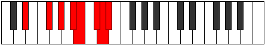

# Mode Phrolian

## Links

- [Documentation](index.md)
- [Scales Index](Scales.md)
- [Modes Index](Modes.md)
- [Chords Index](Chords.md)

## Parent Scale

[Phrolian](ScalePhrolian.md)

## Number

[3497](https://ianring.com/musictheory/scales/3497)

## Perfection

- 5 Perfect notes
- 2 Perfect notes

## Interval Pattern

3, 2, 2, 1, 2, 1, 1

## Perfection Profile

[true true true false true true false]

## Permutations

| Tonic | Notes | Signature | Illustration | Audio |
|-------|-------|-----------|--------------|-------|
| [C](ModeCNaturalPhrolian.md) | C, D#, E#, **F##**, G#, A#, **B**, C | C |  | [midi](https://github.com/edipermadi/music/blob/main/docs/ModeCNaturalPhrolian.mid?raw=true) |
| [C#](ModeCSharpPhrolian.md) | C#, D##, E##, **F###**, G##, A##, **B#**, C# | C |  | [midi](https://github.com/edipermadi/music/blob/main/docs/ModeCSharpPhrolian.mid?raw=true) |
| [Db](ModeDFlatPhrolian.md) | Db, E, F#, **G#**, A, B, **C**, Db | C |  | [midi](https://github.com/edipermadi/music/blob/main/docs/ModeDFlatPhrolian.mid?raw=true) |
| [D](ModeDNaturalPhrolian.md) | D, E#, F##, **G##**, A#, B#, **C#**, D | C |  | [midi](https://github.com/edipermadi/music/blob/main/docs/ModeDNaturalPhrolian.mid?raw=true) |
| [D#](ModeDSharpPhrolian.md) | D#, E##, F###, **G###**, A##, B##, **C##**, D# | C |  | [midi](https://github.com/edipermadi/music/blob/main/docs/ModeDSharpPhrolian.mid?raw=true) |
| [Eb](ModeEFlatPhrolian.md) | Eb, F#, G#, **A#**, B, C#, **D**, Eb | C |  | [midi](https://github.com/edipermadi/music/blob/main/docs/ModeEFlatPhrolian.mid?raw=true) |
| [E](ModeENaturalPhrolian.md) | E, F##, G##, **A##**, B#, C##, **D#**, E | C |  | [midi](https://github.com/edipermadi/music/blob/main/docs/ModeENaturalPhrolian.mid?raw=true) |
| [F](ModeFNaturalPhrolian.md) | F, G#, A#, **B#**, C#, D#, **E**, F | C |  | [midi](https://github.com/edipermadi/music/blob/main/docs/ModeFNaturalPhrolian.mid?raw=true) |
| [F#](ModeFSharpPhrolian.md) | F#, G##, A##, **B##**, C##, D##, **E#**, F# | C |  | [midi](https://github.com/edipermadi/music/blob/main/docs/ModeFSharpPhrolian.mid?raw=true) |
| [Gb](ModeGFlatPhrolian.md) | Gb, A, B, **C#**, D, E, **F**, Gb | C |  | [midi](https://github.com/edipermadi/music/blob/main/docs/ModeGFlatPhrolian.mid?raw=true) |
| [G](ModeGNaturalPhrolian.md) | G, A#, B#, **C##**, D#, E#, **F#**, G | C |  | [midi](https://github.com/edipermadi/music/blob/main/docs/ModeGNaturalPhrolian.mid?raw=true) |
| [G#](ModeGSharpPhrolian.md) | G#, A##, B##, **C###**, D##, E##, **F##**, G# | C |  | [midi](https://github.com/edipermadi/music/blob/main/docs/ModeGSharpPhrolian.mid?raw=true) |
| [Ab](ModeAFlatPhrolian.md) | Ab, B, C#, **D#**, E, F#, **G**, Ab | C |  | [midi](https://github.com/edipermadi/music/blob/main/docs/ModeAFlatPhrolian.mid?raw=true) |
| [A](ModeANaturalPhrolian.md) | A, B#, C##, **D##**, E#, F##, **G#**, A | C |  | [midi](https://github.com/edipermadi/music/blob/main/docs/ModeANaturalPhrolian.mid?raw=true) |
| [A#](ModeASharpPhrolian.md) | A#, B##, C###, **D###**, E##, F###, **G##**, A# | C |  | [midi](https://github.com/edipermadi/music/blob/main/docs/ModeASharpPhrolian.mid?raw=true) |
| [Bb](ModeBFlatPhrolian.md) | Bb, C#, D#, **E#**, F#, G#, **A**, Bb | C |  | [midi](https://github.com/edipermadi/music/blob/main/docs/ModeBFlatPhrolian.mid?raw=true) |
| [B](ModeBNaturalPhrolian.md) | B, C##, D##, **E##**, F##, G##, **A#**, B | C |  | [midi](https://github.com/edipermadi/music/blob/main/docs/ModeBNaturalPhrolian.mid?raw=true) |
