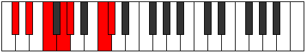
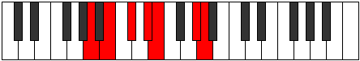

# Mode Phrolimic

## Links

- [Documentation](index.md)
- [Scales Index](Scales.md)
- [Modes Index](Modes.md)
- [Chords Index](Chords.md)

## Parent Scale

[Bylimic](ScaleBylimic.md)

## Number

[2261](https://ianring.com/musictheory/scales/2261)

## Perfection

- 4 Perfect notes
- 2 Perfect notes

## Perfection Profile

[true false true false true true]

## Permutations

| Tonic | Notes | Signature | Illustration | Audio |
|-------|-------|-----------|--------------|-------|
| [C](ModeCNaturalPhrolimic.md) | C, **D**, E, **F#**, G, A##, C | C |  | [midi](ModeCNaturalPhrolimic.mid) [ogg](ModeCNaturalPhrolimic.ogg) |
| [C#](ModeCSharpPhrolimic.md) | C#, **D#**, E#, **F##**, G#, A###, C# | C |  | [midi](ModeCSharpPhrolimic.mid) [ogg](ModeCSharpPhrolimic.ogg) |
| [Db](ModeDFlatPhrolimic.md) | Db, **Eb**, F, **G**, Ab, B#, Db | C |  | [midi](ModeDFlatPhrolimic.mid) [ogg](ModeDFlatPhrolimic.ogg) |
| [D](ModeDNaturalPhrolimic.md) | D, **E**, F#, **G#**, A, B##, D | C |  | [midi](ModeDNaturalPhrolimic.mid) [ogg](ModeDNaturalPhrolimic.ogg) |
| [D#](ModeDSharpPhrolimic.md) | D#, **E#**, F##, **G##**, A#, B###, D# | C |  | [midi](ModeDSharpPhrolimic.mid) [ogg](ModeDSharpPhrolimic.ogg) |
| [Eb](ModeEFlatPhrolimic.md) | Eb, **F**, G, **A**, Bb, C##, Eb | C |  | [midi](ModeEFlatPhrolimic.mid) [ogg](ModeEFlatPhrolimic.ogg) |
| [E](ModeENaturalPhrolimic.md) | E, **F#**, G#, **A#**, B, C###, E | C |  | [midi](ModeENaturalPhrolimic.mid) [ogg](ModeENaturalPhrolimic.ogg) |
| [F](ModeFNaturalPhrolimic.md) | F, **G**, A, **B**, C, D##, F | C |  | [midi](ModeFNaturalPhrolimic.mid) [ogg](ModeFNaturalPhrolimic.ogg) |
| [F#](ModeFSharpPhrolimic.md) | F#, **G#**, A#, **B#**, C#, D###, F# | C |  | [midi](ModeFSharpPhrolimic.mid) [ogg](ModeFSharpPhrolimic.ogg) |
| [Gb](ModeGFlatPhrolimic.md) | Gb, **Ab**, Bb, **C**, Db, E#, Gb | C |  | [midi](ModeGFlatPhrolimic.mid) [ogg](ModeGFlatPhrolimic.ogg) |
| [G](ModeGNaturalPhrolimic.md) | G, **A**, B, **C#**, D, E##, G | C |  | [midi](ModeGNaturalPhrolimic.mid) [ogg](ModeGNaturalPhrolimic.ogg) |
| [G#](ModeGSharpPhrolimic.md) | G#, **A#**, B#, **C##**, D#, E###, G# | C |  | [midi](ModeGSharpPhrolimic.mid) [ogg](ModeGSharpPhrolimic.ogg) |
| [Ab](ModeAFlatPhrolimic.md) | Ab, **Bb**, C, **D**, Eb, F##, Ab | C |  | [midi](ModeAFlatPhrolimic.mid) [ogg](ModeAFlatPhrolimic.ogg) |
| [A](ModeANaturalPhrolimic.md) | A, **B**, C#, **D#**, E, F###, A | C |  | [midi](ModeANaturalPhrolimic.mid) [ogg](ModeANaturalPhrolimic.ogg) |
| [A#](ModeASharpPhrolimic.md) | A#, **B#**, C##, **D##**, E#, Cbbb, A# | C |  | [midi](ModeASharpPhrolimic.mid) [ogg](ModeASharpPhrolimic.ogg) |
| [Bb](ModeBFlatPhrolimic.md) | Bb, **C**, D, **E**, F, G##, Bb | C |  | [midi](ModeBFlatPhrolimic.mid) [ogg](ModeBFlatPhrolimic.ogg) |
| [B](ModeBNaturalPhrolimic.md) | B, **C#**, D#, **E#**, F#, G###, B | C |  | [midi](ModeBNaturalPhrolimic.mid) [ogg](ModeBNaturalPhrolimic.ogg) |
