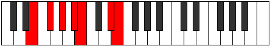

# Mode Phrolimic

## Links

- [Documentation](README.md)
- [Scales Index](Scales.md)
- [Modes Index](Modes.md)
- [Chords Index](Chords.md)

## Parent Scale

[Bylimic](ScaleBylimic.md)

## Number

[2261](https://ianring.com/musictheory/scales/2261)

## Interval Pattern

2, 2, 2, 1, 4, 1

## Chord Pattern

I, vi

## Perfection

- 4 Perfect notes
- 2 Perfect notes

## Perfection Profile

[true false true false true true]

## Permutations

| Tonic | Notes | Signature | Illustration | Audio |
|-------|-------|-----------|--------------|-------|
| [C](ModeCNaturalPhrolimic.md) | C, **D**, E, **F#**, G, A##, C | C |  | [midi](https://github.com/edipermadi/music/blob/main/docs/ModeCNaturalPhrolimic.mid?raw=true) |
| [C#](ModeCSharpPhrolimic.md) | C#, **D#**, E#, **F##**, G#, A###, C# | C |  | [midi](https://github.com/edipermadi/music/blob/main/docs/ModeCSharpPhrolimic.mid?raw=true) |
| [Db](ModeDFlatPhrolimic.md) | Db, **Eb**, F, **G**, Ab, B#, Db | C |  | [midi](https://github.com/edipermadi/music/blob/main/docs/ModeDFlatPhrolimic.mid?raw=true) |
| [D](ModeDNaturalPhrolimic.md) | D, **E**, F#, **G#**, A, B##, D | C |  | [midi](https://github.com/edipermadi/music/blob/main/docs/ModeDNaturalPhrolimic.mid?raw=true) |
| [D#](ModeDSharpPhrolimic.md) | D#, **E#**, F##, **G##**, A#, B###, D# | C |  | [midi](https://github.com/edipermadi/music/blob/main/docs/ModeDSharpPhrolimic.mid?raw=true) |
| [Eb](ModeEFlatPhrolimic.md) | Eb, **F**, G, **A**, Bb, C##, Eb | C |  | [midi](https://github.com/edipermadi/music/blob/main/docs/ModeEFlatPhrolimic.mid?raw=true) |
| [E](ModeENaturalPhrolimic.md) | E, **F#**, G#, **A#**, B, C###, E | C |  | [midi](https://github.com/edipermadi/music/blob/main/docs/ModeENaturalPhrolimic.mid?raw=true) |
| [F](ModeFNaturalPhrolimic.md) | F, **G**, A, **B**, C, D##, F | C |  | [midi](https://github.com/edipermadi/music/blob/main/docs/ModeFNaturalPhrolimic.mid?raw=true) |
| [F#](ModeFSharpPhrolimic.md) | F#, **G#**, A#, **B#**, C#, D###, F# | C |  | [midi](https://github.com/edipermadi/music/blob/main/docs/ModeFSharpPhrolimic.mid?raw=true) |
| [Gb](ModeGFlatPhrolimic.md) | Gb, **Ab**, Bb, **C**, Db, E#, Gb | C |  | [midi](https://github.com/edipermadi/music/blob/main/docs/ModeGFlatPhrolimic.mid?raw=true) |
| [G](ModeGNaturalPhrolimic.md) | G, **A**, B, **C#**, D, E##, G | C |  | [midi](https://github.com/edipermadi/music/blob/main/docs/ModeGNaturalPhrolimic.mid?raw=true) |
| [G#](ModeGSharpPhrolimic.md) | G#, **A#**, B#, **C##**, D#, E###, G# | C |  | [midi](https://github.com/edipermadi/music/blob/main/docs/ModeGSharpPhrolimic.mid?raw=true) |
| [Ab](ModeAFlatPhrolimic.md) | Ab, **Bb**, C, **D**, Eb, F##, Ab | C |  | [midi](https://github.com/edipermadi/music/blob/main/docs/ModeAFlatPhrolimic.mid?raw=true) |
| [A](ModeANaturalPhrolimic.md) | A, **B**, C#, **D#**, E, F###, A | C |  | [midi](https://github.com/edipermadi/music/blob/main/docs/ModeANaturalPhrolimic.mid?raw=true) |
| [A#](ModeASharpPhrolimic.md) | A#, **B#**, C##, **D##**, E#, Cbbb, A# | C |  | [midi](https://github.com/edipermadi/music/blob/main/docs/ModeASharpPhrolimic.mid?raw=true) |
| [Bb](ModeBFlatPhrolimic.md) | Bb, **C**, D, **E**, F, G##, Bb | C |  | [midi](https://github.com/edipermadi/music/blob/main/docs/ModeBFlatPhrolimic.mid?raw=true) |
| [B](ModeBNaturalPhrolimic.md) | B, **C#**, D#, **E#**, F#, G###, B | C |  | [midi](https://github.com/edipermadi/music/blob/main/docs/ModeBNaturalPhrolimic.mid?raw=true) |
