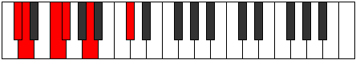
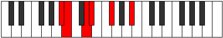

# Mode Phrolitonic

## Links

- [Documentation](README.md)
- [Scales Index](Scales.md)
- [Modes Index](Modes.md)
- [Chords Index](Chords.md)

## Parent Scale

[Zothitonic](ScaleZothitonic.md)

## Number

[307](https://ianring.com/musictheory/scales/307)

## Transposition

1, 3, 1, 3, 4

## Chord Pattern

I⁺

## Perfection

- 2 Perfect notes
- 3 Perfect notes

## Perfection Profile

false, true, false, true, false

## Permutations

| Tonic | Notes | Signature | Illustration | Audio |
|-------|-------|-----------|--------------|-------|
| [C](ModeCNaturalPhrolitonic.md) | **C**, C#, **E**, F, **G#**, **C** | C |  | [midi](https://github.com/edipermadi/music/blob/main/docs/ModeCNaturalPhrolitonic.mid?raw=true) |
| [C#](ModeCSharpPhrolitonic.md) | **C#**, D, **F**, F#, **A**, **C#** | C |  | [midi](https://github.com/edipermadi/music/blob/main/docs/ModeCSharpPhrolitonic.mid?raw=true) |
| [Db](ModeDFlatPhrolitonic.md) | **Db**, D, **F**, Gb, **A**, **Db** | C |  | [midi](https://github.com/edipermadi/music/blob/main/docs/ModeDFlatPhrolitonic.mid?raw=true) |
| [D](ModeDNaturalPhrolitonic.md) | **D**, D#, **F#**, G, **A#**, **D** | C |  | [midi](https://github.com/edipermadi/music/blob/main/docs/ModeDNaturalPhrolitonic.mid?raw=true) |
| [D#](ModeDSharpPhrolitonic.md) | **D#**, E, **G**, G#, **B**, **D#** | C |  | [midi](https://github.com/edipermadi/music/blob/main/docs/ModeDSharpPhrolitonic.mid?raw=true) |
| [Eb](ModeEFlatPhrolitonic.md) | **Eb**, E, **G**, Ab, **B**, **Eb** | C |  | [midi](https://github.com/edipermadi/music/blob/main/docs/ModeEFlatPhrolitonic.mid?raw=true) |
| [E](ModeENaturalPhrolitonic.md) | **E**, F, **G#**, A, **C**, **E** | C |  | [midi](https://github.com/edipermadi/music/blob/main/docs/ModeENaturalPhrolitonic.mid?raw=true) |
| [F](ModeFNaturalPhrolitonic.md) | **F**, F#, **A**, A#, **C#**, **F** | C |  | [midi](https://github.com/edipermadi/music/blob/main/docs/ModeFNaturalPhrolitonic.mid?raw=true) |
| [F#](ModeFSharpPhrolitonic.md) | **F#**, G, **A#**, B, **D**, **F#** | C |  | [midi](https://github.com/edipermadi/music/blob/main/docs/ModeFSharpPhrolitonic.mid?raw=true) |
| [Gb](ModeGFlatPhrolitonic.md) | **Gb**, G, **Bb**, B, **D**, **Gb** | C |  | [midi](https://github.com/edipermadi/music/blob/main/docs/ModeGFlatPhrolitonic.mid?raw=true) |
| [G](ModeGNaturalPhrolitonic.md) | **G**, G#, **B**, C, **D#**, **G** | C |  | [midi](https://github.com/edipermadi/music/blob/main/docs/ModeGNaturalPhrolitonic.mid?raw=true) |
| [G#](ModeGSharpPhrolitonic.md) | **G#**, A, **C**, C#, **E**, **G#** | C |  | [midi](https://github.com/edipermadi/music/blob/main/docs/ModeGSharpPhrolitonic.mid?raw=true) |
| [Ab](ModeAFlatPhrolitonic.md) | **Ab**, A, **C**, Db, **E**, **Ab** | C |  | [midi](https://github.com/edipermadi/music/blob/main/docs/ModeAFlatPhrolitonic.mid?raw=true) |
| [A](ModeANaturalPhrolitonic.md) | **A**, A#, **C#**, D, **F**, **A** | C |  | [midi](https://github.com/edipermadi/music/blob/main/docs/ModeANaturalPhrolitonic.mid?raw=true) |
| [A#](ModeASharpPhrolitonic.md) | **A#**, B, **D**, D#, **F#**, **A#** | C |  | [midi](https://github.com/edipermadi/music/blob/main/docs/ModeASharpPhrolitonic.mid?raw=true) |
| [Bb](ModeBFlatPhrolitonic.md) | **Bb**, B, **D**, Eb, **Gb**, **Bb** | C |  | [midi](https://github.com/edipermadi/music/blob/main/docs/ModeBFlatPhrolitonic.mid?raw=true) |
| [B](ModeBNaturalPhrolitonic.md) | **B**, C, **D#**, E, **G**, **B** | C |  | [midi](https://github.com/edipermadi/music/blob/main/docs/ModeBNaturalPhrolitonic.mid?raw=true) |
