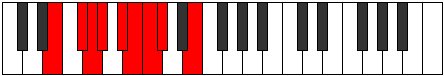

# Mode Phrolyllic

## Links

- [Documentation](index.md)
- [Scales Index](Scales.md)
- [Modes Index](Modes.md)
- [Chords Index](Chords.md)

## Parent Scale

[Zoryllic](ScaleZoryllic.md)

## Number

[989](https://ianring.com/musictheory/scales/989)

## Perfection

- 5 Perfect notes
- 3 Perfect notes

## Perfection Profile

[true true false false false true true true]

## Permutations

| Tonic | Notes | Signature | Illustration | Audio |
|-------|-------|-----------|--------------|-------|
| [C](ModeCNaturalPhrolyllic.md) | C, D, **D#**, **E**, **F#**, G, G#, A, C | C |  | [midi](ModeCNaturalPhrolyllic.mid) [ogg](ModeCNaturalPhrolyllic.ogg) |
| [C#](ModeCSharpPhrolyllic.md) | C#, D#, **E**, **F**, **G**, G#, A, A#, C# | C |  | [midi](ModeCSharpPhrolyllic.mid) [ogg](ModeCSharpPhrolyllic.ogg) |
| [Db](ModeDFlatPhrolyllic.md) | Db, Eb, **E**, **F**, **G**, Ab, A, Bb, Db | C |  | [midi](ModeDFlatPhrolyllic.mid) [ogg](ModeDFlatPhrolyllic.ogg) |
| [D](ModeDNaturalPhrolyllic.md) | D, E, **F**, **F#**, **G#**, A, A#, B, D | C |  | [midi](ModeDNaturalPhrolyllic.mid) [ogg](ModeDNaturalPhrolyllic.ogg) |
| [D#](ModeDSharpPhrolyllic.md) | D#, F, **F#**, **G**, **A**, A#, B, C, D# | C |  | [midi](ModeDSharpPhrolyllic.mid) [ogg](ModeDSharpPhrolyllic.ogg) |
| [Eb](ModeEFlatPhrolyllic.md) | Eb, F, **Gb**, **G**, **A**, Bb, B, C, Eb | C |  | [midi](ModeEFlatPhrolyllic.mid) [ogg](ModeEFlatPhrolyllic.ogg) |
| [E](ModeENaturalPhrolyllic.md) | E, F#, **G**, **G#**, **A#**, B, C, C#, E | C |  | [midi](ModeENaturalPhrolyllic.mid) [ogg](ModeENaturalPhrolyllic.ogg) |
| [F](ModeFNaturalPhrolyllic.md) | F, G, **G#**, **A**, **B**, C, C#, D, F | C |  | [midi](ModeFNaturalPhrolyllic.mid) [ogg](ModeFNaturalPhrolyllic.ogg) |
| [F#](ModeFSharpPhrolyllic.md) | F#, G#, **A**, **A#**, **C**, C#, D, D#, F# | C |  | [midi](ModeFSharpPhrolyllic.mid) [ogg](ModeFSharpPhrolyllic.ogg) |
| [Gb](ModeGFlatPhrolyllic.md) | Gb, Ab, **A**, **Bb**, **C**, Db, D, Eb, Gb | C |  | [midi](ModeGFlatPhrolyllic.mid) [ogg](ModeGFlatPhrolyllic.ogg) |
| [G](ModeGNaturalPhrolyllic.md) | G, A, **A#**, **B**, **C#**, D, D#, E, G | C |  | [midi](ModeGNaturalPhrolyllic.mid) [ogg](ModeGNaturalPhrolyllic.ogg) |
| [G#](ModeGSharpPhrolyllic.md) | G#, A#, **B**, **C**, **D**, D#, E, F, G# | C |  | [midi](ModeGSharpPhrolyllic.mid) [ogg](ModeGSharpPhrolyllic.ogg) |
| [Ab](ModeAFlatPhrolyllic.md) | Ab, Bb, **B**, **C**, **D**, Eb, E, F, Ab | C |  | [midi](ModeAFlatPhrolyllic.mid) [ogg](ModeAFlatPhrolyllic.ogg) |
| [A](ModeANaturalPhrolyllic.md) | A, B, **C**, **C#**, **D#**, E, F, F#, A | C |  | [midi](ModeANaturalPhrolyllic.mid) [ogg](ModeANaturalPhrolyllic.ogg) |
| [A#](ModeASharpPhrolyllic.md) | A#, C, **C#**, **D**, **E**, F, F#, G, A# | C |  | [midi](ModeASharpPhrolyllic.mid) [ogg](ModeASharpPhrolyllic.ogg) |
| [Bb](ModeBFlatPhrolyllic.md) | Bb, C, **Db**, **D**, **E**, F, Gb, G, Bb | C |  | [midi](ModeBFlatPhrolyllic.mid) [ogg](ModeBFlatPhrolyllic.ogg) |
| [B](ModeBNaturalPhrolyllic.md) | B, C#, **D**, **D#**, **F**, F#, G, G#, B | C |  | [midi](ModeBNaturalPhrolyllic.mid) [ogg](ModeBNaturalPhrolyllic.ogg) |
