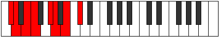

# Mode Phronian

## Links

- [Documentation](README.md)
- [Scales Index](Scales.md)
- [Modes Index](Modes.md)
- [Chords Index](Chords.md)

## Parent Scale

[Palian](ScalePalian.md)

## Number

[1435](https://ianring.com/musictheory/scales/1435)

## Transposition

1, 2, 1, 3, 1, 2, 2

## Chord Pattern

i, ii, ii, III, III, IV⁺, v⁰, VI, VI, vii⁰, vii⁰

## Perfection

- 4 Perfect notes
- 3 Perfect notes

## Perfection Profile

[true true true false false true false]

## Permutations

| Tonic | Notes | Signature | Illustration | Audio |
|-------|-------|-----------|--------------|-------|
| [C](ModeCNaturalPhronian.md) | C, Db, Eb, **Fb**, **G**, Ab, **Bb**, C | C |  | [midi](https://github.com/edipermadi/music/blob/main/docs/ModeCNaturalPhronian.mid?raw=true) |
| [C#](ModeCSharpPhronian.md) | C#, D, E, **F**, **G#**, A, **B**, C# | C |  | [midi](https://github.com/edipermadi/music/blob/main/docs/ModeCSharpPhronian.mid?raw=true) |
| [Db](ModeDFlatPhronian.md) | Db, Ebb, Fb, **Gbb**, **Ab**, Bbb, **Cb**, Db | C |  | [midi](https://github.com/edipermadi/music/blob/main/docs/ModeDFlatPhronian.mid?raw=true) |
| [D](ModeDNaturalPhronian.md) | D, Eb, F, **Gb**, **A**, Bb, **C**, D | C |  | [midi](https://github.com/edipermadi/music/blob/main/docs/ModeDNaturalPhronian.mid?raw=true) |
| [D#](ModeDSharpPhronian.md) | D#, E, F#, **G**, **A#**, B, **C#**, D# | C |  | [midi](https://github.com/edipermadi/music/blob/main/docs/ModeDSharpPhronian.mid?raw=true) |
| [Eb](ModeEFlatPhronian.md) | Eb, Fb, Gb, **Abb**, **Bb**, Cb, **Db**, Eb | C |  | [midi](https://github.com/edipermadi/music/blob/main/docs/ModeEFlatPhronian.mid?raw=true) |
| [E](ModeENaturalPhronian.md) | E, F, G, **Ab**, **B**, C, **D**, E | C |  | [midi](https://github.com/edipermadi/music/blob/main/docs/ModeENaturalPhronian.mid?raw=true) |
| [F](ModeFNaturalPhronian.md) | F, Gb, Ab, **Bbb**, **C**, Db, **Eb**, F | C |  | [midi](https://github.com/edipermadi/music/blob/main/docs/ModeFNaturalPhronian.mid?raw=true) |
| [F#](ModeFSharpPhronian.md) | F#, G, A, **Bb**, **C#**, D, **E**, F# | C |  | [midi](https://github.com/edipermadi/music/blob/main/docs/ModeFSharpPhronian.mid?raw=true) |
| [Gb](ModeGFlatPhronian.md) | Gb, Abb, Bbb, **Cbb**, **Db**, Ebb, **Fb**, Gb | C |  | [midi](https://github.com/edipermadi/music/blob/main/docs/ModeGFlatPhronian.mid?raw=true) |
| [G](ModeGNaturalPhronian.md) | G, Ab, Bb, **Cb**, **D**, Eb, **F**, G | C |  | [midi](https://github.com/edipermadi/music/blob/main/docs/ModeGNaturalPhronian.mid?raw=true) |
| [G#](ModeGSharpPhronian.md) | G#, A, B, **C**, **D#**, E, **F#**, G# | C |  | [midi](https://github.com/edipermadi/music/blob/main/docs/ModeGSharpPhronian.mid?raw=true) |
| [Ab](ModeAFlatPhronian.md) | Ab, Bbb, Cb, **Dbb**, **Eb**, Fb, **Gb**, Ab | C |  | [midi](https://github.com/edipermadi/music/blob/main/docs/ModeAFlatPhronian.mid?raw=true) |
| [A](ModeANaturalPhronian.md) | A, Bb, C, **Db**, **E**, F, **G**, A | C |  | [midi](https://github.com/edipermadi/music/blob/main/docs/ModeANaturalPhronian.mid?raw=true) |
| [A#](ModeASharpPhronian.md) | A#, B, C#, **D**, **E#**, F#, **G#**, A# | C |  | [midi](https://github.com/edipermadi/music/blob/main/docs/ModeASharpPhronian.mid?raw=true) |
| [Bb](ModeBFlatPhronian.md) | Bb, Cb, Db, **Ebb**, **F**, Gb, **Ab**, Bb | C |  | [midi](https://github.com/edipermadi/music/blob/main/docs/ModeBFlatPhronian.mid?raw=true) |
| [B](ModeBNaturalPhronian.md) | B, C, D, **Eb**, **F#**, G, **A**, B | C |  | [midi](https://github.com/edipermadi/music/blob/main/docs/ModeBNaturalPhronian.mid?raw=true) |
