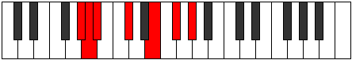

# Mode Phronimic

## Links

- [Documentation](README.md)
- [Scales Index](Scales.md)
- [Modes Index](Modes.md)
- [Chords Index](Chords.md)

## Parent Scale

[Palimic](ScalePalimic.md)

## Number

[1319](https://ianring.com/musictheory/scales/1319)

## Interval Pattern

1, 1, 3, 3, 2, 2

## Chord Pattern

vi

## Perfection

- 3 Perfect notes
- 3 Perfect notes

## Perfection Profile

[false true false true false true]

## Permutations

| Tonic | Notes | Signature | Illustration | Audio |
|-------|-------|-----------|--------------|-------|
| [C](ModeCNaturalPhronimic.md) | **C**, Db, **Ebb**, F, **G#**, A#, **C** | C |  | [midi](https://github.com/edipermadi/music/blob/main/docs/ModeCNaturalPhronimic.mid?raw=true) |
| [C#](ModeCSharpPhronimic.md) | **C#**, D, **Eb**, F#, **G##**, A##, **C#** | C |  | [midi](https://github.com/edipermadi/music/blob/main/docs/ModeCSharpPhronimic.mid?raw=true) |
| [Db](ModeDFlatPhronimic.md) | **Db**, Ebb, **Fbb**, Gb, **A**, B, **Db** | C |  | [midi](https://github.com/edipermadi/music/blob/main/docs/ModeDFlatPhronimic.mid?raw=true) |
| [D](ModeDNaturalPhronimic.md) | **D**, Eb, **Fb**, G, **A#**, B#, **D** | C |  | [midi](https://github.com/edipermadi/music/blob/main/docs/ModeDNaturalPhronimic.mid?raw=true) |
| [D#](ModeDSharpPhronimic.md) | **D#**, E, **F**, G#, **A##**, B##, **D#** | C |  | [midi](https://github.com/edipermadi/music/blob/main/docs/ModeDSharpPhronimic.mid?raw=true) |
| [Eb](ModeEFlatPhronimic.md) | **Eb**, Fb, **Gbb**, Ab, **B**, C#, **Eb** | C |  | [midi](https://github.com/edipermadi/music/blob/main/docs/ModeEFlatPhronimic.mid?raw=true) |
| [E](ModeENaturalPhronimic.md) | **E**, F, **Gb**, A, **B#**, C##, **E** | C |  | [midi](https://github.com/edipermadi/music/blob/main/docs/ModeENaturalPhronimic.mid?raw=true) |
| [F](ModeFNaturalPhronimic.md) | **F**, Gb, **Abb**, Bb, **C#**, D#, **F** | C |  | [midi](https://github.com/edipermadi/music/blob/main/docs/ModeFNaturalPhronimic.mid?raw=true) |
| [F#](ModeFSharpPhronimic.md) | **F#**, G, **Ab**, B, **C##**, D##, **F#** | C |  | [midi](https://github.com/edipermadi/music/blob/main/docs/ModeFSharpPhronimic.mid?raw=true) |
| [Gb](ModeGFlatPhronimic.md) | **Gb**, Abb, **Bbbb**, Cb, **D**, E, **Gb** | C |  | [midi](https://github.com/edipermadi/music/blob/main/docs/ModeGFlatPhronimic.mid?raw=true) |
| [G](ModeGNaturalPhronimic.md) | **G**, Ab, **Bbb**, C, **D#**, E#, **G** | C |  | [midi](https://github.com/edipermadi/music/blob/main/docs/ModeGNaturalPhronimic.mid?raw=true) |
| [G#](ModeGSharpPhronimic.md) | **G#**, A, **Bb**, C#, **D##**, E##, **G#** | C |  | [midi](https://github.com/edipermadi/music/blob/main/docs/ModeGSharpPhronimic.mid?raw=true) |
| [Ab](ModeAFlatPhronimic.md) | **Ab**, Bbb, **Cbb**, Db, **E**, F#, **Ab** | C |  | [midi](https://github.com/edipermadi/music/blob/main/docs/ModeAFlatPhronimic.mid?raw=true) |
| [A](ModeANaturalPhronimic.md) | **A**, Bb, **Cb**, D, **E#**, F##, **A** | C |  | [midi](https://github.com/edipermadi/music/blob/main/docs/ModeANaturalPhronimic.mid?raw=true) |
| [A#](ModeASharpPhronimic.md) | **A#**, B, **C**, D#, **E##**, F###, **A#** | C |  | [midi](https://github.com/edipermadi/music/blob/main/docs/ModeASharpPhronimic.mid?raw=true) |
| [Bb](ModeBFlatPhronimic.md) | **Bb**, Cb, **Dbb**, Eb, **F#**, G#, **Bb** | C |  | [midi](https://github.com/edipermadi/music/blob/main/docs/ModeBFlatPhronimic.mid?raw=true) |
| [B](ModeBNaturalPhronimic.md) | **B**, C, **Db**, E, **F##**, G##, **B** | C |  | [midi](https://github.com/edipermadi/music/blob/main/docs/ModeBNaturalPhronimic.mid?raw=true) |
