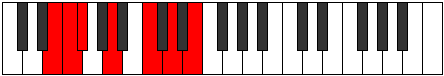

# Mode Phronimic

## Links

- [Documentation](index.md)
- [Scales Index](Scales.md)
- [Modes Index](Modes.md)
- [Chords Index](Chords.md)

## Parent Scale

[Palimic](ScalePalimic.md)

## Number

[1319](https://ianring.com/musictheory/scales/1319)

## Perfection

- 3 Perfect notes
- 3 Perfect notes

## Perfection Profile

[false true false true false true]

## Permutations

| Tonic | Notes | Signature | Illustration | Audio |
|-------|-------|-----------|--------------|-------|
| [C](ModeCNaturalPhronimic.md) | **C**, Db, **Ebb**, F, **G#**, A#, **C** | C |  | [midi](ModeCNaturalPhronimic.mid) [ogg](ModeCNaturalPhronimic.ogg) |
| [C#](ModeCSharpPhronimic.md) | **C#**, D, **Eb**, F#, **G##**, A##, **C#** | C |  | [midi](ModeCSharpPhronimic.mid) [ogg](ModeCSharpPhronimic.ogg) |
| [Db](ModeDFlatPhronimic.md) | **Db**, Ebb, **Fbb**, Gb, **A**, B, **Db** | C |  | [midi](ModeDFlatPhronimic.mid) [ogg](ModeDFlatPhronimic.ogg) |
| [D](ModeDNaturalPhronimic.md) | **D**, Eb, **Fb**, G, **A#**, B#, **D** | C |  | [midi](ModeDNaturalPhronimic.mid) [ogg](ModeDNaturalPhronimic.ogg) |
| [D#](ModeDSharpPhronimic.md) | **D#**, E, **F**, G#, **A##**, B##, **D#** | C |  | [midi](ModeDSharpPhronimic.mid) [ogg](ModeDSharpPhronimic.ogg) |
| [Eb](ModeEFlatPhronimic.md) | **Eb**, Fb, **Gbb**, Ab, **B**, C#, **Eb** | C |  | [midi](ModeEFlatPhronimic.mid) [ogg](ModeEFlatPhronimic.ogg) |
| [E](ModeENaturalPhronimic.md) | **E**, F, **Gb**, A, **B#**, C##, **E** | C |  | [midi](ModeENaturalPhronimic.mid) [ogg](ModeENaturalPhronimic.ogg) |
| [F](ModeFNaturalPhronimic.md) | **F**, Gb, **Abb**, Bb, **C#**, D#, **F** | C |  | [midi](ModeFNaturalPhronimic.mid) [ogg](ModeFNaturalPhronimic.ogg) |
| [F#](ModeFSharpPhronimic.md) | **F#**, G, **Ab**, B, **C##**, D##, **F#** | C |  | [midi](ModeFSharpPhronimic.mid) [ogg](ModeFSharpPhronimic.ogg) |
| [Gb](ModeGFlatPhronimic.md) | **Gb**, Abb, **Bbbb**, Cb, **D**, E, **Gb** | C |  | [midi](ModeGFlatPhronimic.mid) [ogg](ModeGFlatPhronimic.ogg) |
| [G](ModeGNaturalPhronimic.md) | **G**, Ab, **Bbb**, C, **D#**, E#, **G** | C |  | [midi](ModeGNaturalPhronimic.mid) [ogg](ModeGNaturalPhronimic.ogg) |
| [G#](ModeGSharpPhronimic.md) | **G#**, A, **Bb**, C#, **D##**, E##, **G#** | C |  | [midi](ModeGSharpPhronimic.mid) [ogg](ModeGSharpPhronimic.ogg) |
| [Ab](ModeAFlatPhronimic.md) | **Ab**, Bbb, **Cbb**, Db, **E**, F#, **Ab** | C |  | [midi](ModeAFlatPhronimic.mid) [ogg](ModeAFlatPhronimic.ogg) |
| [A](ModeANaturalPhronimic.md) | **A**, Bb, **Cb**, D, **E#**, F##, **A** | C |  | [midi](ModeANaturalPhronimic.mid) [ogg](ModeANaturalPhronimic.ogg) |
| [A#](ModeASharpPhronimic.md) | **A#**, B, **C**, D#, **E##**, F###, **A#** | C |  | [midi](ModeASharpPhronimic.mid) [ogg](ModeASharpPhronimic.ogg) |
| [Bb](ModeBFlatPhronimic.md) | **Bb**, Cb, **Dbb**, Eb, **F#**, G#, **Bb** | C |  | [midi](ModeBFlatPhronimic.mid) [ogg](ModeBFlatPhronimic.ogg) |
| [B](ModeBNaturalPhronimic.md) | **B**, C, **Db**, E, **F##**, G##, **B** | C |  | [midi](ModeBNaturalPhronimic.mid) [ogg](ModeBNaturalPhronimic.ogg) |
