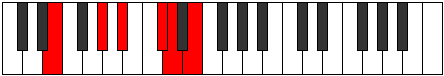

# Mode Phronitonic

## Links

- [Documentation](index.md)
- [Scales Index](Scales.md)
- [Modes Index](Modes.md)
- [Chords Index](Chords.md)

## Parent Scale

[Phronitonic](ScalePhronitonic.md)

## Number

[1617](https://ianring.com/musictheory/scales/1617)

## Perfection

- 1 Perfect notes
- 4 Perfect notes

## Perfection Profile

[false false false true false]

## Permutations

| Tonic | Notes | Signature | Illustration | Audio |
|-------|-------|-----------|--------------|-------|
| [C](ModeCNaturalPhronitonic.md) | **C**, **E**, **F#**, A, **A#**, **C** | C |  | [midi](ModeCNaturalPhronitonic.mid) [ogg](ModeCNaturalPhronitonic.ogg) |
| [C#](ModeCSharpPhronitonic.md) | **C#**, **F**, **G**, A#, **B**, **C#** | C |  | [midi](ModeCSharpPhronitonic.mid) [ogg](ModeCSharpPhronitonic.ogg) |
| [Db](ModeDFlatPhronitonic.md) | **Db**, **F**, **G**, Bb, **B**, **Db** | C |  | [midi](ModeDFlatPhronitonic.mid) [ogg](ModeDFlatPhronitonic.ogg) |
| [D](ModeDNaturalPhronitonic.md) | **D**, **F#**, **G#**, B, **C**, **D** | C |  | [midi](ModeDNaturalPhronitonic.mid) [ogg](ModeDNaturalPhronitonic.ogg) |
| [D#](ModeDSharpPhronitonic.md) | **D#**, **G**, **A**, C, **C#**, **D#** | C |  | [midi](ModeDSharpPhronitonic.mid) [ogg](ModeDSharpPhronitonic.ogg) |
| [Eb](ModeEFlatPhronitonic.md) | **Eb**, **G**, **A**, C, **Db**, **Eb** | C |  | [midi](ModeEFlatPhronitonic.mid) [ogg](ModeEFlatPhronitonic.ogg) |
| [E](ModeENaturalPhronitonic.md) | **E**, **G#**, **A#**, C#, **D**, **E** | C |  | [midi](ModeENaturalPhronitonic.mid) [ogg](ModeENaturalPhronitonic.ogg) |
| [F](ModeFNaturalPhronitonic.md) | **F**, **A**, **B**, D, **D#**, **F** | C |  | [midi](ModeFNaturalPhronitonic.mid) [ogg](ModeFNaturalPhronitonic.ogg) |
| [F#](ModeFSharpPhronitonic.md) | **F#**, **A#**, **C**, D#, **E**, **F#** | C |  | [midi](ModeFSharpPhronitonic.mid) [ogg](ModeFSharpPhronitonic.ogg) |
| [Gb](ModeGFlatPhronitonic.md) | **Gb**, **Bb**, **C**, Eb, **E**, **Gb** | C |  | [midi](ModeGFlatPhronitonic.mid) [ogg](ModeGFlatPhronitonic.ogg) |
| [G](ModeGNaturalPhronitonic.md) | **G**, **B**, **C#**, E, **F**, **G** | C |  | [midi](ModeGNaturalPhronitonic.mid) [ogg](ModeGNaturalPhronitonic.ogg) |
| [G#](ModeGSharpPhronitonic.md) | **G#**, **C**, **D**, F, **F#**, **G#** | C |  | [midi](ModeGSharpPhronitonic.mid) [ogg](ModeGSharpPhronitonic.ogg) |
| [Ab](ModeAFlatPhronitonic.md) | **Ab**, **C**, **D**, F, **Gb**, **Ab** | C |  | [midi](ModeAFlatPhronitonic.mid) [ogg](ModeAFlatPhronitonic.ogg) |
| [A](ModeANaturalPhronitonic.md) | **A**, **C#**, **D#**, F#, **G**, **A** | C |  | [midi](ModeANaturalPhronitonic.mid) [ogg](ModeANaturalPhronitonic.ogg) |
| [A#](ModeASharpPhronitonic.md) | **A#**, **D**, **E**, G, **G#**, **A#** | C |  | [midi](ModeASharpPhronitonic.mid) [ogg](ModeASharpPhronitonic.ogg) |
| [Bb](ModeBFlatPhronitonic.md) | **Bb**, **D**, **E**, G, **Ab**, **Bb** | C |  | [midi](ModeBFlatPhronitonic.mid) [ogg](ModeBFlatPhronitonic.ogg) |
| [B](ModeBNaturalPhronitonic.md) | **B**, **D#**, **F**, G#, **A**, **B** | C |  | [midi](ModeBNaturalPhronitonic.mid) [ogg](ModeBNaturalPhronitonic.ogg) |
