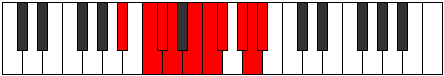

# Mode Phronygic

## Links

- [Documentation](index.md)
- [Scales Index](Scales.md)
- [Modes Index](Modes.md)
- [Chords Index](Chords.md)

## Parent Scale

[Phronygic](ScalePhronygic.md)

## Number

[3549](https://ianring.com/musictheory/scales/3549)

## Perfection

- 6 Perfect notes
- 3 Perfect notes

## Interval Pattern

2, 1, 1, 2, 1, 1, 2, 1, 1

## Perfection Profile

[true false true true false true true false true]

## Permutations

| Tonic | Notes | Signature | Illustration | Audio |
|-------|-------|-----------|--------------|-------|
| [C](ModeCNaturalPhronygic.md) | C, **D**, D#, E, **F#**, G, G#, **A#**, B, C | C |  | [midi](https://github.com/edipermadi/music/blob/main/docs/ModeCNaturalPhronygic.mid?raw=true) |
| [C#](ModeCSharpPhronygic.md) | C#, **D#**, E, F, **G**, G#, A, **B**, C, C# | C |  | [midi](https://github.com/edipermadi/music/blob/main/docs/ModeCSharpPhronygic.mid?raw=true) |
| [Db](ModeDFlatPhronygic.md) | Db, **Eb**, E, F, **G**, Ab, A, **B**, C, Db | C |  | [midi](https://github.com/edipermadi/music/blob/main/docs/ModeDFlatPhronygic.mid?raw=true) |
| [D](ModeDNaturalPhronygic.md) | D, **E**, F, F#, **G#**, A, A#, **C**, C#, D | C |  | [midi](https://github.com/edipermadi/music/blob/main/docs/ModeDNaturalPhronygic.mid?raw=true) |
| [D#](ModeDSharpPhronygic.md) | D#, **F**, F#, G, **A**, A#, B, **C#**, D, D# | C |  | [midi](https://github.com/edipermadi/music/blob/main/docs/ModeDSharpPhronygic.mid?raw=true) |
| [Eb](ModeEFlatPhronygic.md) | Eb, **F**, Gb, G, **A**, Bb, B, **Db**, D, Eb | C |  | [midi](https://github.com/edipermadi/music/blob/main/docs/ModeEFlatPhronygic.mid?raw=true) |
| [E](ModeENaturalPhronygic.md) | E, **F#**, G, G#, **A#**, B, C, **D**, D#, E | C |  | [midi](https://github.com/edipermadi/music/blob/main/docs/ModeENaturalPhronygic.mid?raw=true) |
| [F](ModeFNaturalPhronygic.md) | F, **G**, G#, A, **B**, C, C#, **D#**, E, F | C |  | [midi](https://github.com/edipermadi/music/blob/main/docs/ModeFNaturalPhronygic.mid?raw=true) |
| [F#](ModeFSharpPhronygic.md) | F#, **G#**, A, A#, **C**, C#, D, **E**, F, F# | C |  | [midi](https://github.com/edipermadi/music/blob/main/docs/ModeFSharpPhronygic.mid?raw=true) |
| [Gb](ModeGFlatPhronygic.md) | Gb, **Ab**, A, Bb, **C**, Db, D, **E**, F, Gb | C |  | [midi](https://github.com/edipermadi/music/blob/main/docs/ModeGFlatPhronygic.mid?raw=true) |
| [G](ModeGNaturalPhronygic.md) | G, **A**, A#, B, **C#**, D, D#, **F**, F#, G | C |  | [midi](https://github.com/edipermadi/music/blob/main/docs/ModeGNaturalPhronygic.mid?raw=true) |
| [G#](ModeGSharpPhronygic.md) | G#, **A#**, B, C, **D**, D#, E, **F#**, G, G# | C |  | [midi](https://github.com/edipermadi/music/blob/main/docs/ModeGSharpPhronygic.mid?raw=true) |
| [Ab](ModeAFlatPhronygic.md) | Ab, **Bb**, B, C, **D**, Eb, E, **Gb**, G, Ab | C |  | [midi](https://github.com/edipermadi/music/blob/main/docs/ModeAFlatPhronygic.mid?raw=true) |
| [A](ModeANaturalPhronygic.md) | A, **B**, C, C#, **D#**, E, F, **G**, G#, A | C |  | [midi](https://github.com/edipermadi/music/blob/main/docs/ModeANaturalPhronygic.mid?raw=true) |
| [A#](ModeASharpPhronygic.md) | A#, **C**, C#, D, **E**, F, F#, **G#**, A, A# | C |  | [midi](https://github.com/edipermadi/music/blob/main/docs/ModeASharpPhronygic.mid?raw=true) |
| [Bb](ModeBFlatPhronygic.md) | Bb, **C**, Db, D, **E**, F, Gb, **Ab**, A, Bb | C |  | [midi](https://github.com/edipermadi/music/blob/main/docs/ModeBFlatPhronygic.mid?raw=true) |
| [B](ModeBNaturalPhronygic.md) | B, **C#**, D, D#, **F**, F#, G, **A**, A#, B | C |  | [midi](https://github.com/edipermadi/music/blob/main/docs/ModeBNaturalPhronygic.mid?raw=true) |
