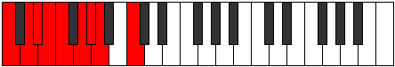

# Mode Phronyllic

## Links

- [Documentation](index.md)
- [Scales Index](Scales.md)
- [Modes Index](Modes.md)
- [Chords Index](Chords.md)

## Parent Scale

[Pothyllic](ScalePothyllic.md)

## Number

[957](https://ianring.com/musictheory/scales/957)

## Perfection

- 6 Perfect notes
- 2 Perfect notes

## Perfection Profile

[true true false false true true true true]

## Permutations

| Tonic | Notes | Signature | Illustration | Audio |
|-------|-------|-----------|--------------|-------|
| [C](ModeCNaturalPhronyllic.md) | C, D, **D#**, **E**, F, G, G#, A, C | C |  | [midi](ModeCNaturalPhronyllic.mid) [ogg](ModeCNaturalPhronyllic.ogg) |
| [C#](ModeCSharpPhronyllic.md) | C#, D#, **E**, **F**, F#, G#, A, A#, C# | C |  | [midi](ModeCSharpPhronyllic.mid) [ogg](ModeCSharpPhronyllic.ogg) |
| [Db](ModeDFlatPhronyllic.md) | Db, Eb, **E**, **F**, Gb, Ab, A, Bb, Db | C |  | [midi](ModeDFlatPhronyllic.mid) [ogg](ModeDFlatPhronyllic.ogg) |
| [D](ModeDNaturalPhronyllic.md) | D, E, **F**, **F#**, G, A, A#, B, D | C |  | [midi](ModeDNaturalPhronyllic.mid) [ogg](ModeDNaturalPhronyllic.ogg) |
| [D#](ModeDSharpPhronyllic.md) | D#, F, **F#**, **G**, G#, A#, B, C, D# | C |  | [midi](ModeDSharpPhronyllic.mid) [ogg](ModeDSharpPhronyllic.ogg) |
| [Eb](ModeEFlatPhronyllic.md) | Eb, F, **Gb**, **G**, Ab, Bb, B, C, Eb | C |  | [midi](ModeEFlatPhronyllic.mid) [ogg](ModeEFlatPhronyllic.ogg) |
| [E](ModeENaturalPhronyllic.md) | E, F#, **G**, **G#**, A, B, C, C#, E | C |  | [midi](ModeENaturalPhronyllic.mid) [ogg](ModeENaturalPhronyllic.ogg) |
| [F](ModeFNaturalPhronyllic.md) | F, G, **G#**, **A**, A#, C, C#, D, F | C |  | [midi](ModeFNaturalPhronyllic.mid) [ogg](ModeFNaturalPhronyllic.ogg) |
| [F#](ModeFSharpPhronyllic.md) | F#, G#, **A**, **A#**, B, C#, D, D#, F# | C |  | [midi](ModeFSharpPhronyllic.mid) [ogg](ModeFSharpPhronyllic.ogg) |
| [Gb](ModeGFlatPhronyllic.md) | Gb, Ab, **A**, **Bb**, B, Db, D, Eb, Gb | C |  | [midi](ModeGFlatPhronyllic.mid) [ogg](ModeGFlatPhronyllic.ogg) |
| [G](ModeGNaturalPhronyllic.md) | G, A, **A#**, **B**, C, D, D#, E, G | C |  | [midi](ModeGNaturalPhronyllic.mid) [ogg](ModeGNaturalPhronyllic.ogg) |
| [G#](ModeGSharpPhronyllic.md) | G#, A#, **B**, **C**, C#, D#, E, F, G# | C |  | [midi](ModeGSharpPhronyllic.mid) [ogg](ModeGSharpPhronyllic.ogg) |
| [Ab](ModeAFlatPhronyllic.md) | Ab, Bb, **B**, **C**, Db, Eb, E, F, Ab | C |  | [midi](ModeAFlatPhronyllic.mid) [ogg](ModeAFlatPhronyllic.ogg) |
| [A](ModeANaturalPhronyllic.md) | A, B, **C**, **C#**, D, E, F, F#, A | C |  | [midi](ModeANaturalPhronyllic.mid) [ogg](ModeANaturalPhronyllic.ogg) |
| [A#](ModeASharpPhronyllic.md) | A#, C, **C#**, **D**, D#, F, F#, G, A# | C |  | [midi](ModeASharpPhronyllic.mid) [ogg](ModeASharpPhronyllic.ogg) |
| [Bb](ModeBFlatPhronyllic.md) | Bb, C, **Db**, **D**, Eb, F, Gb, G, Bb | C |  | [midi](ModeBFlatPhronyllic.mid) [ogg](ModeBFlatPhronyllic.ogg) |
| [B](ModeBNaturalPhronyllic.md) | B, C#, **D**, **D#**, E, F#, G, G#, B | C |  | [midi](ModeBNaturalPhronyllic.mid) [ogg](ModeBNaturalPhronyllic.ogg) |
