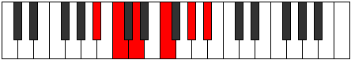

# Mode Phropitonic

## Links

- [Documentation](README.md)
- [Scales Index](Scales.md)
- [Modes Index](Modes.md)
- [Chords Index](Chords.md)

## Parent Scale

[Kataritonic](ScaleKataritonic.md)

## Number

[1173](https://ianring.com/musictheory/scales/1173)

## Interval Pattern

2, 2, 3, 3, 2

## Chord Pattern

## Perfection

- 2 Perfect notes
- 3 Perfect notes

## Perfection Profile

[true false false true false]

## Permutations

| Tonic | Notes | Signature | Illustration | Audio |
|-------|-------|-----------|--------------|-------|
| [C](ModeCNaturalPhropitonic.md) | C, **D**, **E**, G, **A#**, C | C |  | [midi](https://github.com/edipermadi/music/blob/main/docs/ModeCNaturalPhropitonic.mid?raw=true) |
| [C#](ModeCSharpPhropitonic.md) | C#, **D#**, **F**, G#, **B**, C# | C |  | [midi](https://github.com/edipermadi/music/blob/main/docs/ModeCSharpPhropitonic.mid?raw=true) |
| [Db](ModeDFlatPhropitonic.md) | Db, **Eb**, **F**, Ab, **B**, Db | C |  | [midi](https://github.com/edipermadi/music/blob/main/docs/ModeDFlatPhropitonic.mid?raw=true) |
| [D](ModeDNaturalPhropitonic.md) | D, **E**, **F#**, A, **C**, D | C |  | [midi](https://github.com/edipermadi/music/blob/main/docs/ModeDNaturalPhropitonic.mid?raw=true) |
| [D#](ModeDSharpPhropitonic.md) | D#, **F**, **G**, A#, **C#**, D# | C |  | [midi](https://github.com/edipermadi/music/blob/main/docs/ModeDSharpPhropitonic.mid?raw=true) |
| [Eb](ModeEFlatPhropitonic.md) | Eb, **F**, **G**, Bb, **Db**, Eb | C |  | [midi](https://github.com/edipermadi/music/blob/main/docs/ModeEFlatPhropitonic.mid?raw=true) |
| [E](ModeENaturalPhropitonic.md) | E, **F#**, **G#**, B, **D**, E | C |  | [midi](https://github.com/edipermadi/music/blob/main/docs/ModeENaturalPhropitonic.mid?raw=true) |
| [F](ModeFNaturalPhropitonic.md) | F, **G**, **A**, C, **D#**, F | C |  | [midi](https://github.com/edipermadi/music/blob/main/docs/ModeFNaturalPhropitonic.mid?raw=true) |
| [F#](ModeFSharpPhropitonic.md) | F#, **G#**, **A#**, C#, **E**, F# | C |  | [midi](https://github.com/edipermadi/music/blob/main/docs/ModeFSharpPhropitonic.mid?raw=true) |
| [Gb](ModeGFlatPhropitonic.md) | Gb, **Ab**, **Bb**, Db, **E**, Gb | C |  | [midi](https://github.com/edipermadi/music/blob/main/docs/ModeGFlatPhropitonic.mid?raw=true) |
| [G](ModeGNaturalPhropitonic.md) | G, **A**, **B**, D, **F**, G | C |  | [midi](https://github.com/edipermadi/music/blob/main/docs/ModeGNaturalPhropitonic.mid?raw=true) |
| [G#](ModeGSharpPhropitonic.md) | G#, **A#**, **C**, D#, **F#**, G# | C |  | [midi](https://github.com/edipermadi/music/blob/main/docs/ModeGSharpPhropitonic.mid?raw=true) |
| [Ab](ModeAFlatPhropitonic.md) | Ab, **Bb**, **C**, Eb, **Gb**, Ab | C |  | [midi](https://github.com/edipermadi/music/blob/main/docs/ModeAFlatPhropitonic.mid?raw=true) |
| [A](ModeANaturalPhropitonic.md) | A, **B**, **C#**, E, **G**, A | C |  | [midi](https://github.com/edipermadi/music/blob/main/docs/ModeANaturalPhropitonic.mid?raw=true) |
| [A#](ModeASharpPhropitonic.md) | A#, **C**, **D**, F, **G#**, A# | C |  | [midi](https://github.com/edipermadi/music/blob/main/docs/ModeASharpPhropitonic.mid?raw=true) |
| [Bb](ModeBFlatPhropitonic.md) | Bb, **C**, **D**, F, **Ab**, Bb | C |  | [midi](https://github.com/edipermadi/music/blob/main/docs/ModeBFlatPhropitonic.mid?raw=true) |
| [B](ModeBNaturalPhropitonic.md) | B, **C#**, **D#**, F#, **A**, B | C |  | [midi](https://github.com/edipermadi/music/blob/main/docs/ModeBNaturalPhropitonic.mid?raw=true) |
