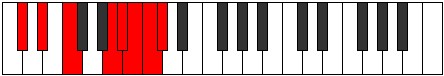
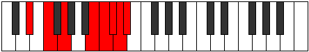

# Mode Phroptian

## Links

- [Documentation](README.md)
- [Scales Index](Scales.md)
- [Modes Index](Modes.md)
- [Chords Index](Chords.md)

## Parent Scale

[Stanian](ScaleStanian.md)

## Number

[3861](https://ianring.com/musictheory/scales/3861)

## Transposition

2, 2, 4, 1, 1, 1, 1

## Chord Pattern

vi⁰b3

## Perfection

- 3 Perfect notes
- 4 Perfect notes

## Perfection Profile

false, true, true, false, true, false, false

## Permutations

| Tonic | Notes | Signature | Illustration | Audio |
|-------|-------|-----------|--------------|-------|
| [C](ModeCNaturalPhroptian.md) | **C**, D, E, **F###**, G##, **A#**, **B**, **C** | C |  | [midi](https://github.com/edipermadi/music/blob/main/docs/ModeCNaturalPhroptian.mid?raw=true) |
| [C#](ModeCSharpPhroptian.md) | **C#**, D#, E#, **Cbbb**, Cbb, **Dbbb**, **Dbb**, **C#** | C |  | [midi](https://github.com/edipermadi/music/blob/main/docs/ModeCSharpPhroptian.mid?raw=true) |
| [Db](ModeDFlatPhroptian.md) | **Db**, Eb, F, **G##**, A#, **B**, **C**, **Db** | C |  | [midi](https://github.com/edipermadi/music/blob/main/docs/ModeDFlatPhroptian.mid?raw=true) |
| [D](ModeDNaturalPhroptian.md) | **D**, E, F#, **G###**, A##, **B#**, **C#**, **D** | C |  | [midi](https://github.com/edipermadi/music/blob/main/docs/ModeDNaturalPhroptian.mid?raw=true) |
| [D#](ModeDSharpPhroptian.md) | **D#**, E#, F##, **Cb**, Dbb, **Ebbb**, **Fbbb**, **D#** | C |  | [midi](https://github.com/edipermadi/music/blob/main/docs/ModeDSharpPhroptian.mid?raw=true) |
| [Eb](ModeEFlatPhroptian.md) | **Eb**, F, G, **A##**, B#, **C#**, **D**, **Eb** | C |  | [midi](https://github.com/edipermadi/music/blob/main/docs/ModeEFlatPhroptian.mid?raw=true) |
| [E](ModeENaturalPhroptian.md) | **E**, F#, G#, **A###**, B##, **C##**, **D#**, **E** | C |  | [midi](https://github.com/edipermadi/music/blob/main/docs/ModeENaturalPhroptian.mid?raw=true) |
| [F](ModeFNaturalPhroptian.md) | **F**, G, A, **B##**, C##, **D#**, **E**, **F** | C |  | [midi](https://github.com/edipermadi/music/blob/main/docs/ModeFNaturalPhroptian.mid?raw=true) |
| [F#](ModeFSharpPhroptian.md) | **F#**, G#, A#, **B###**, C###, **D##**, **E#**, **F#** | C |  | [midi](https://github.com/edipermadi/music/blob/main/docs/ModeFSharpPhroptian.mid?raw=true) |
| [Gb](ModeGFlatPhroptian.md) | **Gb**, Ab, Bb, **C##**, D#, **E**, **F**, **Gb** | C |  | [midi](https://github.com/edipermadi/music/blob/main/docs/ModeGFlatPhroptian.mid?raw=true) |
| [G](ModeGNaturalPhroptian.md) | **G**, A, B, **C###**, D##, **E#**, **F#**, **G** | C |  | [midi](https://github.com/edipermadi/music/blob/main/docs/ModeGNaturalPhroptian.mid?raw=true) |
| [G#](ModeGSharpPhroptian.md) | **G#**, A#, B#, **D##**, E#, **F#**, **G**, **G#** | C |  | [midi](https://github.com/edipermadi/music/blob/main/docs/ModeGSharpPhroptian.mid?raw=true) |
| [Ab](ModeAFlatPhroptian.md) | **Ab**, Bb, C, **D##**, E#, **F#**, **G**, **Ab** | C |  | [midi](https://github.com/edipermadi/music/blob/main/docs/ModeAFlatPhroptian.mid?raw=true) |
| [A](ModeANaturalPhroptian.md) | **A**, B, C#, **D###**, E##, **F##**, **G#**, **A** | C |  | [midi](https://github.com/edipermadi/music/blob/main/docs/ModeANaturalPhroptian.mid?raw=true) |
| [A#](ModeASharpPhroptian.md) | **A#**, B#, C##, **E##**, F##, **G#**, **A**, **A#** | C |  | [midi](https://github.com/edipermadi/music/blob/main/docs/ModeASharpPhroptian.mid?raw=true) |
| [Bb](ModeBFlatPhroptian.md) | **Bb**, C, D, **E##**, F##, **G#**, **A**, **Bb** | C |  | [midi](https://github.com/edipermadi/music/blob/main/docs/ModeBFlatPhroptian.mid?raw=true) |
| [B](ModeBNaturalPhroptian.md) | **B**, C#, D#, **E###**, F###, **G##**, **A#**, **B** | C |  | [midi](https://github.com/edipermadi/music/blob/main/docs/ModeBNaturalPhroptian.mid?raw=true) |
