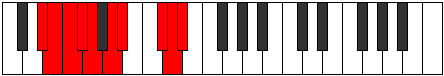

# Mode Phroptygic

## Links

- [Documentation](index.md)
- [Scales Index](Scales.md)
- [Modes Index](Modes.md)
- [Chords Index](Chords.md)

## Parent Scale

[Zothygic](ScaleZothygic.md)

## Number

[3295](https://ianring.com/musictheory/scales/3295)

## Interval Pattern

1, 1, 1, 1, 2, 1, 3, 1, 1

## Chord Pattern

i⁰, i, I, ii⁰, III⁺, iv, IV, IV⁺, v⁰, v, VI, VI⁺, vii⁰, vii, VII, VII⁺, viii⁰, VIII⁺, ix, IX, IX⁺

## Perfection

- 6 Perfect notes
- 3 Perfect notes

## Perfection Profile

[true false false true true true true false true]

## Permutations

| Tonic | Notes | Signature | Illustration | Audio |
|-------|-------|-----------|--------------|-------|
| [C](ModeCNaturalPhroptygic.md) | C, **C#**, **D**, D#, E, F#, G, **A#**, B, C | C |  | [midi](https://github.com/edipermadi/music/blob/main/docs/ModeCNaturalPhroptygic.mid?raw=true) |
| [C#](ModeCSharpPhroptygic.md) | C#, **D**, **D#**, E, F, G, G#, **B**, C, C# | C |  | [midi](https://github.com/edipermadi/music/blob/main/docs/ModeCSharpPhroptygic.mid?raw=true) |
| [Db](ModeDFlatPhroptygic.md) | Db, **D**, **Eb**, E, F, G, Ab, **B**, C, Db | C |  | [midi](https://github.com/edipermadi/music/blob/main/docs/ModeDFlatPhroptygic.mid?raw=true) |
| [D](ModeDNaturalPhroptygic.md) | D, **D#**, **E**, F, F#, G#, A, **C**, C#, D | C |  | [midi](https://github.com/edipermadi/music/blob/main/docs/ModeDNaturalPhroptygic.mid?raw=true) |
| [D#](ModeDSharpPhroptygic.md) | D#, **E**, **F**, F#, G, A, A#, **C#**, D, D# | C |  | [midi](https://github.com/edipermadi/music/blob/main/docs/ModeDSharpPhroptygic.mid?raw=true) |
| [Eb](ModeEFlatPhroptygic.md) | Eb, **E**, **F**, Gb, G, A, Bb, **Db**, D, Eb | C |  | [midi](https://github.com/edipermadi/music/blob/main/docs/ModeEFlatPhroptygic.mid?raw=true) |
| [E](ModeENaturalPhroptygic.md) | E, **F**, **F#**, G, G#, A#, B, **D**, D#, E | C |  | [midi](https://github.com/edipermadi/music/blob/main/docs/ModeENaturalPhroptygic.mid?raw=true) |
| [F](ModeFNaturalPhroptygic.md) | F, **F#**, **G**, G#, A, B, C, **D#**, E, F | C |  | [midi](https://github.com/edipermadi/music/blob/main/docs/ModeFNaturalPhroptygic.mid?raw=true) |
| [F#](ModeFSharpPhroptygic.md) | F#, **G**, **G#**, A, A#, C, C#, **E**, F, F# | C |  | [midi](https://github.com/edipermadi/music/blob/main/docs/ModeFSharpPhroptygic.mid?raw=true) |
| [Gb](ModeGFlatPhroptygic.md) | Gb, **G**, **Ab**, A, Bb, C, Db, **E**, F, Gb | C |  | [midi](https://github.com/edipermadi/music/blob/main/docs/ModeGFlatPhroptygic.mid?raw=true) |
| [G](ModeGNaturalPhroptygic.md) | G, **G#**, **A**, A#, B, C#, D, **F**, F#, G | C |  | [midi](https://github.com/edipermadi/music/blob/main/docs/ModeGNaturalPhroptygic.mid?raw=true) |
| [G#](ModeGSharpPhroptygic.md) | G#, **A**, **A#**, B, C, D, D#, **F#**, G, G# | C |  | [midi](https://github.com/edipermadi/music/blob/main/docs/ModeGSharpPhroptygic.mid?raw=true) |
| [Ab](ModeAFlatPhroptygic.md) | Ab, **A**, **Bb**, B, C, D, Eb, **Gb**, G, Ab | C |  | [midi](https://github.com/edipermadi/music/blob/main/docs/ModeAFlatPhroptygic.mid?raw=true) |
| [A](ModeANaturalPhroptygic.md) | A, **A#**, **B**, C, C#, D#, E, **G**, G#, A | C |  | [midi](https://github.com/edipermadi/music/blob/main/docs/ModeANaturalPhroptygic.mid?raw=true) |
| [A#](ModeASharpPhroptygic.md) | A#, **B**, **C**, C#, D, E, F, **G#**, A, A# | C |  | [midi](https://github.com/edipermadi/music/blob/main/docs/ModeASharpPhroptygic.mid?raw=true) |
| [Bb](ModeBFlatPhroptygic.md) | Bb, **B**, **C**, Db, D, E, F, **Ab**, A, Bb | C |  | [midi](https://github.com/edipermadi/music/blob/main/docs/ModeBFlatPhroptygic.mid?raw=true) |
| [B](ModeBNaturalPhroptygic.md) | B, **C**, **C#**, D, D#, F, F#, **A**, A#, B | C |  | [midi](https://github.com/edipermadi/music/blob/main/docs/ModeBNaturalPhroptygic.mid?raw=true) |
