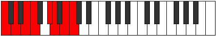

# Mode Phrothian

## Links

- [Documentation](README.md)
- [Scales Index](Scales.md)
- [Modes Index](Modes.md)
- [Chords Index](Chords.md)

## Parent Scale

[Bycrian](ScaleBycrian.md)

## Number

[2869](https://ianring.com/musictheory/scales/2869)

## Luminosity

-1

## Transposition

2, 2, 1, 3, 1, 2, 1

## Chord Pattern

I⁺, ii, III, IV, v⁰, vi, vii⁰

## Perfection

- 4 Perfect notes
- 3 Perfect notes

## Perfection Profile

false, true, true, true, false, true, false

## Permutations

| Tonic | Notes | Signature | Illustration | Audio |
|-------|-------|-----------|--------------|-------|
| [C](ModeCNaturalPhrothian.md) | **C**, D, E, F, **G#**, A, **B**, **C** | C |  | [midi](https://github.com/edipermadi/music/blob/main/docs/ModeCNaturalPhrothian.mid?raw=true) |
| [C#](ModeCSharpPhrothian.md) | **C#**, D#, E#, F#, **G##**, A#, **B#**, **C#** | C |  | [midi](https://github.com/edipermadi/music/blob/main/docs/ModeCSharpPhrothian.mid?raw=true) |
| [Db](ModeDFlatPhrothian.md) | **Db**, Eb, F, Gb, **A**, Bb, **C**, **Db** | C |  | [midi](https://github.com/edipermadi/music/blob/main/docs/ModeDFlatPhrothian.mid?raw=true) |
| [D](ModeDNaturalPhrothian.md) | **D**, E, F#, G, **A#**, B, **C#**, **D** | C |  | [midi](https://github.com/edipermadi/music/blob/main/docs/ModeDNaturalPhrothian.mid?raw=true) |
| [D#](ModeDSharpPhrothian.md) | **D#**, E#, F##, G#, **A##**, B#, **C##**, **D#** | C |  | [midi](https://github.com/edipermadi/music/blob/main/docs/ModeDSharpPhrothian.mid?raw=true) |
| [Eb](ModeEFlatPhrothian.md) | **Eb**, F, G, Ab, **B**, C, **D**, **Eb** | C |  | [midi](https://github.com/edipermadi/music/blob/main/docs/ModeEFlatPhrothian.mid?raw=true) |
| [E](ModeENaturalPhrothian.md) | **E**, F#, G#, A, **B#**, C#, **D#**, **E** | C |  | [midi](https://github.com/edipermadi/music/blob/main/docs/ModeENaturalPhrothian.mid?raw=true) |
| [F](ModeFNaturalPhrothian.md) | **F**, G, A, Bb, **C#**, D, **E**, **F** | C |  | [midi](https://github.com/edipermadi/music/blob/main/docs/ModeFNaturalPhrothian.mid?raw=true) |
| [F#](ModeFSharpPhrothian.md) | **F#**, G#, A#, B, **C##**, D#, **E#**, **F#** | C |  | [midi](https://github.com/edipermadi/music/blob/main/docs/ModeFSharpPhrothian.mid?raw=true) |
| [Gb](ModeGFlatPhrothian.md) | **Gb**, Ab, Bb, Cb, **D**, Eb, **F**, **Gb** | C |  | [midi](https://github.com/edipermadi/music/blob/main/docs/ModeGFlatPhrothian.mid?raw=true) |
| [G](ModeGNaturalPhrothian.md) | **G**, A, B, C, **D#**, E, **F#**, **G** | C |  | [midi](https://github.com/edipermadi/music/blob/main/docs/ModeGNaturalPhrothian.mid?raw=true) |
| [G#](ModeGSharpPhrothian.md) | **G#**, A#, B#, C#, **D##**, E#, **F##**, **G#** | C |  | [midi](https://github.com/edipermadi/music/blob/main/docs/ModeGSharpPhrothian.mid?raw=true) |
| [Ab](ModeAFlatPhrothian.md) | **Ab**, Bb, C, Db, **E**, F, **G**, **Ab** | C |  | [midi](https://github.com/edipermadi/music/blob/main/docs/ModeAFlatPhrothian.mid?raw=true) |
| [A](ModeANaturalPhrothian.md) | **A**, B, C#, D, **E#**, F#, **G#**, **A** | C |  | [midi](https://github.com/edipermadi/music/blob/main/docs/ModeANaturalPhrothian.mid?raw=true) |
| [A#](ModeASharpPhrothian.md) | **A#**, B#, C##, D#, **E##**, F##, **G##**, **A#** | C |  | [midi](https://github.com/edipermadi/music/blob/main/docs/ModeASharpPhrothian.mid?raw=true) |
| [Bb](ModeBFlatPhrothian.md) | **Bb**, C, D, Eb, **F#**, G, **A**, **Bb** | C |  | [midi](https://github.com/edipermadi/music/blob/main/docs/ModeBFlatPhrothian.mid?raw=true) |
| [B](ModeBNaturalPhrothian.md) | **B**, C#, D#, E, **F##**, G#, **A#**, **B** | C |  | [midi](https://github.com/edipermadi/music/blob/main/docs/ModeBNaturalPhrothian.mid?raw=true) |
