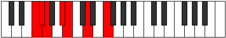

# Mode Phrothimic

## Links

- [Documentation](index.md)
- [Scales Index](Scales.md)
- [Modes Index](Modes.md)
- [Chords Index](Chords.md)

## Parent Scale

[Mydimic](ScaleMydimic.md)

## Number

[615](https://ianring.com/musictheory/scales/615)

## Perfection

- 3 Perfect notes
- 3 Perfect notes

## Perfection Profile

[false false true true true false]

## Permutations

| Tonic | Notes | Signature | Illustration | Audio |
|-------|-------|-----------|--------------|-------|
| [C](ModeCNaturalPhrothimic.md) | **C**, **Db**, Ebb, F, Gb, **A**, **C** | C |  | [midi](ModeCNaturalPhrothimic.mid) [ogg](ModeCNaturalPhrothimic.ogg) |
| [C#](ModeCSharpPhrothimic.md) | **C#**, **D**, Eb, F#, G, **A#**, **C#** | C |  | [midi](ModeCSharpPhrothimic.mid) [ogg](ModeCSharpPhrothimic.ogg) |
| [Db](ModeDFlatPhrothimic.md) | **Db**, **Ebb**, Fbb, Gb, Abb, **Bb**, **Db** | C |  | [midi](ModeDFlatPhrothimic.mid) [ogg](ModeDFlatPhrothimic.ogg) |
| [D](ModeDNaturalPhrothimic.md) | **D**, **Eb**, Fb, G, Ab, **B**, **D** | C |  | [midi](ModeDNaturalPhrothimic.mid) [ogg](ModeDNaturalPhrothimic.ogg) |
| [D#](ModeDSharpPhrothimic.md) | **D#**, **E**, F, G#, A, **B#**, **D#** | C |  | [midi](ModeDSharpPhrothimic.mid) [ogg](ModeDSharpPhrothimic.ogg) |
| [Eb](ModeEFlatPhrothimic.md) | **Eb**, **Fb**, Gbb, Ab, Bbb, **C**, **Eb** | C |  | [midi](ModeEFlatPhrothimic.mid) [ogg](ModeEFlatPhrothimic.ogg) |
| [E](ModeENaturalPhrothimic.md) | **E**, **F**, Gb, A, Bb, **C#**, **E** | C |  | [midi](ModeENaturalPhrothimic.mid) [ogg](ModeENaturalPhrothimic.ogg) |
| [F](ModeFNaturalPhrothimic.md) | **F**, **Gb**, Abb, Bb, Cb, **D**, **F** | C |  | [midi](ModeFNaturalPhrothimic.mid) [ogg](ModeFNaturalPhrothimic.ogg) |
| [F#](ModeFSharpPhrothimic.md) | **F#**, **G**, Ab, B, C, **D#**, **F#** | C |  | [midi](ModeFSharpPhrothimic.mid) [ogg](ModeFSharpPhrothimic.ogg) |
| [Gb](ModeGFlatPhrothimic.md) | **Gb**, **Abb**, Bbbb, Cb, Dbb, **Eb**, **Gb** | C |  | [midi](ModeGFlatPhrothimic.mid) [ogg](ModeGFlatPhrothimic.ogg) |
| [G](ModeGNaturalPhrothimic.md) | **G**, **Ab**, Bbb, C, Db, **E**, **G** | C |  | [midi](ModeGNaturalPhrothimic.mid) [ogg](ModeGNaturalPhrothimic.ogg) |
| [G#](ModeGSharpPhrothimic.md) | **G#**, **A**, Bb, C#, D, **E#**, **G#** | C |  | [midi](ModeGSharpPhrothimic.mid) [ogg](ModeGSharpPhrothimic.ogg) |
| [Ab](ModeAFlatPhrothimic.md) | **Ab**, **Bbb**, Cbb, Db, Ebb, **F**, **Ab** | C |  | [midi](ModeAFlatPhrothimic.mid) [ogg](ModeAFlatPhrothimic.ogg) |
| [A](ModeANaturalPhrothimic.md) | **A**, **Bb**, Cb, D, Eb, **F#**, **A** | C |  | [midi](ModeANaturalPhrothimic.mid) [ogg](ModeANaturalPhrothimic.ogg) |
| [A#](ModeASharpPhrothimic.md) | **A#**, **B**, C, D#, E, **F##**, **A#** | C |  | [midi](ModeASharpPhrothimic.mid) [ogg](ModeASharpPhrothimic.ogg) |
| [Bb](ModeBFlatPhrothimic.md) | **Bb**, **Cb**, Dbb, Eb, Fb, **G**, **Bb** | C |  | [midi](ModeBFlatPhrothimic.mid) [ogg](ModeBFlatPhrothimic.ogg) |
| [B](ModeBNaturalPhrothimic.md) | **B**, **C**, Db, E, F, **G#**, **B** | C |  | [midi](ModeBNaturalPhrothimic.mid) [ogg](ModeBNaturalPhrothimic.ogg) |
