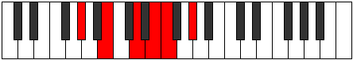

# Mode Phrothitonic

## Links

- [Documentation](README.md)
- [Scales Index](Scales.md)
- [Modes Index](Modes.md)
- [Chords Index](Chords.md)

## Parent Scale

[Mixitonic](ScaleMixitonic.md)

## Number

[841](https://ianring.com/musictheory/scales/841)

## Transposition

3, 3, 2, 1, 3

## Chord Pattern

## Perfection

- 1 Perfect notes
- 4 Perfect notes

## Perfection Profile

false, false, false, true, false

## Permutations

| Tonic | Notes | Signature | Illustration | Audio |
|-------|-------|-----------|--------------|-------|
| [C](ModeCNaturalPhrothitonic.md) | **C**, **D#**, **F#**, G#, **A**, **C** | C |  | [midi](https://github.com/edipermadi/music/blob/main/docs/ModeCNaturalPhrothitonic.mid?raw=true) |
| [C#](ModeCSharpPhrothitonic.md) | **C#**, **E**, **G**, A, **A#**, **C#** | C |  | [midi](https://github.com/edipermadi/music/blob/main/docs/ModeCSharpPhrothitonic.mid?raw=true) |
| [Db](ModeDFlatPhrothitonic.md) | **Db**, **E**, **G**, A, **Bb**, **Db** | C |  | [midi](https://github.com/edipermadi/music/blob/main/docs/ModeDFlatPhrothitonic.mid?raw=true) |
| [D](ModeDNaturalPhrothitonic.md) | **D**, **F**, **G#**, A#, **B**, **D** | C |  | [midi](https://github.com/edipermadi/music/blob/main/docs/ModeDNaturalPhrothitonic.mid?raw=true) |
| [D#](ModeDSharpPhrothitonic.md) | **D#**, **F#**, **A**, B, **C**, **D#** | C |  | [midi](https://github.com/edipermadi/music/blob/main/docs/ModeDSharpPhrothitonic.mid?raw=true) |
| [Eb](ModeEFlatPhrothitonic.md) | **Eb**, **Gb**, **A**, B, **C**, **Eb** | C |  | [midi](https://github.com/edipermadi/music/blob/main/docs/ModeEFlatPhrothitonic.mid?raw=true) |
| [E](ModeENaturalPhrothitonic.md) | **E**, **G**, **A#**, C, **C#**, **E** | C |  | [midi](https://github.com/edipermadi/music/blob/main/docs/ModeENaturalPhrothitonic.mid?raw=true) |
| [F](ModeFNaturalPhrothitonic.md) | **F**, **G#**, **B**, C#, **D**, **F** | C |  | [midi](https://github.com/edipermadi/music/blob/main/docs/ModeFNaturalPhrothitonic.mid?raw=true) |
| [F#](ModeFSharpPhrothitonic.md) | **F#**, **A**, **C**, D, **D#**, **F#** | C |  | [midi](https://github.com/edipermadi/music/blob/main/docs/ModeFSharpPhrothitonic.mid?raw=true) |
| [Gb](ModeGFlatPhrothitonic.md) | **Gb**, **A**, **C**, D, **Eb**, **Gb** | C |  | [midi](https://github.com/edipermadi/music/blob/main/docs/ModeGFlatPhrothitonic.mid?raw=true) |
| [G](ModeGNaturalPhrothitonic.md) | **G**, **A#**, **C#**, D#, **E**, **G** | C |  | [midi](https://github.com/edipermadi/music/blob/main/docs/ModeGNaturalPhrothitonic.mid?raw=true) |
| [G#](ModeGSharpPhrothitonic.md) | **G#**, **B**, **D**, E, **F**, **G#** | C |  | [midi](https://github.com/edipermadi/music/blob/main/docs/ModeGSharpPhrothitonic.mid?raw=true) |
| [Ab](ModeAFlatPhrothitonic.md) | **Ab**, **B**, **D**, E, **F**, **Ab** | C |  | [midi](https://github.com/edipermadi/music/blob/main/docs/ModeAFlatPhrothitonic.mid?raw=true) |
| [A](ModeANaturalPhrothitonic.md) | **A**, **C**, **D#**, F, **F#**, **A** | C |  | [midi](https://github.com/edipermadi/music/blob/main/docs/ModeANaturalPhrothitonic.mid?raw=true) |
| [A#](ModeASharpPhrothitonic.md) | **A#**, **C#**, **E**, F#, **G**, **A#** | C |  | [midi](https://github.com/edipermadi/music/blob/main/docs/ModeASharpPhrothitonic.mid?raw=true) |
| [Bb](ModeBFlatPhrothitonic.md) | **Bb**, **Db**, **E**, Gb, **G**, **Bb** | C |  | [midi](https://github.com/edipermadi/music/blob/main/docs/ModeBFlatPhrothitonic.mid?raw=true) |
| [B](ModeBNaturalPhrothitonic.md) | **B**, **D**, **F**, G, **G#**, **B** | C |  | [midi](https://github.com/edipermadi/music/blob/main/docs/ModeBNaturalPhrothitonic.mid?raw=true) |
