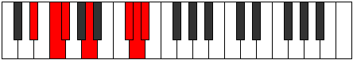
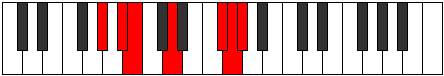

# Mode Phrycrimic

## Links

- [Documentation](index.md)
- [Scales Index](Scales.md)
- [Modes Index](Modes.md)
- [Chords Index](Chords.md)

## Parent Scale

[Aerothimic](ScaleAerothimic.md)

## Number

[3149](https://ianring.com/musictheory/scales/3149)

## Perfection

- 2 Perfect notes
- 4 Perfect notes

## Perfection Profile

[false false true false false true]

## Permutations

| Tonic | Notes | Signature | Illustration | Audio |
|-------|-------|-----------|--------------|-------|
| [C](ModeCNaturalPhrycrimic.md) | **C**, **D**, Eb, **F#**, **G###**, A##, **C** | C |  | [midi](ModeCNaturalPhrycrimic.mid) [ogg](ModeCNaturalPhrycrimic.ogg) |
| [C#](ModeCSharpPhrycrimic.md) | **C#**, **D#**, E, **F##**, **Cb**, Dbb, **C#** | C |  | [midi](ModeCSharpPhrycrimic.mid) [ogg](ModeCSharpPhrycrimic.ogg) |
| [Db](ModeDFlatPhrycrimic.md) | **Db**, **Eb**, Fb, **G**, **A##**, B#, **Db** | C |  | [midi](ModeDFlatPhrycrimic.mid) [ogg](ModeDFlatPhrycrimic.ogg) |
| [D](ModeDNaturalPhrycrimic.md) | **D**, **E**, F, **G#**, **A###**, B##, **D** | C |  | [midi](ModeDNaturalPhrycrimic.mid) [ogg](ModeDNaturalPhrycrimic.ogg) |
| [D#](ModeDSharpPhrycrimic.md) | **D#**, **E#**, F#, **G##**, **Db**, Ebb, **D#** | C |  | [midi](ModeDSharpPhrycrimic.mid) [ogg](ModeDSharpPhrycrimic.ogg) |
| [Eb](ModeEFlatPhrycrimic.md) | **Eb**, **F**, Gb, **A**, **B##**, C##, **Eb** | C |  | [midi](ModeEFlatPhrycrimic.mid) [ogg](ModeEFlatPhrycrimic.ogg) |
| [E](ModeENaturalPhrycrimic.md) | **E**, **F#**, G, **A#**, **B###**, C###, **E** | C |  | [midi](ModeENaturalPhrycrimic.mid) [ogg](ModeENaturalPhrycrimic.ogg) |
| [F](ModeFNaturalPhrycrimic.md) | **F**, **G**, Ab, **B**, **C###**, D##, **F** | C |  | [midi](ModeFNaturalPhrycrimic.mid) [ogg](ModeFNaturalPhrycrimic.ogg) |
| [F#](ModeFSharpPhrycrimic.md) | **F#**, **G#**, A, **B#**, **D##**, E#, **F#** | C |  | [midi](ModeFSharpPhrycrimic.mid) [ogg](ModeFSharpPhrycrimic.ogg) |
| [Gb](ModeGFlatPhrycrimic.md) | **Gb**, **Ab**, Bbb, **C**, **D##**, E#, **Gb** | C |  | [midi](ModeGFlatPhrycrimic.mid) [ogg](ModeGFlatPhrycrimic.ogg) |
| [G](ModeGNaturalPhrycrimic.md) | **G**, **A**, Bb, **C#**, **D###**, E##, **G** | C |  | [midi](ModeGNaturalPhrycrimic.mid) [ogg](ModeGNaturalPhrycrimic.ogg) |
| [G#](ModeGSharpPhrycrimic.md) | **G#**, **A#**, B, **C##**, **E##**, F##, **G#** | C |  | [midi](ModeGSharpPhrycrimic.mid) [ogg](ModeGSharpPhrycrimic.ogg) |
| [Ab](ModeAFlatPhrycrimic.md) | **Ab**, **Bb**, Cb, **D**, **E##**, F##, **Ab** | C |  | [midi](ModeAFlatPhrycrimic.mid) [ogg](ModeAFlatPhrycrimic.ogg) |
| [A](ModeANaturalPhrycrimic.md) | **A**, **B**, C, **D#**, **E###**, F###, **A** | C |  | [midi](ModeANaturalPhrycrimic.mid) [ogg](ModeANaturalPhrycrimic.ogg) |
| [A#](ModeASharpPhrycrimic.md) | **A#**, **B#**, C#, **D##**, **F###**, G##, **A#** | C |  | [midi](ModeASharpPhrycrimic.mid) [ogg](ModeASharpPhrycrimic.ogg) |
| [Bb](ModeBFlatPhrycrimic.md) | **Bb**, **C**, Db, **E**, **F###**, G##, **Bb** | C |  | [midi](ModeBFlatPhrycrimic.mid) [ogg](ModeBFlatPhrycrimic.ogg) |
| [B](ModeBNaturalPhrycrimic.md) | **B**, **C#**, D, **E#**, **Cbbb**, Cbb, **B** | C |  | [midi](ModeBNaturalPhrycrimic.mid) [ogg](ModeBNaturalPhrycrimic.ogg) |
