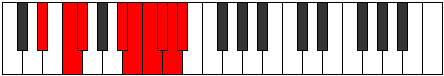

# Mode Phrycryllic

## Links

- [Documentation](index.md)
- [Scales Index](Scales.md)
- [Modes Index](Modes.md)
- [Chords Index](Chords.md)

## Parent Scale

[Phroryllic](ScalePhroryllic.md)

## Number

[3981](https://ianring.com/musictheory/scales/3981)

## Perfection

- 5 Perfect notes
- 3 Perfect notes

## Perfection Profile

[true true true true true false false false]

## Permutations

| Tonic | Notes | Signature | Illustration | Audio |
|-------|-------|-----------|--------------|-------|
| [C](ModeCNaturalPhrycryllic.md) | C, D, D#, G, G#, **A**, **A#**, **B**, C | C |  | [midi](ModeCNaturalPhrycryllic.mid) [ogg](ModeCNaturalPhrycryllic.ogg) |
| [C#](ModeCSharpPhrycryllic.md) | C#, D#, E, G#, A, **A#**, **B**, **C**, C# | C |  | [midi](ModeCSharpPhrycryllic.mid) [ogg](ModeCSharpPhrycryllic.ogg) |
| [Db](ModeDFlatPhrycryllic.md) | Db, Eb, E, Ab, A, **Bb**, **B**, **C**, Db | C |  | [midi](ModeDFlatPhrycryllic.mid) [ogg](ModeDFlatPhrycryllic.ogg) |
| [D](ModeDNaturalPhrycryllic.md) | D, E, F, A, A#, **B**, **C**, **C#**, D | C |  | [midi](ModeDNaturalPhrycryllic.mid) [ogg](ModeDNaturalPhrycryllic.ogg) |
| [D#](ModeDSharpPhrycryllic.md) | D#, F, F#, A#, B, **C**, **C#**, **D**, D# | C |  | [midi](ModeDSharpPhrycryllic.mid) [ogg](ModeDSharpPhrycryllic.ogg) |
| [Eb](ModeEFlatPhrycryllic.md) | Eb, F, Gb, Bb, B, **C**, **Db**, **D**, Eb | C |  | [midi](ModeEFlatPhrycryllic.mid) [ogg](ModeEFlatPhrycryllic.ogg) |
| [E](ModeENaturalPhrycryllic.md) | E, F#, G, B, C, **C#**, **D**, **D#**, E | C |  | [midi](ModeENaturalPhrycryllic.mid) [ogg](ModeENaturalPhrycryllic.ogg) |
| [F](ModeFNaturalPhrycryllic.md) | F, G, G#, C, C#, **D**, **D#**, **E**, F | C |  | [midi](ModeFNaturalPhrycryllic.mid) [ogg](ModeFNaturalPhrycryllic.ogg) |
| [F#](ModeFSharpPhrycryllic.md) | F#, G#, A, C#, D, **D#**, **E**, **F**, F# | C |  | [midi](ModeFSharpPhrycryllic.mid) [ogg](ModeFSharpPhrycryllic.ogg) |
| [Gb](ModeGFlatPhrycryllic.md) | Gb, Ab, A, Db, D, **Eb**, **E**, **F**, Gb | C |  | [midi](ModeGFlatPhrycryllic.mid) [ogg](ModeGFlatPhrycryllic.ogg) |
| [G](ModeGNaturalPhrycryllic.md) | G, A, A#, D, D#, **E**, **F**, **F#**, G | C |  | [midi](ModeGNaturalPhrycryllic.mid) [ogg](ModeGNaturalPhrycryllic.ogg) |
| [G#](ModeGSharpPhrycryllic.md) | G#, A#, B, D#, E, **F**, **F#**, **G**, G# | C |  | [midi](ModeGSharpPhrycryllic.mid) [ogg](ModeGSharpPhrycryllic.ogg) |
| [Ab](ModeAFlatPhrycryllic.md) | Ab, Bb, B, Eb, E, **F**, **Gb**, **G**, Ab | C |  | [midi](ModeAFlatPhrycryllic.mid) [ogg](ModeAFlatPhrycryllic.ogg) |
| [A](ModeANaturalPhrycryllic.md) | A, B, C, E, F, **F#**, **G**, **G#**, A | C |  | [midi](ModeANaturalPhrycryllic.mid) [ogg](ModeANaturalPhrycryllic.ogg) |
| [A#](ModeASharpPhrycryllic.md) | A#, C, C#, F, F#, **G**, **G#**, **A**, A# | C |  | [midi](ModeASharpPhrycryllic.mid) [ogg](ModeASharpPhrycryllic.ogg) |
| [Bb](ModeBFlatPhrycryllic.md) | Bb, C, Db, F, Gb, **G**, **Ab**, **A**, Bb | C |  | [midi](ModeBFlatPhrycryllic.mid) [ogg](ModeBFlatPhrycryllic.ogg) |
| [B](ModeBNaturalPhrycryllic.md) | B, C#, D, F#, G, **G#**, **A**, **A#**, B | C |  | [midi](ModeBNaturalPhrycryllic.mid) [ogg](ModeBNaturalPhrycryllic.ogg) |
