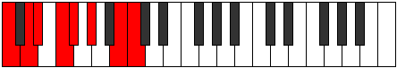
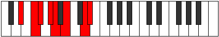
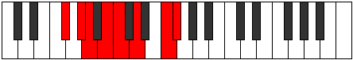

# Mode Phrydian

## Links

- [Documentation](index.md)
- [Scales Index](Scales.md)
- [Modes Index](Modes.md)
- [Chords Index](Chords.md)

## Parent Scale

[Mycrian](ScaleMycrian.md)

## Number

[2413](https://ianring.com/musictheory/scales/2413)

## Perfection

- 3 Perfect notes
- 4 Perfect notes

## Perfection Profile

[false false false true false true true]

## Permutations

| Tonic | Notes | Signature | Illustration | Audio |
|-------|-------|-----------|--------------|-------|
| [C](ModeCNaturalPhrydian.md) | **C**, **D**, **Eb**, F, **Gb**, Ab, B, **C** | C |  | [midi](ModeCNaturalPhrydian.mid) [ogg](ModeCNaturalPhrydian.ogg) |
| [C#](ModeCSharpPhrydian.md) | **C#**, **D#**, **E**, F#, **G**, A, B#, **C#** | C |  | [midi](ModeCSharpPhrydian.mid) [ogg](ModeCSharpPhrydian.ogg) |
| [Db](ModeDFlatPhrydian.md) | **Db**, **Eb**, **Fb**, Gb, **Abb**, Bbb, C, **Db** | C |  | [midi](ModeDFlatPhrydian.mid) [ogg](ModeDFlatPhrydian.ogg) |
| [D](ModeDNaturalPhrydian.md) | **D**, **E**, **F**, G, **Ab**, Bb, C#, **D** | C |  | [midi](ModeDNaturalPhrydian.mid) [ogg](ModeDNaturalPhrydian.ogg) |
| [D#](ModeDSharpPhrydian.md) | **D#**, **E#**, **F#**, G#, **A**, B, C##, **D#** | C |  | [midi](ModeDSharpPhrydian.mid) [ogg](ModeDSharpPhrydian.ogg) |
| [Eb](ModeEFlatPhrydian.md) | **Eb**, **F**, **Gb**, Ab, **Bbb**, Cb, D, **Eb** | C |  | [midi](ModeEFlatPhrydian.mid) [ogg](ModeEFlatPhrydian.ogg) |
| [E](ModeENaturalPhrydian.md) | **E**, **F#**, **G**, A, **Bb**, C, D#, **E** | C |  | [midi](ModeENaturalPhrydian.mid) [ogg](ModeENaturalPhrydian.ogg) |
| [F](ModeFNaturalPhrydian.md) | **F**, **G**, **Ab**, Bb, **Cb**, Db, E, **F** | C |  | [midi](ModeFNaturalPhrydian.mid) [ogg](ModeFNaturalPhrydian.ogg) |
| [F#](ModeFSharpPhrydian.md) | **F#**, **G#**, **A**, B, **C**, D, E#, **F#** | C |  | [midi](ModeFSharpPhrydian.mid) [ogg](ModeFSharpPhrydian.ogg) |
| [Gb](ModeGFlatPhrydian.md) | **Gb**, **Ab**, **Bbb**, Cb, **Dbb**, Ebb, F, **Gb** | C |  | [midi](ModeGFlatPhrydian.mid) [ogg](ModeGFlatPhrydian.ogg) |
| [G](ModeGNaturalPhrydian.md) | **G**, **A**, **Bb**, C, **Db**, Eb, F#, **G** | C |  | [midi](ModeGNaturalPhrydian.mid) [ogg](ModeGNaturalPhrydian.ogg) |
| [G#](ModeGSharpPhrydian.md) | **G#**, **A#**, **B**, C#, **D**, E, F##, **G#** | C |  | [midi](ModeGSharpPhrydian.mid) [ogg](ModeGSharpPhrydian.ogg) |
| [Ab](ModeAFlatPhrydian.md) | **Ab**, **Bb**, **Cb**, Db, **Ebb**, Fb, G, **Ab** | C |  | [midi](ModeAFlatPhrydian.mid) [ogg](ModeAFlatPhrydian.ogg) |
| [A](ModeANaturalPhrydian.md) | **A**, **B**, **C**, D, **Eb**, F, G#, **A** | C |  | [midi](ModeANaturalPhrydian.mid) [ogg](ModeANaturalPhrydian.ogg) |
| [A#](ModeASharpPhrydian.md) | **A#**, **B#**, **C#**, D#, **E**, F#, G##, **A#** | C |  | [midi](ModeASharpPhrydian.mid) [ogg](ModeASharpPhrydian.ogg) |
| [Bb](ModeBFlatPhrydian.md) | **Bb**, **C**, **Db**, Eb, **Fb**, Gb, A, **Bb** | C |  | [midi](ModeBFlatPhrydian.mid) [ogg](ModeBFlatPhrydian.ogg) |
| [B](ModeBNaturalPhrydian.md) | **B**, **C#**, **D**, E, **F**, G, A#, **B** | C |  | [midi](ModeBNaturalPhrydian.mid) [ogg](ModeBNaturalPhrydian.ogg) |
