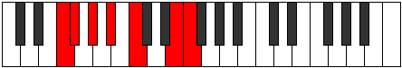

# Mode Phrydimic

## Links

- [Documentation](index.md)
- [Scales Index](Scales.md)
- [Modes Index](Modes.md)
- [Chords Index](Chords.md)

## Parent Scale

[Mycrimic](ScaleMycrimic.md)

## Number

[2219](https://ianring.com/musictheory/scales/2219)

## Perfection

- 2 Perfect notes
- 4 Perfect notes

## Perfection Profile

[true false false true false false]

## Permutations

| Tonic | Notes | Signature | Illustration | Audio |
|-------|-------|-----------|--------------|-------|
| [C](ModeCNaturalPhrydimic.md) | C, **Db**, **Eb**, F, **G**, **A##**, C | C |  | [midi](ModeCNaturalPhrydimic.mid) [ogg](ModeCNaturalPhrydimic.ogg) |
| [C#](ModeCSharpPhrydimic.md) | C#, **D**, **E**, F#, **G#**, **A###**, C# | C |  | [midi](ModeCSharpPhrydimic.mid) [ogg](ModeCSharpPhrydimic.ogg) |
| [Db](ModeDFlatPhrydimic.md) | Db, **Ebb**, **Fb**, Gb, **Ab**, **B#**, Db | C |  | [midi](ModeDFlatPhrydimic.mid) [ogg](ModeDFlatPhrydimic.ogg) |
| [D](ModeDNaturalPhrydimic.md) | D, **Eb**, **F**, G, **A**, **B##**, D | C |  | [midi](ModeDNaturalPhrydimic.mid) [ogg](ModeDNaturalPhrydimic.ogg) |
| [D#](ModeDSharpPhrydimic.md) | D#, **E**, **F#**, G#, **A#**, **B###**, D# | C |  | [midi](ModeDSharpPhrydimic.mid) [ogg](ModeDSharpPhrydimic.ogg) |
| [Eb](ModeEFlatPhrydimic.md) | Eb, **Fb**, **Gb**, Ab, **Bb**, **C##**, Eb | C |  | [midi](ModeEFlatPhrydimic.mid) [ogg](ModeEFlatPhrydimic.ogg) |
| [E](ModeENaturalPhrydimic.md) | E, **F**, **G**, A, **B**, **C###**, E | C |  | [midi](ModeENaturalPhrydimic.mid) [ogg](ModeENaturalPhrydimic.ogg) |
| [F](ModeFNaturalPhrydimic.md) | F, **Gb**, **Ab**, Bb, **C**, **D##**, F | C |  | [midi](ModeFNaturalPhrydimic.mid) [ogg](ModeFNaturalPhrydimic.ogg) |
| [F#](ModeFSharpPhrydimic.md) | F#, **G**, **A**, B, **C#**, **D###**, F# | C |  | [midi](ModeFSharpPhrydimic.mid) [ogg](ModeFSharpPhrydimic.ogg) |
| [Gb](ModeGFlatPhrydimic.md) | Gb, **Abb**, **Bbb**, Cb, **Db**, **E#**, Gb | C |  | [midi](ModeGFlatPhrydimic.mid) [ogg](ModeGFlatPhrydimic.ogg) |
| [G](ModeGNaturalPhrydimic.md) | G, **Ab**, **Bb**, C, **D**, **E##**, G | C |  | [midi](ModeGNaturalPhrydimic.mid) [ogg](ModeGNaturalPhrydimic.ogg) |
| [G#](ModeGSharpPhrydimic.md) | G#, **A**, **B**, C#, **D#**, **E###**, G# | C |  | [midi](ModeGSharpPhrydimic.mid) [ogg](ModeGSharpPhrydimic.ogg) |
| [Ab](ModeAFlatPhrydimic.md) | Ab, **Bbb**, **Cb**, Db, **Eb**, **F##**, Ab | C |  | [midi](ModeAFlatPhrydimic.mid) [ogg](ModeAFlatPhrydimic.ogg) |
| [A](ModeANaturalPhrydimic.md) | A, **Bb**, **C**, D, **E**, **F###**, A | C |  | [midi](ModeANaturalPhrydimic.mid) [ogg](ModeANaturalPhrydimic.ogg) |
| [A#](ModeASharpPhrydimic.md) | A#, **B**, **C#**, D#, **E#**, **Cbbb**, A# | C |  | [midi](ModeASharpPhrydimic.mid) [ogg](ModeASharpPhrydimic.ogg) |
| [Bb](ModeBFlatPhrydimic.md) | Bb, **Cb**, **Db**, Eb, **F**, **G##**, Bb | C |  | [midi](ModeBFlatPhrydimic.mid) [ogg](ModeBFlatPhrydimic.ogg) |
| [B](ModeBNaturalPhrydimic.md) | B, **C**, **D**, E, **F#**, **G###**, B | C |  | [midi](ModeBNaturalPhrydimic.mid) [ogg](ModeBNaturalPhrydimic.ogg) |
