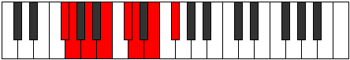
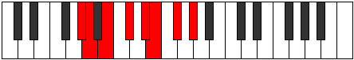

# Mode Phrygian

## Links

- [Documentation](index.md)
- [Scales Index](Scales.md)
- [Modes Index](Modes.md)
- [Chords Index](Chords.md)

## Parent Scale

[Lydian](ScaleLydian.md)

## Number

[1451](https://ianring.com/musictheory/scales/1451)

## Perfection

- 6 Perfect notes
- 1 Perfect notes

## Perfection Profile

[true true true true false true true]

## Permutations

| Tonic | Notes | Signature | Illustration | Audio |
|-------|-------|-----------|--------------|-------|
| [C](ModeCNaturalPhrygian.md) | C, Db, Eb, F, **G**, Ab, Bb, C | Ab |  | [midi](https://github.com/edipermadi/music/blob/main/docs/ModeCNaturalPhrygian.mid?raw=true) |
| [C#](ModeCSharpPhrygian.md) | C#, D, E, F#, **G#**, A, B, C# | A |  | [midi](https://github.com/edipermadi/music/blob/main/docs/ModeCSharpPhrygian.mid?raw=true) |
| [Db](ModeDFlatPhrygian.md) | Db, Ebb, Fb, Gb, **Ab**, Bbb, Cb, Db | A |  | [midi](https://github.com/edipermadi/music/blob/main/docs/ModeDFlatPhrygian.mid?raw=true) |
| [D](ModeDNaturalPhrygian.md) | D, Eb, F, G, **A**, Bb, C, D | Bb |  | [midi](https://github.com/edipermadi/music/blob/main/docs/ModeDNaturalPhrygian.mid?raw=true) |
| [D#](ModeDSharpPhrygian.md) | D#, E, F#, G#, **A#**, B, C#, D# | B |  | [midi](https://github.com/edipermadi/music/blob/main/docs/ModeDSharpPhrygian.mid?raw=true) |
| [Eb](ModeEFlatPhrygian.md) | Eb, Fb, Gb, Ab, **Bb**, Cb, Db, Eb | B |  | [midi](https://github.com/edipermadi/music/blob/main/docs/ModeEFlatPhrygian.mid?raw=true) |
| [E](ModeENaturalPhrygian.md) | E, F, G, A, **B**, C, D, E | C |  | [midi](https://github.com/edipermadi/music/blob/main/docs/ModeENaturalPhrygian.mid?raw=true) |
| [F](ModeFNaturalPhrygian.md) | F, Gb, Ab, Bb, **C**, Db, Eb, F | Db, C# |  | [midi](https://github.com/edipermadi/music/blob/main/docs/ModeFNaturalPhrygian.mid?raw=true) |
| [F#](ModeFSharpPhrygian.md) | F#, G, A, B, **C#**, D, E, F# | D |  | [midi](https://github.com/edipermadi/music/blob/main/docs/ModeFSharpPhrygian.mid?raw=true) |
| [Gb](ModeGFlatPhrygian.md) | Gb, Abb, Bbb, Cb, **Db**, Ebb, Fb, Gb | D |  | [midi](https://github.com/edipermadi/music/blob/main/docs/ModeGFlatPhrygian.mid?raw=true) |
| [G](ModeGNaturalPhrygian.md) | G, Ab, Bb, C, **D**, Eb, F, G | Eb |  | [midi](https://github.com/edipermadi/music/blob/main/docs/ModeGNaturalPhrygian.mid?raw=true) |
| [G#](ModeGSharpPhrygian.md) | G#, A, B, C#, **D#**, E, F#, G# | E |  | [midi](https://github.com/edipermadi/music/blob/main/docs/ModeGSharpPhrygian.mid?raw=true) |
| [Ab](ModeAFlatPhrygian.md) | Ab, Bbb, Cb, Db, **Eb**, Fb, Gb, Ab | E |  | [midi](https://github.com/edipermadi/music/blob/main/docs/ModeAFlatPhrygian.mid?raw=true) |
| [A](ModeANaturalPhrygian.md) | A, Bb, C, D, **E**, F, G, A | F |  | [midi](https://github.com/edipermadi/music/blob/main/docs/ModeANaturalPhrygian.mid?raw=true) |
| [A#](ModeASharpPhrygian.md) | A#, B, C#, D#, **E#**, F#, G#, A# | F#, Gb |  | [midi](https://github.com/edipermadi/music/blob/main/docs/ModeASharpPhrygian.mid?raw=true) |
| [Bb](ModeBFlatPhrygian.md) | Bb, Cb, Db, Eb, **F**, Gb, Ab, Bb | F#, Gb |  | [midi](https://github.com/edipermadi/music/blob/main/docs/ModeBFlatPhrygian.mid?raw=true) |
| [B](ModeBNaturalPhrygian.md) | B, C, D, E, **F#**, G, A, B | G |  | [midi](https://github.com/edipermadi/music/blob/main/docs/ModeBNaturalPhrygian.mid?raw=true) |
