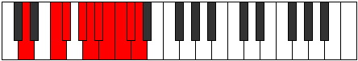

# Mode Phrygic

## Links

- [Documentation](index.md)
- [Scales Index](Scales.md)
- [Modes Index](Modes.md)
- [Chords Index](Chords.md)

## Parent Scale

[Phrygic](ScalePhrygic.md)

## Number

[4057](https://ianring.com/musictheory/scales/4057)

## Perfection

- 6 Perfect notes
- 3 Perfect notes

## Perfection Profile

[true true true false false true true false true]

## Permutations

| Tonic | Notes | Signature | Illustration | Audio |
|-------|-------|-----------|--------------|-------|
| [C](ModeCNaturalPhrygic.md) | C, D#, E, **F#**, **G**, G#, A, **A#**, B, C | C |  | [midi](ModeCNaturalPhrygic.mid) [ogg](ModeCNaturalPhrygic.ogg) |
| [C#](ModeCSharpPhrygic.md) | C#, E, F, **G**, **G#**, A, A#, **B**, C, C# | C |  | [midi](ModeCSharpPhrygic.mid) [ogg](ModeCSharpPhrygic.ogg) |
| [Db](ModeDFlatPhrygic.md) | Db, E, F, **G**, **Ab**, A, Bb, **B**, C, Db | C |  | [midi](ModeDFlatPhrygic.mid) [ogg](ModeDFlatPhrygic.ogg) |
| [D](ModeDNaturalPhrygic.md) | D, F, F#, **G#**, **A**, A#, B, **C**, C#, D | C |  | [midi](ModeDNaturalPhrygic.mid) [ogg](ModeDNaturalPhrygic.ogg) |
| [D#](ModeDSharpPhrygic.md) | D#, F#, G, **A**, **A#**, B, C, **C#**, D, D# | C |  | [midi](ModeDSharpPhrygic.mid) [ogg](ModeDSharpPhrygic.ogg) |
| [Eb](ModeEFlatPhrygic.md) | Eb, Gb, G, **A**, **Bb**, B, C, **Db**, D, Eb | C |  | [midi](ModeEFlatPhrygic.mid) [ogg](ModeEFlatPhrygic.ogg) |
| [E](ModeENaturalPhrygic.md) | E, G, G#, **A#**, **B**, C, C#, **D**, D#, E | C |  | [midi](ModeENaturalPhrygic.mid) [ogg](ModeENaturalPhrygic.ogg) |
| [F](ModeFNaturalPhrygic.md) | F, G#, A, **B**, **C**, C#, D, **D#**, E, F | C |  | [midi](ModeFNaturalPhrygic.mid) [ogg](ModeFNaturalPhrygic.ogg) |
| [F#](ModeFSharpPhrygic.md) | F#, A, A#, **C**, **C#**, D, D#, **E**, F, F# | C |  | [midi](ModeFSharpPhrygic.mid) [ogg](ModeFSharpPhrygic.ogg) |
| [Gb](ModeGFlatPhrygic.md) | Gb, A, Bb, **C**, **Db**, D, Eb, **E**, F, Gb | C |  | [midi](ModeGFlatPhrygic.mid) [ogg](ModeGFlatPhrygic.ogg) |
| [G](ModeGNaturalPhrygic.md) | G, A#, B, **C#**, **D**, D#, E, **F**, F#, G | C |  | [midi](ModeGNaturalPhrygic.mid) [ogg](ModeGNaturalPhrygic.ogg) |
| [G#](ModeGSharpPhrygic.md) | G#, B, C, **D**, **D#**, E, F, **F#**, G, G# | C |  | [midi](ModeGSharpPhrygic.mid) [ogg](ModeGSharpPhrygic.ogg) |
| [Ab](ModeAFlatPhrygic.md) | Ab, B, C, **D**, **Eb**, E, F, **Gb**, G, Ab | C |  | [midi](ModeAFlatPhrygic.mid) [ogg](ModeAFlatPhrygic.ogg) |
| [A](ModeANaturalPhrygic.md) | A, C, C#, **D#**, **E**, F, F#, **G**, G#, A | C |  | [midi](ModeANaturalPhrygic.mid) [ogg](ModeANaturalPhrygic.ogg) |
| [A#](ModeASharpPhrygic.md) | A#, C#, D, **E**, **F**, F#, G, **G#**, A, A# | C |  | [midi](ModeASharpPhrygic.mid) [ogg](ModeASharpPhrygic.ogg) |
| [Bb](ModeBFlatPhrygic.md) | Bb, Db, D, **E**, **F**, Gb, G, **Ab**, A, Bb | C |  | [midi](ModeBFlatPhrygic.mid) [ogg](ModeBFlatPhrygic.ogg) |
| [B](ModeBNaturalPhrygic.md) | B, D, D#, **F**, **F#**, G, G#, **A**, A#, B | C |  | [midi](ModeBNaturalPhrygic.mid) [ogg](ModeBNaturalPhrygic.ogg) |
