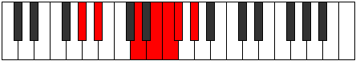

# Mode Phrygimic

## Links

- [Documentation](index.md)
- [Scales Index](Scales.md)
- [Modes Index](Modes.md)
- [Chords Index](Chords.md)

## Parent Scale

[Gacrimic](ScaleGacrimic.md)

## Number

[1861](https://ianring.com/musictheory/scales/1861)

## Perfection

- 1 Perfect notes
- 5 Perfect notes

## Perfection Profile

[false true false false false false]

## Permutations

| Tonic | Notes | Signature | Illustration | Audio |
|-------|-------|-----------|--------------|-------|
| [C](ModeCNaturalPhrygimic.md) | **C**, D, **E##**, **F###**, **G##**, **A#**, **C** | C |  | [midi](ModeCNaturalPhrygimic.mid) [ogg](ModeCNaturalPhrygimic.ogg) |
| [C#](ModeCSharpPhrygimic.md) | **C#**, D#, **E###**, **Cbbb**, **Cbb**, **Dbbb**, **C#** | C |  | [midi](ModeCSharpPhrygimic.mid) [ogg](ModeCSharpPhrygimic.ogg) |
| [Db](ModeDFlatPhrygimic.md) | **Db**, Eb, **F##**, **G##**, **A#**, **B**, **Db** | C |  | [midi](ModeDFlatPhrygimic.mid) [ogg](ModeDFlatPhrygimic.ogg) |
| [D](ModeDNaturalPhrygimic.md) | **D**, E, **F###**, **G###**, **A##**, **B#**, **D** | C |  | [midi](ModeDNaturalPhrygimic.mid) [ogg](ModeDNaturalPhrygimic.ogg) |
| [D#](ModeDSharpPhrygimic.md) | **D#**, E#, **Cbbb**, **Dbbb**, **Dbb**, **Ebbb**, **D#** | C |  | [midi](ModeDSharpPhrygimic.mid) [ogg](ModeDSharpPhrygimic.ogg) |
| [Eb](ModeEFlatPhrygimic.md) | **Eb**, F, **G##**, **A##**, **B#**, **C#**, **Eb** | C |  | [midi](ModeEFlatPhrygimic.mid) [ogg](ModeEFlatPhrygimic.ogg) |
| [E](ModeENaturalPhrygimic.md) | **E**, F#, **G###**, **A###**, **B##**, **C##**, **E** | C |  | [midi](ModeENaturalPhrygimic.mid) [ogg](ModeENaturalPhrygimic.ogg) |
| [F](ModeFNaturalPhrygimic.md) | **F**, G, **A##**, **B##**, **C##**, **D#**, **F** | C |  | [midi](ModeFNaturalPhrygimic.mid) [ogg](ModeFNaturalPhrygimic.ogg) |
| [F#](ModeFSharpPhrygimic.md) | **F#**, G#, **A###**, **B###**, **C###**, **D##**, **F#** | C |  | [midi](ModeFSharpPhrygimic.mid) [ogg](ModeFSharpPhrygimic.ogg) |
| [Gb](ModeGFlatPhrygimic.md) | **Gb**, Ab, **B#**, **C##**, **D#**, **E**, **Gb** | C |  | [midi](ModeGFlatPhrygimic.mid) [ogg](ModeGFlatPhrygimic.ogg) |
| [G](ModeGNaturalPhrygimic.md) | **G**, A, **B##**, **C###**, **D##**, **E#**, **G** | C |  | [midi](ModeGNaturalPhrygimic.mid) [ogg](ModeGNaturalPhrygimic.ogg) |
| [G#](ModeGSharpPhrygimic.md) | **G#**, A#, **B###**, **D##**, **E#**, **F#**, **G#** | C |  | [midi](ModeGSharpPhrygimic.mid) [ogg](ModeGSharpPhrygimic.ogg) |
| [Ab](ModeAFlatPhrygimic.md) | **Ab**, Bb, **C##**, **D##**, **E#**, **F#**, **Ab** | C |  | [midi](ModeAFlatPhrygimic.mid) [ogg](ModeAFlatPhrygimic.ogg) |
| [A](ModeANaturalPhrygimic.md) | **A**, B, **C###**, **D###**, **E##**, **F##**, **A** | C |  | [midi](ModeANaturalPhrygimic.mid) [ogg](ModeANaturalPhrygimic.ogg) |
| [A#](ModeASharpPhrygimic.md) | **A#**, B#, **D##**, **E##**, **F##**, **G#**, **A#** | C |  | [midi](ModeASharpPhrygimic.mid) [ogg](ModeASharpPhrygimic.ogg) |
| [Bb](ModeBFlatPhrygimic.md) | **Bb**, C, **D##**, **E##**, **F##**, **G#**, **Bb** | C |  | [midi](ModeBFlatPhrygimic.mid) [ogg](ModeBFlatPhrygimic.ogg) |
| [B](ModeBNaturalPhrygimic.md) | **B**, C#, **D###**, **E###**, **F###**, **G##**, **B** | C |  | [midi](ModeBNaturalPhrygimic.mid) [ogg](ModeBNaturalPhrygimic.ogg) |
