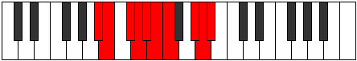

# Mode Phrygygic

## Links

- [Documentation](README.md)
- [Scales Index](Scales.md)
- [Modes Index](Modes.md)
- [Chords Index](Chords.md)

## Parent Scale

[Mixolydygic](ScaleMixolydygic.md)

## Number

[3323](https://ianring.com/musictheory/scales/3323)

## Interval Pattern

1, 2, 1, 1, 1, 1, 3, 1, 1

## Chord Pattern

iv⁰b3, v⁰b3, VIb5, VIIb5

## Perfection

- 7 Perfect notes
- 2 Perfect notes

## Perfection Profile

[true false true true true true false true true]

## Permutations

| Tonic | Notes | Signature | Illustration | Audio |
|-------|-------|-----------|--------------|-------|
| [C](ModeCNaturalPhrygygic.md) | C, **C#**, D#, E, F, F#, **G**, A#, B, C | C |  | [midi](https://github.com/edipermadi/music/blob/main/docs/ModeCNaturalPhrygygic.mid?raw=true) |
| [C#](ModeCSharpPhrygygic.md) | C#, **D**, E, F, F#, G, **G#**, B, C, C# | C |  | [midi](https://github.com/edipermadi/music/blob/main/docs/ModeCSharpPhrygygic.mid?raw=true) |
| [Db](ModeDFlatPhrygygic.md) | Db, **D**, E, F, Gb, G, **Ab**, B, C, Db | C |  | [midi](https://github.com/edipermadi/music/blob/main/docs/ModeDFlatPhrygygic.mid?raw=true) |
| [D](ModeDNaturalPhrygygic.md) | D, **D#**, F, F#, G, G#, **A**, C, C#, D | C |  | [midi](https://github.com/edipermadi/music/blob/main/docs/ModeDNaturalPhrygygic.mid?raw=true) |
| [D#](ModeDSharpPhrygygic.md) | D#, **E**, F#, G, G#, A, **A#**, C#, D, D# | C |  | [midi](https://github.com/edipermadi/music/blob/main/docs/ModeDSharpPhrygygic.mid?raw=true) |
| [Eb](ModeEFlatPhrygygic.md) | Eb, **E**, Gb, G, Ab, A, **Bb**, Db, D, Eb | C |  | [midi](https://github.com/edipermadi/music/blob/main/docs/ModeEFlatPhrygygic.mid?raw=true) |
| [E](ModeENaturalPhrygygic.md) | E, **F**, G, G#, A, A#, **B**, D, D#, E | C |  | [midi](https://github.com/edipermadi/music/blob/main/docs/ModeENaturalPhrygygic.mid?raw=true) |
| [F](ModeFNaturalPhrygygic.md) | F, **F#**, G#, A, A#, B, **C**, D#, E, F | C |  | [midi](https://github.com/edipermadi/music/blob/main/docs/ModeFNaturalPhrygygic.mid?raw=true) |
| [F#](ModeFSharpPhrygygic.md) | F#, **G**, A, A#, B, C, **C#**, E, F, F# | C |  | [midi](https://github.com/edipermadi/music/blob/main/docs/ModeFSharpPhrygygic.mid?raw=true) |
| [Gb](ModeGFlatPhrygygic.md) | Gb, **G**, A, Bb, B, C, **Db**, E, F, Gb | C |  | [midi](https://github.com/edipermadi/music/blob/main/docs/ModeGFlatPhrygygic.mid?raw=true) |
| [G](ModeGNaturalPhrygygic.md) | G, **G#**, A#, B, C, C#, **D**, F, F#, G | C |  | [midi](https://github.com/edipermadi/music/blob/main/docs/ModeGNaturalPhrygygic.mid?raw=true) |
| [G#](ModeGSharpPhrygygic.md) | G#, **A**, B, C, C#, D, **D#**, F#, G, G# | C |  | [midi](https://github.com/edipermadi/music/blob/main/docs/ModeGSharpPhrygygic.mid?raw=true) |
| [Ab](ModeAFlatPhrygygic.md) | Ab, **A**, B, C, Db, D, **Eb**, Gb, G, Ab | C |  | [midi](https://github.com/edipermadi/music/blob/main/docs/ModeAFlatPhrygygic.mid?raw=true) |
| [A](ModeANaturalPhrygygic.md) | A, **A#**, C, C#, D, D#, **E**, G, G#, A | C |  | [midi](https://github.com/edipermadi/music/blob/main/docs/ModeANaturalPhrygygic.mid?raw=true) |
| [A#](ModeASharpPhrygygic.md) | A#, **B**, C#, D, D#, E, **F**, G#, A, A# | C |  | [midi](https://github.com/edipermadi/music/blob/main/docs/ModeASharpPhrygygic.mid?raw=true) |
| [Bb](ModeBFlatPhrygygic.md) | Bb, **B**, Db, D, Eb, E, **F**, Ab, A, Bb | C |  | [midi](https://github.com/edipermadi/music/blob/main/docs/ModeBFlatPhrygygic.mid?raw=true) |
| [B](ModeBNaturalPhrygygic.md) | B, **C**, D, D#, E, F, **F#**, A, A#, B | C |  | [midi](https://github.com/edipermadi/music/blob/main/docs/ModeBNaturalPhrygygic.mid?raw=true) |
