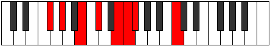
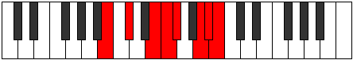

# Mode Phrynian

## Links

- [Documentation](README.md)
- [Scales Index](Scales.md)
- [Modes Index](Modes.md)
- [Chords Index](Chords.md)

## Parent Scale

[Epogian](ScaleEpogian.md)

## Number

[3301](https://ianring.com/musictheory/scales/3301)

## Transposition

2, 3, 1, 1, 3, 1, 1

## Chord Pattern

II⁺, iii⁰b3, IVb5, IVb5, V, vii

## Perfection

- 5 Perfect notes
- 2 Perfect notes

## Perfection Profile

[true false true false true true true]

## Permutations

| Tonic | Notes | Signature | Illustration | Audio |
|-------|-------|-----------|--------------|-------|
| [C](ModeCNaturalPhrynian.md) | C, **D**, E#, **F#**, G, A#, B, C | C |  | [midi](https://github.com/edipermadi/music/blob/main/docs/ModeCNaturalPhrynian.mid?raw=true) |
| [C#](ModeCSharpPhrynian.md) | C#, **D#**, E##, **F##**, G#, A##, B#, C# | C |  | [midi](https://github.com/edipermadi/music/blob/main/docs/ModeCSharpPhrynian.mid?raw=true) |
| [Db](ModeDFlatPhrynian.md) | Db, **Eb**, F#, **G**, Ab, B, C, Db | C |  | [midi](https://github.com/edipermadi/music/blob/main/docs/ModeDFlatPhrynian.mid?raw=true) |
| [D](ModeDNaturalPhrynian.md) | D, **E**, F##, **G#**, A, B#, C#, D | C |  | [midi](https://github.com/edipermadi/music/blob/main/docs/ModeDNaturalPhrynian.mid?raw=true) |
| [D#](ModeDSharpPhrynian.md) | D#, **E#**, F###, **G##**, A#, B##, C##, D# | C |  | [midi](https://github.com/edipermadi/music/blob/main/docs/ModeDSharpPhrynian.mid?raw=true) |
| [Eb](ModeEFlatPhrynian.md) | Eb, **F**, G#, **A**, Bb, C#, D, Eb | C |  | [midi](https://github.com/edipermadi/music/blob/main/docs/ModeEFlatPhrynian.mid?raw=true) |
| [E](ModeENaturalPhrynian.md) | E, **F#**, G##, **A#**, B, C##, D#, E | C |  | [midi](https://github.com/edipermadi/music/blob/main/docs/ModeENaturalPhrynian.mid?raw=true) |
| [F](ModeFNaturalPhrynian.md) | F, **G**, A#, **B**, C, D#, E, F | C |  | [midi](https://github.com/edipermadi/music/blob/main/docs/ModeFNaturalPhrynian.mid?raw=true) |
| [F#](ModeFSharpPhrynian.md) | F#, **G#**, A##, **B#**, C#, D##, E#, F# | C |  | [midi](https://github.com/edipermadi/music/blob/main/docs/ModeFSharpPhrynian.mid?raw=true) |
| [Gb](ModeGFlatPhrynian.md) | Gb, **Ab**, B, **C**, Db, E, F, Gb | C |  | [midi](https://github.com/edipermadi/music/blob/main/docs/ModeGFlatPhrynian.mid?raw=true) |
| [G](ModeGNaturalPhrynian.md) | G, **A**, B#, **C#**, D, E#, F#, G | C |  | [midi](https://github.com/edipermadi/music/blob/main/docs/ModeGNaturalPhrynian.mid?raw=true) |
| [G#](ModeGSharpPhrynian.md) | G#, **A#**, B##, **C##**, D#, E##, F##, G# | C |  | [midi](https://github.com/edipermadi/music/blob/main/docs/ModeGSharpPhrynian.mid?raw=true) |
| [Ab](ModeAFlatPhrynian.md) | Ab, **Bb**, C#, **D**, Eb, F#, G, Ab | C |  | [midi](https://github.com/edipermadi/music/blob/main/docs/ModeAFlatPhrynian.mid?raw=true) |
| [A](ModeANaturalPhrynian.md) | A, **B**, C##, **D#**, E, F##, G#, A | C |  | [midi](https://github.com/edipermadi/music/blob/main/docs/ModeANaturalPhrynian.mid?raw=true) |
| [A#](ModeASharpPhrynian.md) | A#, **B#**, C###, **D##**, E#, F###, G##, A# | C |  | [midi](https://github.com/edipermadi/music/blob/main/docs/ModeASharpPhrynian.mid?raw=true) |
| [Bb](ModeBFlatPhrynian.md) | Bb, **C**, D#, **E**, F, G#, A, Bb | C |  | [midi](https://github.com/edipermadi/music/blob/main/docs/ModeBFlatPhrynian.mid?raw=true) |
| [B](ModeBNaturalPhrynian.md) | B, **C#**, D##, **E#**, F#, G##, A#, B | C |  | [midi](https://github.com/edipermadi/music/blob/main/docs/ModeBNaturalPhrynian.mid?raw=true) |
